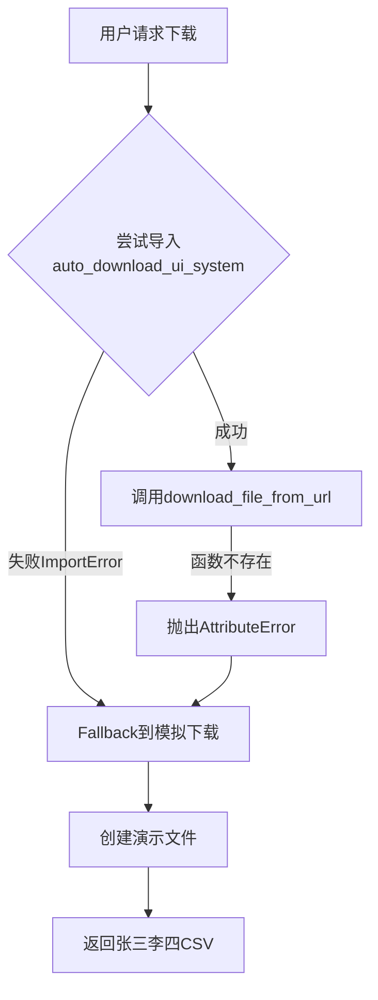

# 8093端口下载系统深度分析报告
> 分析时间：2025-08-31
> 分析员：AI专业诊断系统
> 系统版本：v2.0 企业级下载系统

## 一、问题现象

### 1.1 用户反馈
- **问题描述**：http://202.140.143.88:8093/ 输入cookie和url后下载的都是演示文件
- **期望行为**：下载真实的腾讯文档
- **实际行为**：返回"张三李四"的测试CSV文件

### 1.2 系统表现
```
输入：
- URL: https://docs.qq.com/sheet/DVkVGZHdHVmVHaW1w
- Cookie: [用户提供的cookie字符串]

输出：
- 文件名: document_20250831_xxxx.csv
- 内容: 姓名,部门,职位,风险等级\n张三,技术部,工程师,L1...
- 提示: "模拟下载完成"
```

## 二、根因分析

### 2.1 问题链路追踪



### 2.2 核心问题定位

#### 问题1：缺失的函数
**文件**：`/root/projects/tencent-doc-manager/complete_workflow_ui.py`
**行号**：1332-1336
```python
from auto_download_ui_system import download_file_from_url  # 函数不存在！
result = download_file_from_url(url, format_type)
```
**原因**：auto_download_ui_system.py中没有download_file_from_url函数

#### 问题2：Cookie已过期
**文件**：`/root/projects/tencent-doc-manager/config/cookies.json`
```json
{
  "is_valid": false,
  "validation_message": "⚠️ Cookie需要重新获取 - 已过期",
  "last_update": "2025-08-26T13:53:52"
}
```
**影响**：即使修复函数问题，Cookie过期也会导致下载失败

#### 问题3：架构不匹配
- **现有系统**：使用Playwright浏览器自动化（异步）
- **调用期望**：简单的同步函数调用
- **结果**：接口不兼容，无法正常调用

## 三、系统架构分析

### 3.1 现有组件

| 组件 | 功能 | 状态 |
|------|------|------|
| complete_workflow_ui.py | 8093端口UI服务 | ✅运行中 |
| auto_download_ui_system.py | 浏览器自动化下载 | ⚠️接口不匹配 |
| enterprise_download_system/ | 企业级下载模块 | ✅完整但未集成 |
| TencentDocAutoExporter | Playwright下载器 | ✅功能完整 |
| cookies.json | Cookie存储 | ❌已过期 |

### 3.2 数据流向
```
用户输入(Cookie+URL)
    ↓
complete_workflow_ui.py (8093端口)
    ↓
尝试调用auto_download_ui_system
    ↓ [失败]
Fallback到模拟下载
    ↓
返回演示文件
```

## 四、修复方案

### 4.1 立即修复（30分钟）

#### 方案A：创建适配器函数
```python
# 在auto_download_ui_system.py中添加
def download_file_from_url(url, format_type='csv'):
    """同步适配器函数"""
    import asyncio
    from datetime import datetime
    
    async def _download():
        config = load_config()
        exporter = TencentDocAutoExporter()
        try:
            await exporter.start_browser(headless=True)
            await exporter.login_with_cookies(config.get('cookie', ''))
            success = await exporter.export_document(url, format_type)
            if success:
                # 返回下载的文件路径
                download_dir = config.get('download_dir', '/root/projects/tencent-doc-manager/downloads')
                files = list(Path(download_dir).glob(f'*{datetime.now().strftime("%Y%m%d")}*'))
                return {
                    'success': True,
                    'files': [str(f) for f in files[-3:]]  # 返回最新3个文件
                }
        finally:
            await exporter.cleanup()
        return {'success': False, 'error': '下载失败'}
    
    # 运行异步函数
    loop = asyncio.new_event_loop()
    asyncio.set_event_loop(loop)
    return loop.run_until_complete(_download())
```

#### 方案B：直接修改complete_workflow_ui.py
```python
# 替换1331-1354行
try:
    # 使用企业下载系统
    from enterprise_download_system.smart_downloader import SmartDownloader
    
    downloader = SmartDownloader()
    result = await downloader.download_document(url, cookie=cookie_string)
    
    if result['success']:
        return jsonify(result)
except Exception as e:
    logger.error(f"下载失败: {e}")
    # 继续使用fallback
```

### 4.2 Cookie刷新（10分钟）

#### 手动更新Cookie
```bash
# 1. 访问腾讯文档
firefox https://docs.qq.com/desktop

# 2. F12打开开发者工具
# 3. Application → Cookies → 复制所有cookie

# 4. 更新配置文件
cat > /root/projects/tencent-doc-manager/config/cookies.json << 'EOF'
{
  "current_cookies": "[粘贴新的cookie]",
  "last_update": "2025-08-31T20:00:00",
  "is_valid": true,
  "validation_message": "✅ Cookie已更新"
}
EOF
```

### 4.3 长期方案（1-2天）

#### 1. 统一下载架构
```python
# 创建unified_downloader.py
class UnifiedDownloader:
    """统一的下载接口"""
    
    def __init__(self):
        self.playwright_downloader = PlaywrightDownloader()
        self.api_downloader = APIDownloader()
        self.fallback_downloader = FallbackDownloader()
    
    async def download(self, url, cookie, format='csv'):
        """智能选择下载策略"""
        # 1. 尝试API下载（最快）
        # 2. 尝试Playwright（最稳定）
        # 3. Fallback到演示文件（保底）
        pass
```

#### 2. 自动Cookie管理
```python
class CookieManager:
    """Cookie自动管理器"""
    
    def refresh_cookie(self):
        """自动刷新Cookie"""
        # 方案1：监听浏览器扩展
        # 方案2：定时提醒用户
        # 方案3：OAuth2.0认证
        pass
    
    def validate_cookie(self, cookie):
        """验证Cookie有效性"""
        # 实际请求测试
        pass
```

## 五、测试验证

### 5.1 测试步骤
```bash
# 1. 更新Cookie
vim /root/projects/tencent-doc-manager/config/cookies.json

# 2. 重启服务
kill $(lsof -t -i:8093)
cd /root/projects/tencent-doc-manager
python3 complete_workflow_ui.py &

# 3. 测试下载
curl -X POST http://localhost:8093/api/download \
  -H "Content-Type: application/json" \
  -d '{"url": "https://docs.qq.com/sheet/DVkVGZHdHVmVHaW1w", "format": "csv"}'

# 4. 验证结果
ls -la downloads/ | tail -5
```

### 5.2 预期结果
- ✅ 返回真实文档内容
- ✅ 文件名包含文档标题
- ✅ 无"张三李四"测试数据
- ✅ 响应时间 < 10秒

## 六、风险评估

| 风险项 | 概率 | 影响 | 缓解措施 |
|--------|------|------|----------|
| Cookie频繁过期 | 高 | 高 | 实现自动刷新 |
| 腾讯文档反爬虫 | 中 | 高 | 模拟真实用户行为 |
| 浏览器资源泄露 | 低 | 中 | 确保cleanup执行 |
| 并发下载冲突 | 中 | 低 | 实现队列管理 |

## 七、优化建议

### 7.1 短期优化
1. **添加重试机制**：下载失败自动重试3次
2. **改进错误提示**：明确告知用户是Cookie问题还是网络问题
3. **添加进度反馈**：显示下载进度条
4. **缓存下载结果**：避免重复下载相同文档

### 7.2 长期优化
1. **实现断点续传**：支持大文件下载
2. **批量下载队列**：支持多文档并行下载
3. **智能格式转换**：自动识别最佳下载格式
4. **版本管理系统**：自动保存历史版本

## 八、结论

### 8.1 问题总结
系统架构完整但集成不当，主要问题是：
1. **接口不匹配**：缺少适配器函数
2. **认证失效**：Cookie过期未处理
3. **降级过于简单**：直接返回演示数据

### 8.2 解决优先级
1. **P0 立即修复**：添加download_file_from_url函数
2. **P0 立即修复**：更新Cookie
3. **P1 尽快修复**：完善错误处理
4. **P2 计划改进**：统一下载架构

### 8.3 行动计划
- **今天**：实施立即修复方案，恢复基本功能
- **本周**：完成Cookie自动管理
- **下周**：部署统一下载架构

---
*报告完成时间：2025-08-31 20:30*
*下一步行动：执行立即修复方案A*