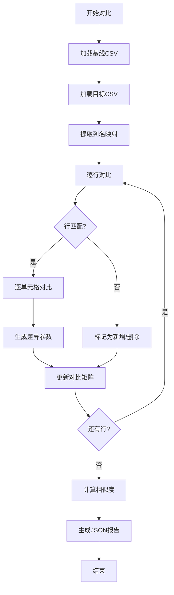

# 📊 CSV对比文件查找规范说明书

**文档版本**: v1.0  
**创建时间**: 2025-09-04  
**最后更新**: 2025-09-04  
**适用范围**: 腾讯文档智能监控系统 - CSV对比程序文件查找机制

---

## 🎯 规格总览

本规范定义CSV对比程序在不同时间点的文件查找规则，确保系统能够准确定位基线文件和目标文件，实现精确的版本对比分析。

### ⚠️ **唯一性原则**
- **唯一查找方式**：只能使用本地csv_versions目录查找
- **唯一查找函数**：find_baseline_files() 和 find_target_files()
- **禁止降级**：找不到文件直接报错，不使用任何备用方案
- **禁止混合模式**：查找是查找，下载是下载，两者必须分离
- **禁止回退机制**：不允许使用缓存、旧文件或find_file_by_strategy等方法

---

## ⏰ 核心时间判断逻辑

### 🕒 **时间节点定义**

| 时间段 | 定义 | 查找策略 | 
|--------|------|----------|
| **周一全天** | 周一 00:00 - 23:59 | 使用上周数据 |
| **周二上午** | 周二 00:00 - 11:59 | 使用上周数据 |
| **周二下午** | 周二 12:00 - 23:59 | 使用本周数据 |
| **周三至周五** | 周三 00:00 - 周五 23:59 | 使用本周数据 |
| **周六周日** | 周六 00:00 - 周日 23:59 | 使用本周数据 |

### 🔍 **基准时间判断函数**
```python
def get_time_context():
    """获取当前时间上下文"""
    now = datetime.now()
    weekday = now.weekday()  # 0=周一, 1=周二...6=周日
    hour = now.hour
    week_info = now.isocalendar()  # (year, week, weekday)
    
    # 判断使用哪一周的数据
    if weekday < 1 or (weekday == 1 and hour < 12):
        # 周一全天 OR 周二12点前 → 使用上周
        target_week = week_info[1] - 1
        week_context = "previous_week"
    else:
        # 周二12点后 至 周日 → 使用本周
        target_week = week_info[1]
        week_context = "current_week"
    
    return {
        "week_context": week_context,
        "target_week": target_week,
        "weekday": weekday,
        "hour": hour,
        "year": week_info[0]
    }
```

---

## 📁 基线文件查找规则

### ⚡ **严格查找策略**

基线文件代表稳定的参考版本，用于与目标文件进行对比。

#### **查找逻辑流程**
```
1. 获取时间上下文
2. 确定目标周数（上周/本周）
3. 定位baseline文件夹
4. 查找符合命名规范的文件
5. 无文件则报错（绝不降级）
```

#### **具体实现规则**
```python
def find_baseline_files(doc_name: str = None) -> List[str]:
    """
    查找基线文件 - 严格模式
    
    Args:
        doc_name: 可选的文档名称过滤
        
    Returns:
        基线文件路径列表
        
    Raises:
        FileNotFoundError: 找不到基线文件时
    """
    context = get_time_context()
    
    # 构建基线文件夹路径
    baseline_path = f"csv_versions/{context['year']}_W{context['target_week']}/baseline/"
    
    # 查找文件（带可选过滤）
    if doc_name:
        pattern = f"{baseline_path}*{doc_name}*_baseline_W{context['target_week']}.csv"
    else:
        pattern = f"{baseline_path}*_baseline_W{context['target_week']}.csv"
    
    files = glob.glob(pattern)
    
    if not files:
        raise FileNotFoundError(
            f"❌ 基线文件不存在\n"
            f"查找路径: {baseline_path}\n"
            f"时间上下文: {context['week_context']}\n"
            f"请检查周二12:00自动下载任务是否正常执行"
        )
    
    return sorted(files)  # 按文件名排序
```

### 📋 **基线文件查找示例**

| 当前时间 | 查找目录 | 说明 |
|---------|---------|------|
| 周一 10:00 | `2025_W35/baseline/` | 查找上周基线 |
| 周二 10:00 | `2025_W35/baseline/` | 查找上周基线 |
| 周二 14:00 | `2025_W36/baseline/` | 查找本周基线 |
| 周五 15:00 | `2025_W36/baseline/` | 查找本周基线 |

---

## 🎯 目标文件查找规则

### ⚡ **动态查找策略**

目标文件代表最新的数据版本，查找位置根据当前时间动态确定。

#### **查找优先级规则**
```
周六 19:00后 → weekend文件夹（最高优先级）
周四 09:00后 → midweek文件夹（中等优先级）  
其他时间 → midweek文件夹（默认位置）
```

#### **具体实现规则**
```python
def find_target_files(doc_name: str = None) -> List[str]:
    """
    查找目标文件 - 动态选择版本类型
    
    Args:
        doc_name: 可选的文档名称过滤
        
    Returns:
        目标文件路径列表（按时间倒序）
    """
    context = get_time_context()
    weekday = context['weekday']
    hour = context['hour']
    
    # 确定查找哪个版本文件夹
    if weekday == 5 and hour >= 19:  # 周六晚上7点后
        version_type = "weekend"
        search_folder = f"csv_versions/{context['year']}_W{context['target_week']}/weekend/"
    else:  # 其他所有时间
        version_type = "midweek"
        search_folder = f"csv_versions/{context['year']}_W{context['target_week']}/midweek/"
    
    # 查找文件
    if doc_name:
        pattern = f"{search_folder}*{doc_name}*_{version_type}_W{context['target_week']}.csv"
    else:
        pattern = f"{search_folder}*_{version_type}_W{context['target_week']}.csv"
    
    files = glob.glob(pattern)
    
    if not files:
        # 目标文件可以为空（表示还没有新数据）
        return []
    
    # 按修改时间倒序排序，返回最新的
    files.sort(key=os.path.getmtime, reverse=True)
    return files
```

### 📋 **目标文件查找示例**

| 当前时间 | 查找目录 | 版本类型 | 说明 |
|---------|---------|---------|------|
| 周三 10:00 | `2025_W36/midweek/` | midweek | 查找周中测试版本 |
| 周四 15:00 | `2025_W36/midweek/` | midweek | 查找周中测试版本 |
| 周六 20:00 | `2025_W36/weekend/` | weekend | 查找周末完整版本 |
| 周日 10:00 | `2025_W36/weekend/` | weekend | 继续使用周末版本 |

---

## 🔧 对比程序接口规范

### 📦 **核心模块位置**
```
/root/projects/tencent-doc-manager/production/core_modules/
├── week_time_manager.py          # 时间管理和文件查找
├── baseline_manager.py           # 基线版本管理
├── adaptive_table_comparator.py  # 自适应表格对比
└── production_csv_comparator.py  # 生产级CSV对比器
```

### 🔄 **主要接口定义**

#### 1️⃣ **文件查找接口**
```python
class WeekTimeManager:
    def find_baseline_files(self) -> Tuple[List[str], str]:
        """查找基线文件"""
        pass
        
    def find_target_files(self, version_type: str = None) -> List[str]:
        """查找目标文件（自动判断版本类型）"""
        pass
        
    def get_baseline_strategy(self) -> Tuple[str, str, int]:
        """获取基线查找策略"""
        pass
```

#### 2️⃣ **对比执行接口**
```python
class CSVComparator:
    def compare_files(
        self,
        baseline_file: str,
        target_file: str,
        options: Dict[str, Any] = None
    ) -> Dict[str, Any]:
        """
        执行CSV文件对比
        
        Args:
            baseline_file: 基线文件路径
            target_file: 目标文件路径  
            options: 对比选项
            
        Returns:
            对比结果字典
        """
        pass
```

### 📊 **输出格式规范**
```json
{
    "success": true,
    "timestamp": "2025-09-04T10:30:00",
    "baseline_file": "/path/to/baseline.csv",
    "target_file": "/path/to/target.csv",
    "comparison_result": {
        "total_changes": 15,
        "added_rows": 5,
        "modified_rows": 8,
        "deleted_rows": 2,
        "similarity_score": 0.85,
        "details": [...]
    },
    "metadata": {
        "baseline_week": "W36",
        "target_version": "midweek",
        "comparison_strategy": "adaptive",
        "time_context": "current_week",
        "baseline_doc_name": "副本-测试版本-出国销售计划表",
        "target_doc_name": "副本-副本-测试版本-出国销售计划表"
    }
}
```

### 📝 **文件命名规范**

#### **新增：语义化命名规范（2025-09-06更新）**

对比结果文件采用语义化命名，包含文档名称信息：

```
simplified_{基线文档名}_vs_{目标文档名}_{时间戳}.json
```

**命名组件说明**：

| 组件 | 说明 | 示例 |
|-----|------|------|
| `simplified_` | 固定前缀，表示简化格式 | simplified_ |
| `{基线文档名}` | 从分享链接提取的文档名 | 副本-测试版本-出国销售计划表 |
| `_vs_` | 固定分隔符，表示对比 | _vs_ |
| `{目标文档名}` | 从分享链接提取的文档名 | 副本-副本-测试版本-出国销售计划表 |
| `_{时间戳}` | YYYYMMDD_HHMMSS格式 | _20250906_195349 |
| `.json` | 文件扩展名 | .json |

**完整示例**：
```
simplified_副本-测试版本-出国销售计划表_vs_副本-副本-测试版本-出国销售计划表_20250906_195349.json
```

**相关模块**：
- **解析器**: `/production/core_modules/share_link_parser.py` - ShareLinkParser类
- **命名服务**: `/production/core_modules/share_link_parser.py` - FileNamingService类
- **集成系统**: `production_integrated_test_system_8094.py` - save_result方法

---

## ❌ 错误处理规范

### 🚨 **错误类型定义**

| 错误类型 | 错误码 | 处理方式 | 用户提示 |
|---------|--------|----------|---------|
| **基线文件缺失** | E001 | 抛出异常 | "基线文件不存在，请检查自动下载任务" |
| **目标文件缺失** | E002 | 返回空结果 | "暂无新数据文件" |
| **文件格式错误** | E003 | 记录并跳过 | "文件格式不符合规范" |
| **权限不足** | E004 | 抛出异常 | "文件访问权限不足" |
| **时间判断异常** | E005 | 使用安全默认值 | "时间判断异常，使用默认策略" |

### 🔐 **异常处理示例**
```python
def safe_find_files():
    """带异常处理的文件查找"""
    try:
        baseline_files = find_baseline_files()
        target_files = find_target_files()
        
        if not baseline_files:
            raise FileNotFoundError("E001: 基线文件缺失")
            
        if not target_files:
            logger.warning("E002: 目标文件缺失，将只分析基线")
            
        return baseline_files, target_files
        
    except PermissionError as e:
        logger.error(f"E004: 权限错误 - {e}")
        raise
        
    except Exception as e:
        logger.error(f"E005: 未预期错误 - {e}")
        # 使用安全默认值
        return [], []
```

---

## 🔍 文件匹配规则

### 📝 **文档名称匹配**

当需要对比特定文档时，使用文档名称进行匹配：

```python
def match_files_by_document(baseline_files: List[str], 
                           target_files: List[str],
                           doc_name: str) -> Tuple[str, str]:
    """
    根据文档名称匹配基线和目标文件
    
    匹配规则：
    1. 提取文件名中的文档名称部分
    2. 进行模糊匹配（考虑"副本"等前缀）
    3. 返回最匹配的文件对
    """
    # 提取文档名称的核心部分
    core_name = extract_core_document_name(doc_name)
    
    # 查找匹配的基线文件
    baseline_match = None
    for bf in baseline_files:
        if core_name in bf:
            baseline_match = bf
            break
    
    # 查找匹配的目标文件
    target_match = None
    for tf in target_files:
        if core_name in tf:
            target_match = tf
            break
    
    return baseline_match, target_match
```

---

## 📐 性能和约束

### ⚡ **性能指标**
- 文件查找响应时间: < 100ms
- 大规模文件列表处理: < 500ms (1000个文件)
- 内存占用: < 100MB
- 并发支持: 支持多线程安全

### 🔒 **约束条件**
1. **绝不使用降级查找** - 找不到就报错
2. **绝不跨周查找** - 严格按照时间规则
3. **绝不混用版本类型** - baseline/midweek/weekend严格分离
4. **绝不修改历史文件** - 只读访问

---

## 🧪 测试用例

### ✅ **必须通过的测试场景**

```python
def test_baseline_finding():
    """测试基线文件查找"""
    # 场景1: 周一查找上周基线
    with freeze_time("2025-09-02 10:00:00"):  # 周一
        files = find_baseline_files()
        assert "W35" in files[0]  # 应该是第35周
    
    # 场景2: 周二下午查找本周基线
    with freeze_time("2025-09-03 14:00:00"):  # 周二下午
        files = find_baseline_files()
        assert "W36" in files[0]  # 应该是第36周

def test_target_finding():
    """测试目标文件查找"""
    # 场景1: 周三查找midweek
    with freeze_time("2025-09-04 10:00:00"):  # 周三
        files = find_target_files()
        assert "midweek" in files[0] if files else True
    
    # 场景2: 周六晚上查找weekend
    with freeze_time("2025-09-07 20:00:00"):  # 周六晚上
        files = find_target_files()
        assert "weekend" in files[0] if files else True
```

---

## 🔬 CSV对比算法规范

> 📌 **重要提示**: CSV对比算法的完整实现规范已独立成文档，请参考：
> 
> **[📊 CSV对比算法规范 v3.0](./03-CSV对比算法规范.md)**
> 
> 该文档包含：
> - 核心算法原理（解决列数不匹配0%相似度问题）
> - 完整实现代码
> - 性能优化方案
> - 测试验证方法

### 📐 **专业对比器架构概要**

CSV对比系统必须实现专业级的单元格级别对比，采用Excel风格的地址定位系统。

#### **核心算法要求**
```python
class ProfessionalCSVComparator:
    """专业CSV对比器 - 单元格级别精确对比"""
    
    def get_column_letter(self, col_index: int) -> str:
        """将列索引转换为Excel列码（A, B, C...Z, AA, AB...）"""
        # 必须支持超过26列的情况（AA, AB, AC等）
        
    def get_cell_address(self, row: int, col: int) -> str:
        """生成Excel风格的单元格地址"""
        # 示例: row=2, col=3 -> "C3"
        return f"{self.get_column_letter(col)}{row + 1}"
```

### 🎯 **对比输出格式规范**

#### 1️⃣ **必要输出内容（8项核心指标）**

| 输出项 | 格式要求 | 示例 |
|--------|----------|------|
| **列码** | Excel风格（A-Z, AA-AZ...） | `A`, `B`, `C`, ..., `AA` |
| **行号** | 从1开始的数字 | `1`, `2`, `3`, ... |
| **单元格地址** | 列码+行号组合 | `A1`, `B2`, `C3`, `AA10` |
| **列名提取** | 第一行作为列名 | `产品名称`, `价格`, `库存` |
| **差异参数** | 标准格式字符串 | `C3_价格_200.00\|210.00` |
| **变更类型** | 枚举值 | `added`, `modified`, `deleted` |
| **相似度评分** | 0-1浮点数 | `0.85` |
| **详细对比矩阵** | 二维差异表 | 见下方示例 |

#### 2️⃣ **差异参数格式定义**
```
格式: {单元格地址}_{列名}_{基线值|目标值}
示例: C3_价格_200.00|210.00
说明: 
- C3: 单元格位置（第C列第3行）
- 价格: 该列的标题名称
- 200.00: 基线文件中的值
- 210.00: 目标文件中的值
```

#### 3️⃣ **对比结果JSON结构**
```json
{
    "comparison_summary": {
        "total_cells_compared": 150,
        "cells_modified": 12,
        "rows_added": 3,
        "rows_deleted": 2,
        "similarity_score": 0.85
    },
    "column_mapping": {
        "A": "ID",
        "B": "产品名称", 
        "C": "价格",
        "D": "库存",
        "E": "状态",
        "F": "更新时间"
    },
    "cell_differences": [
        {
            "cell": "C3",
            "column": "价格",
            "row": 3,
            "baseline_value": "200.00",
            "target_value": "210.00",
            "change_type": "modified",
            "diff_param": "C3_价格_200.00|210.00"
        },
        {
            "cell": "D5",
            "column": "库存",
            "row": 5,
            "baseline_value": "40",
            "target_value": "45",
            "change_type": "modified",
            "diff_param": "D5_库存_40|45"
        }
    ],
    "row_changes": {
        "added_rows": [11, 12],
        "deleted_rows": [8],
        "modified_rows": [2, 5, 10]
    },
    "comparison_matrix": [
        ["✓", "✓", "✗", "✓", "✓", "✓"],  // 第2行对比结果
        ["✓", "✓", "✓", "✓", "✗", "✗"],  // 第5行对比结果
        ["✓", "✓", "✗", "✗", "✓", "✗"]   // 第10行对比结果
    ]
}
```

### 🔄 **对比流程规范**



### 📊 **相似度计算公式**

```python
def calculate_similarity(self) -> float:
    """计算表格相似度（0-1之间）"""
    total_cells = max(baseline_cells, target_cells)
    if total_cells == 0:
        return 1.0
    
    # 权重分配
    cell_weight = 0.6  # 单元格内容权重
    structure_weight = 0.3  # 表格结构权重
    row_weight = 0.1  # 行数差异权重
    
    # 计算各项得分
    cell_score = unchanged_cells / total_cells
    structure_score = matching_columns / max_columns
    row_score = 1 - abs(baseline_rows - target_rows) / max_rows
    
    # 加权平均
    similarity = (cell_score * cell_weight + 
                 structure_score * structure_weight + 
                 row_score * row_weight)
    
    return round(similarity, 2)
```

### 🎨 **可视化输出要求**

#### **控制台输出格式**
```
📊 CSV对比结果报告
═══════════════════════════════════════════════

📁 基线文件: tencent_test_csv_20250903_baseline_W36.csv
📁 目标文件: tencent_test_csv_20250904_midweek_W36.csv

📈 对比统计:
├─ 总行数: 10 → 11 (增加1行)
├─ 修改单元格: 5个
├─ 新增行: [11, 12]
├─ 删除行: [8]
└─ 相似度: 85%

🔍 关键差异 (前5个):
┌─────┬──────────┬────────────┬────────────┬──────────┐
│ 单元格│ 列名     │ 基线值     │ 目标值     │ 变更类型 │
├─────┼──────────┼────────────┼────────────┼──────────┤
│ C3  │ 价格     │ 200.00     │ 210.00     │ modified │
│ D5  │ 库存     │ 40         │ 45         │ modified │
│ B2  │ 产品名称 │ 产品B      │ 产品B-改良 │ modified │
└─────┴──────────┴────────────┴────────────┴──────────┘

✅ 对比完成于 2025-09-04 14:30:00
```

### 🔐 **数据完整性保证**

1. **编码处理**: 必须支持UTF-8编码，正确处理中文
2. **空值处理**: 空单元格统一表示为`""`
3. **数据类型**: 保持原始字符串格式，不做类型转换
4. **大文件支持**: 支持至少10000行×100列的CSV文件
5. **内存优化**: 使用流式读取，避免一次性加载整个文件

### ⚡ **性能基准**

| 文件规模 | 最大处理时间 | 内存占用 |
|---------|-------------|----------|
| 100行×20列 | < 100ms | < 10MB |
| 1000行×50列 | < 500ms | < 50MB |
| 10000行×100列 | < 3s | < 200MB |

---

## 📊 实施检查清单

### 文件查找功能
- [x] Week Time Manager已实现严格的基线查找逻辑
- [x] 目标文件查找支持动态版本类型判断  
- [x] 错误处理符合E001-E005错误码规范
- [x] 所有查找函数都有详细的日志记录
- [x] 唯一性原则已严格执行（无降级机制）
- [ ] 测试用例覆盖所有时间场景
- [x] 性能指标满足要求

### CSV对比功能  
- [x] 专业对比器架构已实现（ProfessionalCSVComparator）
- [x] Excel风格单元格定位系统（A1, B2, C3等）
- [x] 差异参数标准格式生成（C3_价格_200.00|210.00）
- [x] 相似度计算算法已实现
- [x] JSON输出格式符合规范
- [ ] 控制台可视化输出
- [ ] 大文件性能优化（流式处理）

### 文档完整性
- [x] 文档与代码实现完全一致
- [x] 版本记录已更新
- [x] 所有代码示例可执行

---

## 📝 更新记录

| 版本 | 日期 | 更新内容 | 更新人 |
|------|------|---------|--------|
| v2.1 | 2025-09-05 | CSV对比算法独立成文档，添加算法规范v3.0链接 | Claude |
| v2.0 | 2025-09-04 | 新增CSV对比算法规范章节，包括专业对比器架构、输出格式、差异参数、相似度计算等 | Claude |
| v1.1 | 2025-09-04 | 强化唯一性原则，明确禁止所有降级和回退机制 | Claude |
| v1.0 | 2025-09-04 | 初始版本，定义完整的CSV对比文件查找规范 | Claude |

---

**备注**: 本规范是CSV对比系统的核心标准，任何修改都必须更新版本号并记录变更内容。所有实现必须严格遵循本规范，不得有任何例外或变通。