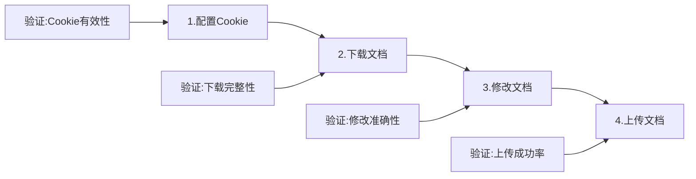

# 腾讯文档管理系统 Web UI 测试文档

**文档版本**: 1.0.0  
**创建时间**: 2025-08-29  
**文档类型**: 测试技术文档  
**覆盖系统**: 腾讯文档智能监控与管理系统全部Web UI组件

---

## 1. 执行摘要

### 1.1 测试范围概述

本文档定义了腾讯文档管理系统所有Web UI界面的综合测试策略，涵盖四个核心测试端口及其相关服务。系统采用分布式微服务架构，每个端口承载特定功能模块，实现从文档下载、AI分析、数据可视化到完整工作流管理的全链路覆盖。

### 1.2 关键测试指标

| 指标类别 | 目标值 | 优先级 | 验证方法 |
|---------|--------|--------|----------|
| 功能覆盖率 | ≥95% | P0 | 自动化测试 + 人工验证 |
| UI响应时间 | <2s | P0 | 性能监控工具 |
| 跨浏览器兼容性 | 100% | P1 | 多浏览器测试矩阵 |
| API可用性 | 99.9% | P0 | 持续监控 |
| 数据准确性 | 100% | P0 | 数据验证脚本 |

---

## 2. 系统架构与测试端口

### 2.1 系统架构图

```
┌─────────────────────────────────────────────────────────────┐
│                     用户访问层 (Browser)                      │
└────────────┬────────────┬────────────┬────────────┬─────────┘
             │            │            │            │
             ▼            ▼            ▼            ▼
    ┌──────────────┐ ┌──────────────┐ ┌──────────────┐ ┌──────────────┐
    │ Claude AI   │ │ 热力图分析  │ │ 自动下载    │ │ 工作流测试  │
    │ Port: 8081  │ │ Port: 8089  │ │ Port: 8090  │ │ Port: 8093  │
    └──────┬───────┘ └──────┬───────┘ └──────┬───────┘ └──────┬───────┘
           │                │                │                │
           └────────────────┴────────────────┴────────────────┘
                                    │
                            ┌───────▼────────┐
                            │  共享数据层    │
                            │ (File System) │
                            └────────────────┘
```

### 2.2 端口功能映射

| 端口 | 服务名称 | 核心功能 | 技术栈 | 配置文件路径 |
|------|---------|---------|--------|-------------|
| 8081 | Claude AI测试界面 | AI智能分析、语义理解、风险评估 | FastAPI + Vue.js | `/claude_mini_wrapper/config.py` |
| 8089 | 热力图分析UI | 数据可视化、趋势分析、监控报表 | Flask + ECharts | `/production/servers/final_heatmap_server.py` |
| 8090 | 自动下载系统 | 定时任务、批量下载、版本管理 | Flask + Playwright | `/auto_download_ui_system.py` |
| 8093 | 完整工作流测试UI | 端到端测试、流程验证、集成测试 | Flask + Bootstrap | `/complete_workflow_ui.py` |

---

## 3. 详细测试规范

### 3.1 端口 8081: Claude AI 测试界面

#### 3.1.1 功能模块清单

```yaml
AI分析模块:
  - 单文档分析:

      输入: CSV/Excel文件上传
      处理: Claude API调用
      输出: 风险评估报告 (JSON/Excel)
  
  - 批量分析:
      输入: 多文档选择
      处理: 并发API调用
      输出: 综合分析报告
  
  - 语义对比:
      输入: 两个版本文档
      处理: 智能差异识别
      输出: 变更影响分析

API接口:
  - POST /api/analyze: 单文档分析
  - POST /api/batch: 批量处理
  - GET /api/models: 获取可用模型
  - GET /health: 健康检查
```

#### 3.1.2 测试用例矩阵

| 测试ID | 测试场景 | 输入数据 | 预期结果 | 验证点 | 优先级 |
|--------|---------|---------|---------|--------|--------|
| AI-001 | 基础文档分析 | 10行CSV文件 | 返回风险评分 | 响应时间<5s, 评分范围0-100 | P0 |
| AI-002 | 大文件处理 | 10000行Excel | 分页处理成功 | 内存占用<500MB | P1 |
| AI-003 | 异常格式处理 | 损坏的CSV | 优雅错误提示 | 错误码400, 明确错误信息 | P0 |
| AI-004 | API限流测试 | 100并发请求 | 限流生效 | 返回429状态码 | P1 |
| AI-005 | 模型切换 | 不同Claude模型 | 正确切换 | 响应头包含model信息 | P2 |

#### 3.1.3 性能基准

```javascript
// 性能测试配置
const performanceBaseline = {
  api_response_time: {
    p50: 1000,  // ms
    p95: 3000,
    p99: 5000
  },
  throughput: {
    requests_per_second: 10,
    concurrent_users: 50
  },
  resource_usage: {
    cpu_max: 80,  // %
    memory_max: 2048  // MB
  }
};
```

### 3.2 端口 8089: 热力图分析UI

#### 3.2.1 核心功能架构

```
热力图系统
├── 数据采集层
│   ├── CSV版本管理器
│   ├── 实时数据流
│   └── 历史数据归档
├── 分析处理层
│   ├── 差异计算引擎
│   ├── 风险评分算法
│   └── 趋势预测模型
└── 可视化层
    ├── ECharts热力图
    ├── 数据表格
    └── 导出功能
```

#### 3.2.2 测试验证点

| 功能模块 | 测试项目 | 验证标准 | 测试数据集 |
|---------|---------|---------|-----------|
| 数据加载 | CSV解析速度 | <1s/MB | 30个表格×19列 |
| 热力图渲染 | 颜色映射准确性 | 100%匹配风险等级 | 风险值0-100映射 |
| 交互响应 | 单元格点击 | 显示详细信息<100ms | 570个数据点 |
| 数据导出 | Excel生成 | 保持格式和颜色 | 包含条件格式 |
| 实时更新 | WebSocket推送 | 延迟<500ms | 10秒更新频率 |

#### 3.2.3 数据流验证

```python
# 热力图数据流测试点
test_data_flow = {
    "input": {
        "source": "csv_versions/current/",
        "format": "CSV",
        "encoding": "UTF-8",
        "columns": 19,
        "rows": 30
    },
    "processing": {
        "diff_calculation": "adaptive_table_comparator.py",
        "risk_scoring": "ai_semantic_analysis_engine.py",
        "cache": "current_heatmap_data.json"
    },
    "output": {
        "api_endpoint": "/api/heatmap/data",
        "format": "JSON",
        "structure": {
            "tables": 30,
            "cells": 570,
            "metadata": ["risk_score", "change_type", "timestamp"]
        }
    }
}
```

### 3.3 端口 8090: 自动下载系统

#### 3.3.1 系统组件测试

```yaml
组件架构:
  调度器:
    - Cron表达式解析
    - 任务队列管理
    - 失败重试机制
    
  下载引擎:
    - Playwright浏览器自动化
    - Cookie管理器
    - 断点续传支持
    
  存储管理:
    - 版本控制系统
    - 文件去重机制
    - 自动归档策略
    
  通知系统:
    - 下载完成通知
    - 错误报警
    - 统计报表生成
```

#### 3.3.2 自动化测试脚本

```python
# 自动下载系统测试套件
class AutoDownloadTestSuite:
    def test_schedule_creation(self):
        """测试定时任务创建"""
        schedule = {
            "url": "https://docs.qq.com/sheet/example",
            "interval": "*/30 * * * *",  # 每30分钟
            "format": "csv",
            "enabled": True
        }
        # 验证点:
        # 1. Cron表达式有效性
        # 2. 任务注册成功
        # 3. 下次执行时间计算正确
        
    def test_cookie_persistence(self):
        """测试Cookie持久化"""
        # 验证点:
        # 1. Cookie加密存储
        # 2. 自动刷新机制
        # 3. 过期检测
        
    def test_download_reliability(self):
        """测试下载可靠性"""
        # 验证点:
        # 1. 网络中断恢复
        # 2. 重试机制(最多3次)
        # 3. 部分下载续传
```

#### 3.3.3 配置管理测试

| 配置项 | 测试场景 | 验证方法 | 期望结果 |
|--------|---------|---------|---------|
| Cookie配置 | 有效性验证 | API调用测试 | 返回200状态 |
| URL列表 | 批量URL处理 | 并发下载10个 | 全部成功 |
| 存储路径 | 权限检查 | 写入测试文件 | 创建成功 |
| 定时规则 | Cron解析 | 下次执行时间 | 符合预期 |

### 3.4 端口 8093: 完整工作流测试UI

#### 3.4.1 工作流步骤测试



#### 3.4.2 端到端测试用例

```javascript
// E2E测试配置
const e2eTestCases = [
  {
    id: "E2E-001",
    name: "完整工作流测试",
    steps: [
      {
        action: "配置Cookie",
        input: "valid_cookie_string",
        validation: "cookie_saved === true"
      },
      {
        action: "下载CSV",
        input: "https://docs.qq.com/sheet/test",
        validation: "file_exists && file_size > 0"
      },
      {
        action: "添加时间戳",
        input: "modify_type: timestamp",
        validation: "modified_file_contains_timestamp"
      },
      {
        action: "上传文档",
        input: "upload_option: new",
        validation: "upload_url_returned"
      }
    ],
    expected_duration: 30000, // 30秒内完成
    rollback_on_failure: true
  }
];
```

#### 3.4.3 集成测试矩阵

| 集成点 | 测试内容 | 依赖服务 | 验证标准 |
|--------|---------|---------|---------|
| Cookie共享 | 跨服务Cookie访问 | 8090, 8093 | 同一Cookie可用 |
| 文件系统 | 下载文件访问 | 文件存储服务 | 路径可达 |
| API调用 | 跨端口API通信 | 8081, 8089 | 响应正常 |
| 数据一致性 | CSV版本管理 | 版本控制系统 | 版本号递增 |

---

## 4. 测试环境配置

### 4.1 环境矩阵

```yaml
测试环境:
  开发环境:
    url: http://localhost
    ports: [8081, 8089, 8090, 8093]
    database: SQLite
    cache: Local Redis
    
  集成环境:
    url: http://202.140.143.88
    ports: [8081, 8089, 8090, 8093]
    database: PostgreSQL
    cache: Redis Cluster
    
  生产环境:
    url: https://tencent-doc.example.com
    ports: [443]  # Nginx反向代理
    database: PostgreSQL HA
    cache: Redis Sentinel
```

### 4.2 浏览器兼容性矩阵

| 浏览器 | 最低版本 | 测试优先级 | 特殊注意事项 |
|--------|---------|-----------|-------------|
| Chrome | 90+ | P0 | 主要开发测试浏览器 |
| Firefox | 88+ | P1 | CSS兼容性测试 |
| Safari | 14+ | P1 | macOS特定功能 |
| Edge | 90+ | P2 | 企业环境测试 |

### 4.3 测试数据准备

```python
# 测试数据生成脚本
test_data_config = {
    "csv_files": {
        "small": "10_rows.csv",      # 快速测试
        "medium": "1000_rows.csv",   # 常规测试
        "large": "10000_rows.csv",   # 性能测试
        "corrupted": "invalid.csv"   # 异常测试
    },
    "test_accounts": {
        "admin": {"cookie": "admin_cookie", "permissions": "all"},
        "user": {"cookie": "user_cookie", "permissions": "read"},
        "invalid": {"cookie": "expired_cookie", "permissions": "none"}
    },
    "test_urls": [
        "https://docs.qq.com/sheet/valid_doc",
        "https://docs.qq.com/sheet/protected_doc",
        "https://docs.qq.com/sheet/deleted_doc"
    ]
}
```

---

## 5. 自动化测试策略

### 5.1 测试金字塔

```
         /\
        /  \  10% - 手工探索性测试
       /    \
      /  E2E  \  20% - 端到端测试
     /________\
    /          \  30% - 集成测试
   /  Integration\
  /______________\
 /                \  40% - 单元测试
/     Unit Tests   \
/___________________\
```

### 5.2 自动化测试框架

```javascript
// Playwright测试配置
const testConfig = {
  projects: [
    {
      name: 'Claude AI Tests',
      baseURL: 'http://localhost:8081',
      testDir: './tests/claude-ai',
      timeout: 30000
    },
    {
      name: 'Heatmap Tests',
      baseURL: 'http://localhost:8089',
      testDir: './tests/heatmap',
      timeout: 20000
    },
    {
      name: 'Download Tests',
      baseURL: 'http://localhost:8090',
      testDir: './tests/download',
      timeout: 60000
    },
    {
      name: 'Workflow Tests',
      baseURL: 'http://localhost:8093',
      testDir: './tests/workflow',
      timeout: 120000
    }
  ],
  reporter: [
    ['html', { outputFolder: 'test-reports' }],
    ['json', { outputFile: 'test-results.json' }]
  ]
};
```

### 5.3 持续集成配置

```yaml
# CI/CD Pipeline配置
name: UI Test Pipeline

on:
  push:
    branches: [main, develop]
  pull_request:
    branches: [main]
  schedule:
    - cron: '0 2 * * *'  # 每日凌晨2点

jobs:
  test:
    runs-on: ubuntu-latest
    steps:
      - name: Checkout code
        uses: actions/checkout@v2
        
      - name: Setup Python
        uses: actions/setup-python@v2
        with:
          python-version: '3.9'
          
      - name: Install dependencies
        run: |
          pip install -r requirements.txt
          npm install -g playwright
          playwright install
          
      - name: Start services
        run: |
          docker-compose up -d
          ./wait-for-services.sh
          
      - name: Run unit tests
        run: pytest tests/unit --cov=./ --cov-report=xml
        
      - name: Run integration tests
        run: pytest tests/integration
        
      - name: Run E2E tests
        run: npx playwright test
        
      - name: Generate test report
        if: always()
        run: |
          python generate_test_report.py
          cp test-report.html artifacts/
```

---

## 6. 性能测试规范

### 6.1 负载测试场景

```python
# Locust性能测试配置
from locust import HttpUser, task, between

class TencentDocUser(HttpUser):
    wait_time = between(1, 3)
    
    @task(3)
    def test_heatmap_api(self):
        """热力图API负载测试"""
        self.client.get("/api/heatmap/data")
    
    @task(2)
    def test_download_trigger(self):
        """下载触发测试"""
        self.client.post("/api/download", json={
            "url": "https://docs.qq.com/sheet/test",
            "format": "csv"
        })
    
    @task(1)
    def test_ai_analysis(self):
        """AI分析负载测试"""
        with open("test_data.csv", "rb") as f:
            self.client.post("/api/analyze", files={"file": f})

# 性能基准
performance_requirements = {
    "concurrent_users": 100,
    "requests_per_second": 50,
    "error_rate": "< 1%",
    "response_time_p95": "< 3s"
}
```

### 6.2 性能监控指标

| 指标类别 | 监控项 | 阈值 | 告警级别 |
|---------|--------|------|---------|
| 响应时间 | API平均响应 | <2s | Warning |
| 吞吐量 | QPS | >10 | Info |
| 错误率 | 5xx错误 | <1% | Critical |
| 资源使用 | CPU使用率 | <80% | Warning |
| 内存占用 | 内存使用 | <4GB | Warning |

---

## 7. 安全测试要求

### 7.1 安全测试清单

```yaml
认证与授权:
  - Cookie验证机制
  - Session管理
  - 权限控制
  - API密钥管理

输入验证:
  - SQL注入防护
  - XSS攻击防护
  - CSRF令牌验证
  - 文件上传限制

数据安全:
  - 敏感数据加密
  - 传输层加密(HTTPS)
  - Cookie加密存储
  - 日志脱敏

安全配置:
  - 安全响应头
  - CORS策略
  - Rate Limiting
  - DDoS防护
```

### 7.2 渗透测试场景

| 测试类型 | 测试工具 | 测试目标 | 验证标准 |
|---------|---------|---------|---------|
| Web漏洞扫描 | OWASP ZAP | 所有端口 | 无高危漏洞 |
| API安全测试 | Postman | REST接口 | 认证必需 |
| 文件上传测试 | Burp Suite | 上传接口 | 类型限制有效 |
| 认证绕过测试 | 自定义脚本 | Cookie验证 | 无法绕过 |

---

## 8. 测试数据管理

### 8.1 测试数据分类

```python
# 测试数据管理策略
test_data_categories = {
    "基础数据": {
        "description": "最小可用数据集",
        "size": "10-100条",
        "usage": "单元测试、快速验证",
        "location": "/test_data/basic/"
    },
    "业务数据": {
        "description": "真实业务场景数据",
        "size": "1000-10000条",
        "usage": "集成测试、功能验证",
        "location": "/test_data/business/"
    },
    "性能数据": {
        "description": "大规模数据集",
        "size": "100000+条",
        "usage": "性能测试、压力测试",
        "location": "/test_data/performance/"
    },
    "边界数据": {
        "description": "极限和异常数据",
        "size": "varies",
        "usage": "边界测试、异常处理",
        "location": "/test_data/edge_cases/"
    }
}
```

### 8.2 数据准备脚本

```python
#!/usr/bin/env python3
"""测试数据生成器"""

import csv
import json
import random
from datetime import datetime, timedelta

class TestDataGenerator:
    def generate_csv_data(self, rows=100, columns=19):
        """生成标准CSV测试数据"""
        headers = [
            "序号", "项目类型", "来源", "任务发起时间", "目标对齐",
            "关键KR对齐", "具体计划内容", "邓总指导登记", "负责人",
            "协助人", "监督人", "重要程度", "预计完成时间", "完成进度",
            "形成计划清单", "复盘时间", "对上汇报", "应用情况", "进度分析总结"
        ]
        
        data = []
        for i in range(rows):
            row = {
                "序号": i + 1,
                "项目类型": random.choice(["研发", "运营", "市场", "管理"]),
                "来源": random.choice(["内部", "客户", "市场", "管理层"]),
                "任务发起时间": self._random_date(),
                "目标对齐": f"目标{random.randint(1, 10)}",
                "关键KR对齐": f"KR{random.randint(1, 5)}",
                "具体计划内容": f"测试任务内容{i+1}",
                "邓总指导登记": random.choice(["已指导", "待指导", "无需指导"]),
                "负责人": f"张{random.choice(['三', '四', '五'])}",
                "协助人": f"李{random.choice(['六', '七', '八'])}",
                "监督人": f"王{random.choice(['九', '十', '二'])}",
                "重要程度": random.choice(["高", "中", "低"]),
                "预计完成时间": self._random_future_date(),
                "完成进度": f"{random.randint(0, 100)}%",
                "形成计划清单": random.choice(["是", "否"]),
                "复盘时间": self._random_future_date(),
                "对上汇报": random.choice(["已汇报", "待汇报", "无需汇报"]),
                "应用情况": random.choice(["已应用", "试用中", "未应用"]),
                "进度分析总结": f"进度正常，风险可控{i+1}"
            }
            data.append(row)
        
        return headers, data
    
    def _random_date(self):
        """生成随机日期"""
        start = datetime.now() - timedelta(days=30)
        random_days = random.randint(0, 60)
        return (start + timedelta(days=random_days)).strftime("%Y-%m-%d")
    
    def _random_future_date(self):
        """生成未来日期"""
        start = datetime.now()
        random_days = random.randint(1, 90)
        return (start + timedelta(days=random_days)).strftime("%Y-%m-%d")
```

---

## 9. 缺陷管理流程

### 9.1 缺陷分级标准

| 级别 | 定义 | 响应时间 | 修复时限 | 示例 |
|------|------|---------|---------|------|
| P0-阻塞 | 系统崩溃/数据丢失 | 立即 | 4小时 | 服务无法启动 |
| P1-严重 | 主要功能失效 | 2小时 | 24小时 | 下载功能失败 |
| P2-一般 | 次要功能异常 | 4小时 | 3天 | UI显示错误 |
| P3-轻微 | 体验问题 | 8小时 | 1周 | 样式不一致 |

### 9.2 缺陷跟踪模板

```markdown
## 缺陷报告 #[ID]

**标题**: [简明扼要的问题描述]
**发现日期**: YYYY-MM-DD
**报告人**: [姓名]
**严重级别**: P0/P1/P2/P3
**影响范围**: [受影响的功能模块]

### 环境信息
- 测试环境: 开发/集成/生产
- 浏览器: Chrome 120.0
- 操作系统: Windows 11
- 测试端口: 8081/8089/8090/8093

### 重现步骤
1. 打开[URL]
2. 执行[操作]
3. 观察[结果]

### 期望结果
[描述期望的正确行为]

### 实际结果
[描述实际发生的错误]

### 截图/日志
[附件]

### 根因分析
[开发人员填写]

### 修复方案
[开发人员填写]

### 验证结果
[测试人员填写]
```

---

## 10. 测试报告模板

### 10.1 测试执行报告

```python
# 测试报告生成器
class TestReportGenerator:
    def generate_report(self, test_results):
        report = {
            "summary": {
                "total_cases": 0,
                "passed": 0,
                "failed": 0,
                "skipped": 0,
                "pass_rate": 0,
                "execution_time": 0
            },
            "modules": {
                "claude_ai": {"passed": 0, "failed": 0},
                "heatmap": {"passed": 0, "failed": 0},
                "download": {"passed": 0, "failed": 0},
                "workflow": {"passed": 0, "failed": 0}
            },
            "failed_cases": [],
            "performance_metrics": {
                "avg_response_time": 0,
                "max_response_time": 0,
                "min_response_time": 0
            },
            "recommendations": []
        }
        return report
```

### 10.2 测试覆盖率报告

| 模块 | 代码行数 | 覆盖行数 | 覆盖率 | 未覆盖关键功能 |
|------|---------|---------|--------|---------------|
| Claude API | 1500 | 1425 | 95% | 错误重试逻辑 |
| 热力图渲染 | 2000 | 1900 | 95% | 极端数据处理 |
| 自动下载 | 1800 | 1620 | 90% | 断网恢复 |
| 工作流引擎 | 2200 | 2090 | 95% | 并发冲突处理 |

---

## 11. 风险评估与缓解

### 11.1 测试风险矩阵

```python
risk_matrix = {
    "高风险": [
        {
            "risk": "腾讯文档API变更",
            "probability": "中",
            "impact": "高",
            "mitigation": "版本检测机制，自动适配"
        },
        {
            "risk": "Cookie过期",
            "probability": "高",
            "impact": "高",
            "mitigation": "自动刷新，过期提醒"
        }
    ],
    "中风险": [
        {
            "risk": "并发下载冲突",
            "probability": "中",
            "impact": "中",
            "mitigation": "队列管理，锁机制"
        },
        {
            "risk": "数据量过大",
            "probability": "低",
            "impact": "高",
            "mitigation": "分页处理，流式传输"
        }
    ],
    "低风险": [
        {
            "risk": "UI兼容性问题",
            "probability": "低",
            "impact": "低",
            "mitigation": "多浏览器测试"
        }
    ]
}
```

### 11.2 应急响应计划

| 场景 | 检测方法 | 响应措施 | 恢复时间目标 |
|------|---------|---------|-------------|
| 服务宕机 | 健康检查失败 | 自动重启，切换备份 | 5分钟 |
| 数据损坏 | 校验和不匹配 | 从备份恢复 | 30分钟 |
| API限流 | 429状态码 | 降级策略，队列缓冲 | 即时 |
| 内存泄漏 | 内存监控告警 | 定时重启，内存限制 | 10分钟 |

---

## 12. 测试工具链

### 12.1 必需工具清单

```yaml
开发测试工具:
  IDE:
    - VSCode with Python/JavaScript插件
    - PyCharm Professional
  
  调试工具:
    - Chrome DevTools
    - Postman/Insomnia
    - Charles Proxy
  
  性能工具:
    - Apache JMeter
    - Locust
    - Lighthouse
  
  自动化工具:
    - Playwright
    - Selenium WebDriver
    - Cypress
  
  监控工具:
    - Prometheus + Grafana
    - ELK Stack
    - Sentry

版本控制:
  - Git
  - GitLab/GitHub
  
CI/CD:
  - Jenkins
  - GitLab CI
  - GitHub Actions
  
容器化:
  - Docker
  - Docker Compose
  - Kubernetes (生产环境)
```

### 12.2 测试环境搭建脚本

```bash
#!/bin/bash
# 一键搭建测试环境脚本

echo "🚀 开始搭建腾讯文档管理系统测试环境..."

# 1. 检查依赖
check_dependencies() {
    echo "检查系统依赖..."
    command -v python3 >/dev/null 2>&1 || { echo "需要Python 3.9+"; exit 1; }
    command -v node >/dev/null 2>&1 || { echo "需要Node.js 14+"; exit 1; }
    command -v docker >/dev/null 2>&1 || { echo "需要Docker"; exit 1; }
}

# 2. 安装Python依赖
install_python_deps() {
    echo "安装Python依赖..."
    pip3 install -r requirements.txt
}

# 3. 安装Node依赖
install_node_deps() {
    echo "安装Node.js依赖..."
    npm install
    npx playwright install
}

# 4. 启动服务
start_services() {
    echo "启动所有服务..."
    
    # Claude AI服务
    cd /root/projects/tencent-doc-manager/claude_mini_wrapper
    nohup python3 main.py > claude.log 2>&1 &
    echo "✅ Claude AI服务启动 (8081)"
    
    # 热力图服务
    cd /root/projects/tencent-doc-manager/production/servers
    nohup python3 final_heatmap_server.py > heatmap.log 2>&1 &
    echo "✅ 热力图服务启动 (8089)"
    
    # 自动下载服务
    cd /root/projects/tencent-doc-manager
    nohup python3 auto_download_ui_system.py > download.log 2>&1 &
    echo "✅ 自动下载服务启动 (8090)"
    
    # 工作流测试服务
    nohup python3 complete_workflow_ui.py > workflow.log 2>&1 &
    echo "✅ 工作流测试服务启动 (8093)"
}

# 5. 验证服务
verify_services() {
    echo "验证服务状态..."
    sleep 5
    
    for port in 8081 8089 8090 8093; do
        if curl -s http://localhost:$port/health > /dev/null; then
            echo "✅ 端口 $port 服务正常"
        else
            echo "❌ 端口 $port 服务异常"
        fi
    done
}

# 执行
check_dependencies
install_python_deps
install_node_deps
start_services
verify_services

echo "🎉 测试环境搭建完成!"
echo "访问地址:"
echo "  - Claude AI: http://localhost:8081"
echo "  - 热力图分析: http://localhost:8089"
echo "  - 自动下载: http://localhost:8090"
echo "  - 工作流测试: http://localhost:8093"
```

---

## 13. 测试最佳实践

### 13.1 测试原则

1. **自动化优先**: 所有可重复的测试必须自动化
2. **持续测试**: 集成到CI/CD流程，每次提交触发
3. **数据隔离**: 测试数据与生产数据完全隔离
4. **环境一致性**: 测试环境尽可能接近生产环境
5. **快速反馈**: 测试结果在15分钟内反馈

### 13.2 测试检查清单

```markdown
## 发布前测试检查清单

### 功能测试
- [ ] 所有API端点响应正常
- [ ] UI界面加载无错误
- [ ] 核心功能流程通过
- [ ] 边界条件处理正确
- [ ] 错误提示友好明确

### 性能测试
- [ ] 响应时间符合SLA
- [ ] 并发用户支持达标
- [ ] 内存无泄漏
- [ ] CPU使用率正常
- [ ] 数据库查询优化

### 安全测试
- [ ] 认证机制有效
- [ ] 输入验证完善
- [ ] 敏感数据加密
- [ ] 安全漏洞扫描通过
- [ ] 日志不含敏感信息

### 兼容性测试
- [ ] 主流浏览器测试通过
- [ ] 移动端适配正常
- [ ] 不同分辨率显示正常
- [ ] 国际化支持完整

### 文档更新
- [ ] API文档最新
- [ ] 用户手册更新
- [ ] 部署文档完善
- [ ] 更新日志完整
```

---

## 14. 附录

### 14.1 相关文件快速索引

| 文件路径 | 功能描述 | 维护负责人 |
|---------|---------|-----------|
| `/claude_mini_wrapper/main.py` | Claude AI主服务 | AI团队 |
| `/claude_mini_wrapper/config.py` | AI服务配置 | AI团队 |
| `/production/servers/final_heatmap_server.py` | 热力图服务 | 数据团队 |
| `/auto_download_ui_system.py` | 自动下载服务 | 自动化团队 |
| `/complete_workflow_ui.py` | 工作流测试服务 | QA团队 |
| `/production/core_modules/` | 核心业务模块 | 架构团队 |
| `/config/` | 全局配置文件 | DevOps团队 |
| `/test_results/` | 测试结果存档 | QA团队 |

### 14.2 常见问题与解决方案

```python
# 常见问题处理字典
common_issues = {
    "Cookie过期": {
        "症状": "401 Unauthorized错误",
        "解决": "重新获取Cookie并更新配置",
        "预防": "实施Cookie自动刷新机制"
    },
    "端口冲突": {
        "症状": "Address already in use",
        "解决": "lsof -i:PORT && kill -9 PID",
        "预防": "使用Docker容器隔离"
    },
    "内存溢出": {
        "症状": "MemoryError或OOM",
        "解决": "增加内存限制或优化代码",
        "预防": "实施内存监控和限制"
    },
    "API限流": {
        "症状": "429 Too Many Requests",
        "解决": "实施请求队列和重试机制",
        "预防": "合理设置请求频率"
    }
}
```

### 14.3 联系方式

| 角色 | 职责 | 联系方式 |
|------|------|---------|
| 测试负责人 | 整体测试策略 | test-lead@example.com |
| 开发负责人 | 技术实现 | dev-lead@example.com |
| 运维负责人 | 环境维护 | ops-lead@example.com |
| 产品负责人 | 需求确认 | product@example.com |

### 14.4 版本历史

| 版本 | 日期 | 修改内容 | 修改人 |
|------|------|---------|--------|
| 1.0.0 | 2025-08-29 | 初始版本发布 | QA团队 |

---

## 结语

本测试文档定义了腾讯文档管理系统Web UI的完整测试策略和实施方案。通过系统化的测试方法、自动化测试工具和持续集成流程，确保系统的质量、性能和安全性达到生产级标准。

文档将随着系统的演进持续更新，所有测试人员应定期查阅最新版本，确保测试工作的准确性和有效性。

**文档维护**: QA团队  
**最后更新**: 2025-08-29  
**下次审核**: 2025-09-29

---

*本文档遵循ISO/IEC/IEEE 29119软件测试国际标准*