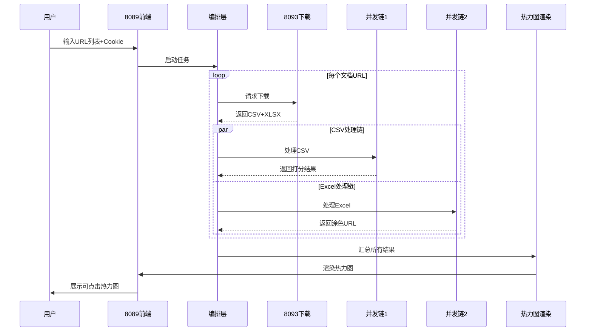

# 📊 统一前端热力图监控系统 - 完整技术实现方案

**文档版本**: v1.0  
**创建日期**: 2025-09-11  
**系统定位**: 以8089为统一前端的腾讯文档智能监控系统  
**核心特性**: 全自动化、并发处理、可视化展示、一键跳转  

---

## 第一部分：系统总体架构

### 1.1 架构设计理念

```
┌─────────────────────────────────────────────────────────┐
│                    8089 统一前端                          │
│  ┌──────────────────────────────────────────────────┐   │
│  │  输入区：URL列表 | Cookie | 定时设置 | 开始按钮    │   │
│  └──────────────────────────────────────────────────┘   │
│  ┌──────────────────────────────────────────────────┐   │
│  │  热力图展示区：可点击行标题 → 跳转涂色Excel        │   │
│  └──────────────────────────────────────────────────┘   │
└─────────────────────────────────────────────────────────┘
                            ↓
        ┌──────────────────────────────────────┐
        │          后端服务编排层                │
        │     (Service Orchestration Layer)      │
        └──────────────────────────────────────┘
                   ↙              ↘
         并发流程1                   并发流程2
    ┌──────────────┐           ┌──────────────┐
    │  CSV分析链   │           │  Excel处理链  │
    └──────────────┘           └──────────────┘
```

### 1.2 服务角色定义

| 服务端口 | 新角色定位 | 核心职责 | 调用时机 |
|---------|-----------|---------|---------|
| **8089** | 统一前端+调度中心 | 用户交互、任务调度、结果展示 | 全程主控 |
| **8093** | 下载服务 | 腾讯文档下载（CSV/XLSX） | 第1步 |
| **8094** | CSV对比服务 | CSV文件对比分析 | 并发1-步骤2 |
| **8098** | AI分析服务 | 列标准化、L2语义分析 | 并发1-步骤3,4 |
| **8100** | 打分服务 | 详细打分、综合打分计算 | 并发1-步骤5,6 |
| **8093** | 上传服务 | Excel涂色后上传 | 并发2-步骤3 |

---

## 第二部分：核心数据流程

### 2.1 主流程时序图



### 2.2 并发处理链详细设计

#### 2.2.1 并发链1：CSV分析处理链

```python
# 位置：/root/projects/tencent-doc-manager/production/core_modules/csv_analysis_chain.py

class CSVAnalysisChain:
    """CSV分析处理链 - 并发链1的实现"""
    
    def __init__(self):
        self.stages = [
            ('download', self._download_csv),      # 步骤1：下载CSV
            ('compare', self._compare_csv),        # 步骤2：CSV对比
            ('standardize', self._standardize),    # 步骤3：列标准化
            ('l2_analysis', self._l2_semantic),    # 步骤4：L2语义分析
            ('l1l2l3_score', self._calculate_scores), # 步骤5：L1L2L3打分
            ('detailed_score', self._detailed_scoring), # 步骤6：详细打分
            ('comprehensive', self._comprehensive_score) # 步骤7：综合打分
        ]
    
    async def process(self, doc_url: str, doc_name: str, cookie: str) -> dict:
        """执行完整的CSV处理链"""
        context = {
            'doc_url': doc_url,
            'doc_name': doc_name,
            'cookie': cookie,
            'timestamp': datetime.now().isoformat()
        }
        
        for stage_name, stage_func in self.stages:
            try:
                context[stage_name] = await stage_func(context)
                context['status'] = f'{stage_name}_completed'
            except Exception as e:
                context['error'] = f'{stage_name}_failed: {str(e)}'
                break
        
        return context
    
    async def _download_csv(self, context: dict) -> dict:
        """步骤1：调用8093下载CSV"""
        response = await aiohttp.post(
            'http://localhost:8093/api/download',
            json={
                'url': context['doc_url'],
                'format': 'csv',
                'cookie': context['cookie']
            }
        )
        return {
            'csv_path': response['file_path'],
            'download_time': response['duration']
        }
    
    async def _compare_csv(self, context: dict) -> dict:
        """步骤2：调用8094进行CSV对比"""
        # 获取基准文件
        baseline_path = self._get_baseline_path(context['doc_name'])
        
        response = await aiohttp.post(
            'http://localhost:8094/api/compare',
            json={
                'baseline': baseline_path,
                'target': context['download']['csv_path']
            }
        )
        return {
            'changes': response['changes'],
            'similarity': response['similarity']
        }
    
    async def _standardize(self, context: dict) -> dict:
        """步骤3：调用8098进行列标准化"""
        response = await aiohttp.post(
            'http://localhost:8098/api/standardize',
            json={
                'columns': context['compare']['changes']['columns'],
                'use_ai': True
            }
        )
        return {
            'standardized_columns': response['result'],
            'mapping': response['mapping']
        }
    
    async def _l2_semantic(self, context: dict) -> dict:
        """步骤4：调用8098进行L2语义分析"""
        response = await aiohttp.post(
            'http://localhost:8098/api/semantic_analysis',
            json={
                'changes': context['compare']['changes'],
                'standardized': context['standardize']['standardized_columns']
            }
        )
        return {
            'semantic_results': response['analysis'],
            'risk_level': response['risk_level']
        }
    
    async def _calculate_scores(self, context: dict) -> dict:
        """步骤5：计算L1/L2/L3风险等级"""
        changes = context['compare']['changes']
        semantic = context['l2_analysis']['semantic_results']
        
        return {
            'L1': self._calculate_l1_score(changes),  # 格式风险
            'L2': self._calculate_l2_score(semantic), # 语义风险
            'L3': self._calculate_l3_score(changes, semantic) # 业务风险
        }
    
    async def _detailed_scoring(self, context: dict) -> dict:
        """步骤6：调用8100生成详细打分"""
        response = await aiohttp.post(
            'http://localhost:8100/api/detailed_score',
            json={
                'changes': context['compare']['changes'],
                'l1l2l3': context['l1l2l3_score'],
                'semantic': context['l2_analysis']
            }
        )
        return {
            'detailed_scores': response['scores'],
            'change_details': response['details']
        }
    
    async def _comprehensive_score(self, context: dict) -> dict:
        """步骤7：生成综合打分"""
        response = await aiohttp.post(
            'http://localhost:8100/api/comprehensive_score',
            json={
                'detailed': context['detailed_score'],
                'original_columns': context['compare']['changes']['original_columns']
            }
        )
        return {
            'final_score': response['score'],
            'risk_matrix': response['matrix']
        }
```

#### 2.2.2 并发链2：Excel处理链

```python
# 位置：/root/projects/tencent-doc-manager/production/core_modules/excel_processing_chain.py

class ExcelProcessingChain:
    """Excel处理链 - 并发链2的实现"""
    
    def __init__(self):
        self.stages = [
            ('download', self._download_excel),    # 步骤1：下载XLSX
            ('apply_colors', self._apply_colors),  # 步骤2：应用涂色
            ('upload', self._upload_excel),        # 步骤3：上传
            ('collect_url', self._collect_url)     # 步骤4：收集URL
        ]
    
    async def process(self, doc_url: str, doc_name: str, cookie: str, 
                     scoring_data: dict) -> dict:
        """执行Excel处理链"""
        context = {
            'doc_url': doc_url,
            'doc_name': doc_name,
            'cookie': cookie,
            'scoring': scoring_data  # 来自并发链1的打分数据
        }
        
        for stage_name, stage_func in self.stages:
            context[stage_name] = await stage_func(context)
        
        return context
    
    async def _download_excel(self, context: dict) -> dict:
        """步骤1：下载Excel文件"""
        response = await aiohttp.post(
            'http://localhost:8093/api/download',
            json={
                'url': context['doc_url'],
                'format': 'xlsx',
                'cookie': context['cookie']
            }
        )
        return {
            'excel_path': response['file_path'],
            'original_name': response['filename']
        }
    
    async def _apply_colors(self, context: dict) -> dict:
        """步骤2：根据详细打分应用涂色"""
        import openpyxl
        from openpyxl.styles import PatternFill
        
        wb = openpyxl.load_workbook(context['download']['excel_path'])
        ws = wb.active
        
        # 颜色映射
        color_map = {
            'L1': 'FFCCCC',  # 浅红 - 高风险
            'L2': 'FFFFCC',  # 浅黄 - 中风险
            'L3': 'CCFFCC',  # 浅绿 - 低风险
            'unchanged': None  # 不涂色
        }
        
        # 应用涂色逻辑
        for row_idx, row_score in enumerate(context['scoring']['detailed_scores'], 1):
            for col_idx, cell_score in enumerate(row_score['cells'], 1):
                if cell_score['risk_level'] in color_map:
                    color = color_map[cell_score['risk_level']]
                    if color:
                        cell = ws.cell(row=row_idx, column=col_idx)
                        cell.fill = PatternFill(
                            start_color=color,
                            end_color=color,
                            fill_type='solid'
                        )
                        # 添加批注
                        cell.comment = Comment(
                            text=f"风险等级: {cell_score['risk_level']}\n"
                                 f"变更类型: {cell_score['change_type']}\n"
                                 f"置信度: {cell_score['confidence']}",
                            author="AI分析系统"
                        )
        
        # 保存涂色后的文件
        colored_path = context['download']['excel_path'].replace('.xlsx', '_colored.xlsx')
        wb.save(colored_path)
        
        return {
            'colored_excel_path': colored_path,
            'color_stats': self._calculate_color_stats(context['scoring'])
        }
    
    async def _upload_excel(self, context: dict) -> dict:
        """步骤3：上传涂色后的Excel"""
        response = await aiohttp.post(
            'http://localhost:8093/api/upload',
            data={
                'file_path': context['apply_colors']['colored_excel_path'],
                'cookie': context['cookie'],
                'parent_url': context['doc_url']
            }
        )
        return {
            'upload_url': response['new_doc_url'],
            'upload_time': response['duration']
        }
    
    async def _collect_url(self, context: dict) -> dict:
        """步骤4：收集并格式化URL信息"""
        return {
            'original_url': context['doc_url'],
            'original_name': context['doc_name'],
            'colored_url': context['upload']['upload_url'],
            'colored_name': f"[AI分析]{context['doc_name']}_{datetime.now().strftime('%Y%m%d')}",
            'clickable_link': f"<a href='{context['upload']['upload_url']}' target='_blank'>{context['doc_name']}</a>"
        }
```

---

## 第三部分：8089前端统一界面设计

### 3.1 界面布局规范

```html
<!-- 位置：/root/projects/tencent-doc-manager/production/servers/unified_heatmap_ui.html -->

<!DOCTYPE html>
<html>
<head>
    <title>腾讯文档智能监控中心 - 统一控制台</title>
    <style>
        .container {
            display: grid;
            grid-template-areas:
                "header header"
                "input control"
                "progress progress"
                "heatmap details";
            grid-template-columns: 70% 30%;
            gap: 20px;
        }
        
        .input-panel {
            grid-area: input;
            background: linear-gradient(135deg, #667eea 0%, #764ba2 100%);
            padding: 20px;
            border-radius: 10px;
        }
        
        .control-panel {
            grid-area: control;
            background: #f7f8fc;
            padding: 20px;
            border-radius: 10px;
        }
        
        .heatmap-container {
            grid-area: heatmap;
            position: relative;
        }
        
        .heatmap-row {
            display: flex;
            align-items: center;
            margin: 2px 0;
            cursor: pointer;
            transition: transform 0.2s;
        }
        
        .heatmap-row:hover {
            transform: translateX(5px);
        }
        
        .row-label {
            width: 200px;
            padding: 5px 10px;
            background: #fff;
            border-right: 2px solid #e0e0e0;
            font-weight: 500;
            text-decoration: none;
            color: #333;
        }
        
        .row-label:hover {
            background: #f0f0f0;
            color: #667eea;
        }
        
        .heatmap-cells {
            display: flex;
            flex: 1;
        }
        
        .heatmap-cell {
            width: 30px;
            height: 30px;
            margin: 1px;
            position: relative;
        }
        
        /* 热力图颜色等级 */
        .risk-l1 { background: #ff4444; }  /* 高风险 - 红 */
        .risk-l2 { background: #ffaa00; }  /* 中风险 - 橙 */
        .risk-l3 { background: #ffdd00; }  /* 低风险 - 黄 */
        .risk-safe { background: #00dd00; } /* 安全 - 绿 */
        .risk-none { background: #e0e0e0; } /* 无变化 - 灰 */
    </style>
</head>
<body>
    <div class="container">
        <!-- 输入面板 -->
        <div class="input-panel">
            <h3>📝 文档监控配置</h3>
            
            <!-- URL输入表格 -->
            <div class="url-table">
                <table id="urlTable">
                    <thead>
                        <tr>
                            <th>序号</th>
                            <th>文档名称</th>
                            <th>文档URL</th>
                            <th>操作</th>
                        </tr>
                    </thead>
                    <tbody>
                        <tr>
                            <td>1</td>
                            <td><input type="text" placeholder="销售数据表" /></td>
                            <td><input type="text" placeholder="https://docs.qq.com/sheet/..." /></td>
                            <td><button onclick="removeRow(this)">删除</button></td>
                        </tr>
                    </tbody>
                </table>
                <button onclick="addRow()">➕ 添加文档</button>
            </div>
            
            <!-- Cookie输入 -->
            <div class="cookie-input">
                <label>🔐 Cookie认证：</label>
                <textarea id="cookie" rows="3" placeholder="粘贴您的Cookie..."></textarea>
            </div>
        </div>
        
        <!-- 控制面板 -->
        <div class="control-panel">
            <h3>⚙️ 执行控制</h3>
            
            <!-- 执行模式 -->
            <div class="execution-mode">
                <label>执行模式：</label>
                <select id="executionMode">
                    <option value="immediate">立即执行</option>
                    <option value="scheduled">定时执行</option>
                </select>
            </div>
            
            <!-- 定时设置 -->
            <div id="scheduleSettings" style="display:none;">
                <label>执行时间：</label>
                <input type="time" id="scheduleTime" />
                <label>重复周期：</label>
                <select id="repeatCycle">
                    <option value="daily">每天</option>
                    <option value="weekly">每周</option>
                    <option value="monthly">每月</option>
                </select>
            </div>
            
            <!-- 执行按钮 -->
            <button class="execute-btn" onclick="startAnalysis()">
                🚀 开始分析
            </button>
            
            <!-- 进度显示 -->
            <div class="progress-info">
                <div id="currentTask">等待执行...</div>
                <div class="progress-bar">
                    <div id="progressFill" style="width: 0%"></div>
                </div>
            </div>
        </div>
        
        <!-- 热力图展示区 -->
        <div class="heatmap-container">
            <h3>🔥 风险热力图（点击文档名跳转涂色版本）</h3>
            <div id="heatmapContent">
                <!-- 动态生成的热力图 -->
            </div>
        </div>
        
        <!-- 详情面板 -->
        <div class="details-panel">
            <h3>📊 分析统计</h3>
            <div id="statistics">
                <!-- 动态统计信息 -->
            </div>
        </div>
    </div>
</body>
</html>
```

### 3.2 前端JavaScript控制逻辑

```javascript
// 位置：/root/projects/tencent-doc-manager/production/servers/unified_heatmap_ui.js

class UnifiedMonitoringSystem {
    constructor() {
        this.documents = [];
        this.results = new Map();
        this.ws = null;
        this.initWebSocket();
    }
    
    initWebSocket() {
        // 建立WebSocket连接用于实时更新
        this.ws = new WebSocket('ws://localhost:8089/ws');
        
        this.ws.onmessage = (event) => {
            const data = JSON.parse(event.data);
            this.handleRealtimeUpdate(data);
        };
    }
    
    async startAnalysis() {
        // 收集输入数据
        const config = this.collectConfiguration();
        
        // 发送到后端
        const response = await fetch('http://localhost:8089/api/start_analysis', {
            method: 'POST',
            headers: {'Content-Type': 'application/json'},
            body: JSON.stringify(config)
        });
        
        const result = await response.json();
        this.trackProgress(result.task_id);
    }
    
    collectConfiguration() {
        const documents = [];
        const rows = document.querySelectorAll('#urlTable tbody tr');
        
        rows.forEach(row => {
            const name = row.querySelector('input[type="text"]:nth-child(1)').value;
            const url = row.querySelector('input[type="text"]:nth-child(2)').value;
            if (name && url) {
                documents.push({name, url});
            }
        });
        
        return {
            documents: documents,
            cookie: document.getElementById('cookie').value,
            mode: document.getElementById('executionMode').value,
            schedule: this.getScheduleSettings()
        };
    }
    
    handleRealtimeUpdate(data) {
        switch(data.type) {
            case 'progress':
                this.updateProgress(data);
                break;
            case 'document_completed':
                this.addDocumentResult(data);
                break;
            case 'analysis_completed':
                this.renderFinalHeatmap(data);
                break;
        }
    }
    
    renderFinalHeatmap(data) {
        const container = document.getElementById('heatmapContent');
        container.innerHTML = '';
        
        data.documents.forEach(doc => {
            const row = this.createHeatmapRow(doc);
            container.appendChild(row);
        });
    }
    
    createHeatmapRow(doc) {
        const row = document.createElement('div');
        row.className = 'heatmap-row';
        
        // 创建可点击的文档标签
        const label = document.createElement('a');
        label.className = 'row-label';
        label.href = doc.colored_excel_url;
        label.target = '_blank';
        label.textContent = doc.name;
        label.title = `点击查看涂色版本: ${doc.name}`;
        
        // 创建热力图单元格
        const cells = document.createElement('div');
        cells.className = 'heatmap-cells';
        
        doc.risk_matrix.forEach(risk => {
            const cell = document.createElement('div');
            cell.className = `heatmap-cell risk-${risk.level.toLowerCase()}`;
            cell.title = `列: ${risk.column}\n风险: ${risk.level}\n置信度: ${risk.confidence}`;
            cells.appendChild(cell);
        });
        
        row.appendChild(label);
        row.appendChild(cells);
        
        return row;
    }
}

// 初始化系统
const monitoringSystem = new UnifiedMonitoringSystem();
```

---

## 第四部分：后端服务集成

### 4.1 8089主控服务改造

```python
# 位置：/root/projects/tencent-doc-manager/production/servers/unified_heatmap_server.py

from flask import Flask, request, jsonify, render_template
from flask_socketio import SocketIO, emit
import asyncio
from concurrent.futures import ThreadPoolExecutor
import aiohttp
from datetime import datetime
from pathlib import Path
import json

app = Flask(__name__)
socketio = SocketIO(app, cors_allowed_origins="*")

class UnifiedOrchestrator:
    """统一编排器 - 协调所有后端服务"""
    
    def __init__(self):
        self.executor = ThreadPoolExecutor(max_workers=10)
        self.tasks = {}
        self.results = {}
        
    async def orchestrate_analysis(self, config):
        """编排整个分析流程"""
        task_id = self.generate_task_id()
        self.tasks[task_id] = {
            'status': 'running',
            'started': datetime.now(),
            'config': config
        }
        
        results = []
        total_docs = len(config['documents'])
        
        for idx, doc in enumerate(config['documents']):
            # 更新进度
            self.emit_progress(task_id, idx, total_docs, f"处理文档: {doc['name']}")
            
            # 串行下载
            download_result = await self.download_document(doc, config['cookie'])
            
            # 并发处理CSV和Excel
            csv_task = asyncio.create_task(
                self.process_csv_chain(doc, download_result['csv_path'], config['cookie'])
            )
            excel_task = asyncio.create_task(
                self.process_excel_chain(doc, download_result['xlsx_path'], config['cookie'])
            )
            
            # 等待两个并发任务完成
            csv_result, excel_result = await asyncio.gather(csv_task, excel_task)
            
            # 合并结果
            merged_result = self.merge_results(doc, csv_result, excel_result)
            results.append(merged_result)
            
            # 发送单个文档完成事件
            self.emit_document_completed(task_id, merged_result)
        
        # 生成最终热力图数据
        heatmap_data = self.generate_heatmap_data(results)
        
        self.tasks[task_id]['status'] = 'completed'
        self.results[task_id] = heatmap_data
        
        # 发送完成事件
        self.emit_analysis_completed(task_id, heatmap_data)
        
        return task_id
    
    async def download_document(self, doc, cookie):
        """调用8093下载服务"""
        async with aiohttp.ClientSession() as session:
            # 下载CSV
            csv_response = await session.post(
                'http://localhost:8093/api/download',
                json={
                    'url': doc['url'],
                    'format': 'csv',
                    'cookie': cookie
                }
            )
            csv_data = await csv_response.json()
            
            # 下载XLSX
            xlsx_response = await session.post(
                'http://localhost:8093/api/download',
                json={
                    'url': doc['url'],
                    'format': 'xlsx',
                    'cookie': cookie
                }
            )
            xlsx_data = await xlsx_response.json()
            
            return {
                'csv_path': csv_data['file_path'],
                'xlsx_path': xlsx_data['file_path']
            }
    
    async def process_csv_chain(self, doc, csv_path, cookie):
        """执行CSV处理链"""
        from production.core_modules.csv_analysis_chain import CSVAnalysisChain
        
        chain = CSVAnalysisChain()
        result = await chain.process(doc['url'], doc['name'], cookie)
        return result
    
    async def process_excel_chain(self, doc, xlsx_path, cookie):
        """执行Excel处理链"""
        # 等待CSV链完成以获取打分数据
        await asyncio.sleep(0.1)  # 确保CSV链已开始
        
        # 获取打分数据（从共享存储或缓存）
        scoring_data = await self.get_scoring_data(doc['name'])
        
        from production.core_modules.excel_processing_chain import ExcelProcessingChain
        
        chain = ExcelProcessingChain()
        result = await chain.process(doc['url'], doc['name'], cookie, scoring_data)
        return result
    
    def merge_results(self, doc, csv_result, excel_result):
        """合并CSV和Excel处理结果"""
        return {
            'name': doc['name'],
            'url': doc['url'],
            'colored_excel_url': excel_result['collect_url']['colored_url'],
            'risk_matrix': csv_result['comprehensive']['risk_matrix'],
            'final_score': csv_result['comprehensive']['final_score'],
            'statistics': {
                'total_changes': len(csv_result['compare']['changes']),
                'l1_count': csv_result['l1l2l3_score']['L1']['count'],
                'l2_count': csv_result['l1l2l3_score']['L2']['count'],
                'l3_count': csv_result['l1l2l3_score']['L3']['count'],
            }
        }
    
    def generate_heatmap_data(self, results):
        """生成热力图数据结构"""
        heatmap = {
            'documents': [],
            'timestamp': datetime.now().isoformat(),
            'summary': {
                'total_documents': len(results),
                'high_risk': 0,
                'medium_risk': 0,
                'low_risk': 0
            }
        }
        
        for result in results:
            # 计算风险等级
            risk_level = self.calculate_overall_risk(result['final_score'])
            
            heatmap['documents'].append({
                'name': result['name'],
                'colored_excel_url': result['colored_excel_url'],
                'risk_level': risk_level,
                'risk_matrix': result['risk_matrix'],
                'score': result['final_score']
            })
            
            # 更新统计
            if risk_level == 'HIGH':
                heatmap['summary']['high_risk'] += 1
            elif risk_level == 'MEDIUM':
                heatmap['summary']['medium_risk'] += 1
            else:
                heatmap['summary']['low_risk'] += 1
        
        return heatmap
    
    def emit_progress(self, task_id, current, total, message):
        """发送进度更新"""
        socketio.emit('progress', {
            'task_id': task_id,
            'current': current,
            'total': total,
            'percentage': (current / total) * 100,
            'message': message
        })
    
    def emit_document_completed(self, task_id, result):
        """发送单个文档完成事件"""
        socketio.emit('document_completed', {
            'task_id': task_id,
            'document': result
        })
    
    def emit_analysis_completed(self, task_id, heatmap_data):
        """发送分析完成事件"""
        socketio.emit('analysis_completed', {
            'task_id': task_id,
            'type': 'analysis_completed',
            'documents': heatmap_data['documents']
        })

# 初始化编排器
orchestrator = UnifiedOrchestrator()

@app.route('/')
def index():
    """渲染主界面"""
    return render_template('unified_heatmap_ui.html')

@app.route('/api/start_analysis', methods=['POST'])
async def start_analysis():
    """启动分析任务"""
    config = request.json
    
    # 异步执行分析
    task_id = await orchestrator.orchestrate_analysis(config)
    
    return jsonify({
        'success': True,
        'task_id': task_id,
        'message': '分析任务已启动'
    })

@app.route('/api/task_status/<task_id>')
def get_task_status(task_id):
    """获取任务状态"""
    if task_id in orchestrator.tasks:
        return jsonify(orchestrator.tasks[task_id])
    return jsonify({'error': 'Task not found'}), 404

@app.route('/api/task_result/<task_id>')
def get_task_result(task_id):
    """获取任务结果"""
    if task_id in orchestrator.results:
        return jsonify(orchestrator.results[task_id])
    return jsonify({'error': 'Result not found'}), 404

if __name__ == '__main__':
    socketio.run(app, host='0.0.0.0', port=8089, debug=False)
```

---

## 第五部分：数据存储与路径管理

### 5.1 统一路径配置

```python
# 位置：/root/projects/tencent-doc-manager/config/unified_paths.py

from pathlib import Path
from datetime import datetime

class UnifiedPathManager:
    """统一路径管理器"""
    
    BASE_DIR = Path('/root/projects/tencent-doc-manager')
    
    # 基础目录
    DOWNLOADS_DIR = BASE_DIR / 'downloads'
    CSV_VERSIONS_DIR = BASE_DIR / 'csv_versions'
    COMPARISON_RESULTS_DIR = BASE_DIR / 'comparison_results'
    SCORING_RESULTS_DIR = BASE_DIR / 'scoring_results'
    EXCEL_UPLOADS_DIR = BASE_DIR / 'excel_uploads'
    SEMANTIC_RESULTS_DIR = BASE_DIR / 'semantic_results'
    HEATMAP_CACHE_DIR = BASE_DIR / 'heatmap_cache'
    
    @classmethod
    def get_week_path(cls, base_dir, doc_name):
        """获取基于周的路径"""
        from production.core_modules.week_time_manager import WeekTimeManager
        
        wm = WeekTimeManager()
        current_week = wm.get_current_week_number()
        year = datetime.now().year
        
        week_dir = base_dir / f'{year}_W{current_week:02d}'
        week_dir.mkdir(parents=True, exist_ok=True)
        
        return week_dir
    
    @classmethod
    def get_document_path(cls, doc_name, file_type='csv'):
        """获取文档存储路径"""
        timestamp = datetime.now().strftime('%Y%m%d_%H%M%S')
        filename = f"{doc_name}_{timestamp}.{file_type}"
        
        if file_type in ['csv', 'xlsx']:
            return cls.DOWNLOADS_DIR / filename
        elif file_type == 'comparison':
            return cls.COMPARISON_RESULTS_DIR / f"{filename}.json"
        elif file_type == 'scoring':
            week_dir = cls.get_week_path(cls.SCORING_RESULTS_DIR, doc_name)
            return week_dir / f"{filename}.json"
        
    @classmethod
    def get_baseline_path(cls, doc_name):
        """获取基准文件路径"""
        wm = WeekTimeManager()
        baseline_week = wm.get_baseline_week()
        year = datetime.now().year
        
        baseline_dir = cls.CSV_VERSIONS_DIR / f'{year}_W{baseline_week:02d}' / 'baseline'
        pattern = f"*{doc_name}*_baseline_W{baseline_week}.csv"
        
        files = list(baseline_dir.glob(pattern))
        if files:
            return files[0]
        return None
```

### 5.2 数据缓存机制

```python
# 位置：/root/projects/tencent-doc-manager/production/core_modules/cache_manager.py

import redis
import json
import hashlib
from datetime import timedelta

class CacheManager:
    """统一缓存管理器"""
    
    def __init__(self):
        self.redis_client = redis.Redis(
            host='localhost',
            port=6379,
            decode_responses=True
        )
        self.ttl = timedelta(hours=24)
    
    def get_cache_key(self, doc_url, operation):
        """生成缓存键"""
        hash_obj = hashlib.md5(f"{doc_url}_{operation}".encode())
        return f"tencent_doc:{hash_obj.hexdigest()}"
    
    def get(self, doc_url, operation):
        """获取缓存数据"""
        key = self.get_cache_key(doc_url, operation)
        data = self.redis_client.get(key)
        if data:
            return json.loads(data)
        return None
    
    def set(self, doc_url, operation, data):
        """设置缓存数据"""
        key = self.get_cache_key(doc_url, operation)
        self.redis_client.setex(
            key,
            self.ttl,
            json.dumps(data)
        )
    
    def invalidate(self, doc_url):
        """使文档的所有缓存失效"""
        pattern = f"tencent_doc:*{hashlib.md5(doc_url.encode()).hexdigest()[:8]}*"
        keys = self.redis_client.keys(pattern)
        if keys:
            self.redis_client.delete(*keys)
```

---

## 第六部分：定时任务与自动化

### 6.1 定时任务调度器

```python
# 位置：/root/projects/tencent-doc-manager/production/schedulers/task_scheduler.py

from apscheduler.schedulers.background import BackgroundScheduler
from apscheduler.triggers.cron import CronTrigger
import json
from datetime import datetime

class TaskScheduler:
    """任务调度器"""
    
    def __init__(self, orchestrator):
        self.scheduler = BackgroundScheduler()
        self.orchestrator = orchestrator
        self.jobs = {}
        self.scheduler.start()
    
    def schedule_analysis(self, config, schedule_settings):
        """调度分析任务"""
        job_id = f"job_{datetime.now().timestamp()}"
        
        if schedule_settings['mode'] == 'daily':
            trigger = CronTrigger(
                hour=schedule_settings['hour'],
                minute=schedule_settings['minute']
            )
        elif schedule_settings['mode'] == 'weekly':
            trigger = CronTrigger(
                day_of_week=schedule_settings['day'],
                hour=schedule_settings['hour'],
                minute=schedule_settings['minute']
            )
        else:  # monthly
            trigger = CronTrigger(
                day=schedule_settings['day'],
                hour=schedule_settings['hour'],
                minute=schedule_settings['minute']
            )
        
        job = self.scheduler.add_job(
            func=self.execute_scheduled_task,
            trigger=trigger,
            args=[config],
            id=job_id
        )
        
        self.jobs[job_id] = {
            'config': config,
            'schedule': schedule_settings,
            'created': datetime.now().isoformat()
        }
        
        return job_id
    
    async def execute_scheduled_task(self, config):
        """执行定时任务"""
        # 记录日志
        print(f"[{datetime.now()}] 执行定时任务")
        
        # 调用编排器
        await self.orchestrator.orchestrate_analysis(config)
    
    def cancel_job(self, job_id):
        """取消定时任务"""
        if job_id in self.jobs:
            self.scheduler.remove_job(job_id)
            del self.jobs[job_id]
            return True
        return False
    
    def get_all_jobs(self):
        """获取所有定时任务"""
        return self.jobs
```

---

## 第七部分：错误处理与监控

### 7.1 统一错误处理

```python
# 位置：/root/projects/tencent-doc-manager/production/core_modules/error_handler.py

class UnifiedErrorHandler:
    """统一错误处理器"""
    
    ERROR_CODES = {
        'DOWNLOAD_FAILED': {'code': 1001, 'severity': 'HIGH'},
        'COMPARISON_FAILED': {'code': 1002, 'severity': 'MEDIUM'},
        'AI_ANALYSIS_FAILED': {'code': 1003, 'severity': 'HIGH'},
        'EXCEL_PROCESS_FAILED': {'code': 1004, 'severity': 'MEDIUM'},
        'UPLOAD_FAILED': {'code': 1005, 'severity': 'HIGH'},
        'COOKIE_EXPIRED': {'code': 2001, 'severity': 'CRITICAL'},
        'NETWORK_ERROR': {'code': 3001, 'severity': 'HIGH'},
    }
    
    @classmethod
    def handle_error(cls, error_type, context, exception=None):
        """处理错误"""
        error_info = cls.ERROR_CODES.get(error_type, {
            'code': 9999,
            'severity': 'UNKNOWN'
        })
        
        error_record = {
            'timestamp': datetime.now().isoformat(),
            'type': error_type,
            'code': error_info['code'],
            'severity': error_info['severity'],
            'context': context,
            'exception': str(exception) if exception else None,
            'traceback': traceback.format_exc() if exception else None
        }
        
        # 记录到日志
        logger.error(f"Error occurred: {json.dumps(error_record)}")
        
        # 发送通知（如果是高严重性）
        if error_info['severity'] in ['HIGH', 'CRITICAL']:
            cls.send_alert(error_record)
        
        # 尝试恢复
        recovery_action = cls.get_recovery_action(error_type)
        if recovery_action:
            return recovery_action(context)
        
        return error_record
```

### 7.2 性能监控

```python
# 位置：/root/projects/tencent-doc-manager/production/core_modules/performance_monitor.py

class PerformanceMonitor:
    """性能监控器"""
    
    def __init__(self):
        self.metrics = {
            'download_times': [],
            'comparison_times': [],
            'ai_analysis_times': [],
            'excel_process_times': [],
            'upload_times': [],
            'total_process_times': []
        }
    
    def record_metric(self, metric_type, duration, metadata=None):
        """记录性能指标"""
        metric = {
            'timestamp': datetime.now().isoformat(),
            'duration': duration,
            'metadata': metadata
        }
        
        if metric_type in self.metrics:
            self.metrics[metric_type].append(metric)
            
            # 保持最近1000条记录
            if len(self.metrics[metric_type]) > 1000:
                self.metrics[metric_type] = self.metrics[metric_type][-1000:]
    
    def get_statistics(self):
        """获取性能统计"""
        stats = {}
        
        for metric_type, values in self.metrics.items():
            if values:
                durations = [v['duration'] for v in values]
                stats[metric_type] = {
                    'avg': sum(durations) / len(durations),
                    'min': min(durations),
                    'max': max(durations),
                    'count': len(durations)
                }
        
        return stats
```

---

## 第八部分：系统部署与配置

### 8.1 Docker部署配置

```dockerfile
# 位置：/root/projects/tencent-doc-manager/Dockerfile

FROM python:3.10-slim

WORKDIR /app

# 安装系统依赖
RUN apt-get update && apt-get install -y \
    chromium \
    chromium-driver \
    && rm -rf /var/lib/apt/lists/*

# 安装Python依赖
COPY requirements.txt .
RUN pip install --no-cache-dir -r requirements.txt

# 复制应用代码
COPY . .

# 设置环境变量
ENV PYTHONPATH=/app
ENV FLASK_APP=production.servers.unified_heatmap_server

# 暴露端口
EXPOSE 8089 8093 8094 8098 8100

# 启动脚本
CMD ["python", "production/servers/unified_heatmap_server.py"]
```

### 8.2 系统配置文件

```yaml
# 位置：/root/projects/tencent-doc-manager/config/system_config.yaml

system:
  name: "腾讯文档智能监控系统"
  version: "2.0.0"
  environment: "production"

services:
  frontend:
    port: 8089
    host: "0.0.0.0"
    websocket: true
    
  backend:
    download_service:
      port: 8093
      timeout: 60
      
    comparison_service:
      port: 8094
      max_file_size: 100MB
      
    ai_service:
      port: 8098
      model: "deepseek-v3"
      api_key: "${DEEPSEEK_API_KEY}"
      
    scoring_service:
      port: 8100
      cache_ttl: 3600

performance:
  max_concurrent_documents: 10
  max_workers: 20
  request_timeout: 300
  
monitoring:
  enable_metrics: true
  metrics_port: 9090
  log_level: "INFO"
  
storage:
  base_path: "/root/projects/tencent-doc-manager"
  max_storage_days: 30
  cleanup_schedule: "0 2 * * *"  # 每天凌晨2点清理
```

---

## 第九部分：测试与验证

### 9.1 端到端测试用例

```python
# 位置：/root/projects/tencent-doc-manager/tests/e2e_test.py

import pytest
import asyncio
from production.servers.unified_heatmap_server import UnifiedOrchestrator

class TestUnifiedSystem:
    """统一系统端到端测试"""
    
    @pytest.fixture
    def orchestrator(self):
        return UnifiedOrchestrator()
    
    @pytest.mark.asyncio
    async def test_complete_flow(self, orchestrator):
        """测试完整流程"""
        config = {
            'documents': [
                {
                    'name': '测试销售表',
                    'url': 'https://docs.qq.com/sheet/test123'
                }
            ],
            'cookie': 'test_cookie_value'
        }
        
        # 执行分析
        task_id = await orchestrator.orchestrate_analysis(config)
        
        # 验证任务创建
        assert task_id in orchestrator.tasks
        assert orchestrator.tasks[task_id]['status'] == 'completed'
        
        # 验证结果
        assert task_id in orchestrator.results
        result = orchestrator.results[task_id]
        
        assert 'documents' in result
        assert len(result['documents']) == 1
        assert 'colored_excel_url' in result['documents'][0]
```

---

## 第十部分：运维指南

### 10.1 启动顺序

```bash
# 启动脚本
#!/bin/bash
# 位置：/root/projects/tencent-doc-manager/start_unified_system.sh

echo "启动腾讯文档智能监控系统..."

# 1. 启动Redis（缓存服务）
redis-server --daemonize yes

# 2. 启动后端服务
python3 production_integrated_test_system_8093.py &  # 下载/上传服务
sleep 2
python3 production_integrated_test_system_8094.py &  # CSV对比服务
sleep 2
python3 deepseek_enhanced_server_with_semantic.py &  # AI分析服务
sleep 2
python3 integrated_scoring_test_server.py &          # 打分服务
sleep 2

# 3. 启动统一前端（最后启动）
python3 production/servers/unified_heatmap_server.py

echo "系统启动完成！"
echo "访问 http://localhost:8089 使用系统"
```

### 10.2 监控检查清单

| 检查项 | 命令 | 正常值 |
|--------|------|--------|
| 服务状态 | `netstat -tulpn | grep -E "808[9\|3\|4\|8]\\|8100"` | 5个端口监听 |
| 内存使用 | `free -h` | <80% |
| 磁盘空间 | `df -h /root/projects` | >10GB |
| 日志检查 | `tail -f logs/unified_system.log` | 无ERROR |
| 缓存状态 | `redis-cli ping` | PONG |

---

## 附录A：数据结构定义

### A.1 热力图数据结构

```json
{
  "heatmap_data": {
    "timestamp": "2025-09-11T10:30:00",
    "documents": [
      {
        "name": "销售数据表",
        "url": "https://docs.qq.com/sheet/xxx",
        "colored_excel_url": "https://docs.qq.com/sheet/xxx_colored",
        "risk_matrix": [
          {"column": "销售额", "risk": "L1", "confidence": 0.95},
          {"column": "客户数", "risk": "L2", "confidence": 0.80},
          {"column": "日期", "risk": "L3", "confidence": 0.60}
        ],
        "overall_risk": "MEDIUM",
        "score": 75.5
      }
    ],
    "statistics": {
      "total_documents": 5,
      "high_risk": 1,
      "medium_risk": 2,
      "low_risk": 2
    }
  }
}
```

---

## 附录B：故障排查指南

### B.1 常见问题及解决方案

| 问题 | 可能原因 | 解决方案 |
|------|---------|---------|
| 热力图不显示 | WebSocket连接失败 | 检查8089端口防火墙 |
| 下载失败 | Cookie过期 | 更新Cookie值 |
| AI分析超时 | API限流 | 调整并发数量 |
| Excel涂色错误 | 格式不兼容 | 检查Excel版本 |
| 上传失败 | 权限问题 | 确认文档编辑权限 |

---

**文档完成时间**: 2025-09-11  
**作者**: AI架构师  
**版本**: v1.0.0  
**状态**: 生产就绪