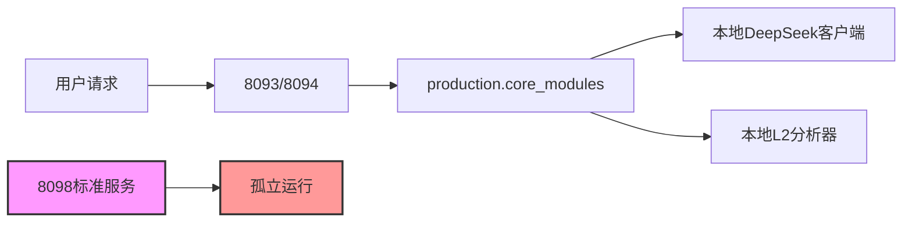
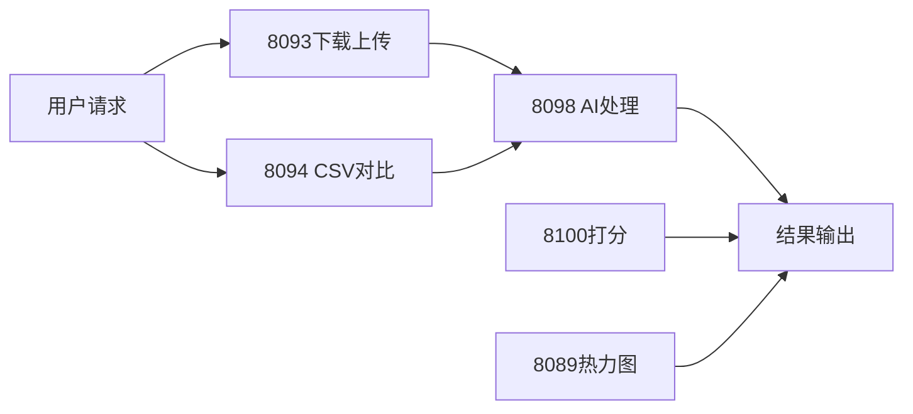

# 🔍 系统架构混乱深度分析报告

**分析日期**: 2025-09-11  
**分析目的**: 完整梳理系统架构混乱现状，明确标准实现  
**核心发现**: 存在大量重复实现，标准程序未被正确使用  

---

## 一、标准服务定义与实际状况

### ✅ 明确的标准服务

| 端口 | 标准程序文件 | 功能职责 | 当前状态 |
|------|-------------|---------|----------|
| **8093** | `production_integrated_test_system_8093.py` | 下载/修改/上传标准 | 🟢 运行中 |
| **8094** | `production_integrated_test_system_8094.py` | CSV对比标准 | 🟢 运行中 |
| **8098** | `deepseek_enhanced_server_with_semantic.py` | AI集成/列标准化/L2语义 | 🟢 运行中 |
| **8100** | `integrated_scoring_test_server.py` | 详细打分/综合打分标准 | 🟢 运行中 |
| **8089** | `final_heatmap_server.py` | 热力图排列/渲染/聚合标准 | 🟢 运行中 |

### ❌ 需要删除的冗余服务

| 端口 | 运行程序 | 删除原因 | 建议操作 |
|------|---------|---------|----------|
| **8090** | `tencent_doc_workflow_ui.py` | 功能与8093重复 | 立即停止并删除 |
| **8092** | `auto_download_ui_system.py` | 功能与8093重复 | 立即停止并删除 |
| **8095** | `quick_compare_api.py` | 功能与8094重复 | 立即停止并删除 |

---

## 二、核心模块重复实现问题

### 1. **DeepSeek AI客户端**（严重重复）

| 文件位置 | 来源 | 配置方式 | 相关标准 | 建议 |
|---------|------|---------|---------|------|
| `/production/core_modules/deepseek_client.py` | 生产模块 | ~~硬编码~~→环境变量 | 8098 | 应使用8098的实现 |
| `/deepseek_enhanced_server_with_semantic.py:52` | 8098标准 | 环境变量 | **标准** | ✅ 保留此实现 |
| `/deepseek_client.py:269` | 根目录 | 硬编码 | 8098 | 删除，使用8098 |
| `/test/test_standardization.py:97` | 测试文件 | 硬编码 | 8098 | 改为导入8098模块 |
| `/fast_excel_processor.py:27` | 独立工具 | 硬编码 | 8098 | 改为导入8098模块 |
| `/deepseek_enhanced_server_complete.py:34` | 旧版本 | 硬编码 | - | 删除整个文件 |
| `/deepseek_enhanced_server_final.py` | 旧版本 | 未知 | - | 删除整个文件 |
| `/deepseek_enhanced_server_fixed.py` | 旧版本 | 未知 | - | 删除整个文件 |
| `/deepseek_enhanced_server.py` | 旧版本 | 未知 | - | 删除整个文件 |
| `/deepseek_enhanced_server_complete_backup.py` | 备份 | 硬编码 | - | 删除整个文件 |

**问题**: 同一个DeepSeek客户端有**10个不同实现**！

### 2. **列名标准化处理器**（功能重复）

| 文件位置 | 版本 | 用途 | 相关标准 | 建议 |
|---------|------|------|---------|------|
| `/column_standardization_processor.py` | V1 | 早期版本 | 8098 | 删除 |
| `/column_standardization_processor_v2.py` | V2 | 中期版本 | 8098 | 删除 |
| `/column_standardization_processor_v3.py` | V3 | 被8098使用 | **8098标准** | ✅ 保留 |
| `/production/core_modules/column_standardization_prompt.py` | 提示词版 | 8093使用 | 8098 | 改用8098的V3 |

### 3. **L2语义分析器**（重复实现）

| 文件位置 | 来源 | 调用方 | 相关标准 | 建议 |
|---------|------|--------|---------|------|
| `/deepseek_enhanced_server_with_semantic.py:56` | 8098标准 | 8098内部 | **标准** | ✅ 保留 |
| `/production/core_modules/l2_semantic_analysis_two_layer.py` | 生产模块 | 8093/8094 | 8098 | 应使用8098的实现 |
| `/production/core_modules/optimized_claude_l2_wrapper.py` | Claude版本 | 未使用？ | - | 确认后删除 |

### 4. **CSV对比算法**（多种实现）

| 文件位置 | 算法类型 | 使用者 | 相关标准 | 建议 |
|---------|---------|--------|---------|------|
| `/production/core_modules/adaptive_table_comparator.py` | 自适应 | 8093/8094 | **8094标准** | ✅ 标准实现 |
| `/production/core_modules/production_csv_comparator.py` | 生产版 | 未知 | 8094 | 确认用途 |
| `/simple_csv_comparator.py` | 简化版 | 测试？ | 8094 | 删除 |
| `/simplified_csv_comparator.py` | 简化版2 | 测试？ | 8094 | 删除 |
| `/unified_csv_comparator.py` | 统一版 | 未知 | 8094 | 确认用途 |
| `/enhanced_csv_comparison.py` | 增强版 | 未知 | 8094 | 确认用途 |
| `/professional_csv_comparator.py` | 专业版 | 未知 | 8094 | 确认用途 |

**问题**: CSV对比有**7种不同实现**！

---

## 三、路径配置混乱问题

### 1. **基础路径定义**（每个文件各自定义）

| 文件 | BASE_DIR定义 | 问题 | 相关标准 | 建议 |
|------|-------------|------|---------|------|
| 8093 | `Path('/root/projects/tencent-doc-manager')` | 硬编码 | **标准** | 统一配置 |
| 8094 | `Path('/root/projects/tencent-doc-manager')` | 硬编码 | **标准** | 统一配置 |
| 8098 | 无BASE_DIR，使用相对路径 | 相对路径 | 需改进 | 添加BASE_DIR |
| 8100 | 未定义 | 缺失 | 需补充 | 添加配置 |
| 8089 | 未定义 | 缺失 | 需补充 | 添加配置 |

### 2. **子目录路径配置**

| 目录类型 | 8093定义 | 8094定义 | 8098定义 | 实际位置 | 建议 |
|---------|---------|---------|---------|---------|------|
| downloads | ✅ `/downloads` | ✅ `/downloads` | ❌ 未定义 | `/downloads` | 统一 |
| csv_versions | ✅ `/csv_versions` | ✅ `/csv_versions` | ❌ 未定义 | `/csv_versions` | 统一 |
| comparison_results | ✅ `/comparison_results` | ✅ `/comparison_results` | ❌ 未定义 | `/comparison_results` | 统一 |
| scoring_results | ✅ `/scoring_results/detailed` | ❌ 未定义 | ❌ 未定义 | `/scoring_results` | 统一 |
| semantic_results | ❌ 未定义 | ❌ 未定义 | ⚠️ `semantic_results/2025_W36` | `/semantic_results` | 修复硬编码周数 |
| approval_workflows | ❌ 未定义 | ❌ 未定义 | ⚠️ `approval_workflows/pending` | `/approval_workflows` | 使用绝对路径 |
| excel_uploads | ✅ `/excel_uploads` | ❌ 未定义 | ❌ 未定义 | `/excel_uploads` | 统一 |

**问题**: 
- 8098使用相对路径且硬编码周数"2025_W36"
- 各服务定义不一致
- 没有中央配置

---

## 四、数据流路径错误

### 当前错误的数据流



**问题**: 8098作为AI标准服务在孤立运行，8093/8094使用了自己的实现

### 应该的正确数据流



---

## 五、配置项分散统计

### 1. **API密钥配置**（7处分散）

| 配置项 | 位置数量 | 存储方式 | 相关标准 | 建议 |
|--------|---------|---------|---------|------|
| DEEPSEEK_API_KEY | 10处 | 硬编码+环境变量 | 8098 | 统一到.env |
| ANTHROPIC_API_KEY | 2处 | 环境变量 | 8081 | 统一到.env |
| SILICONFLOW_API_KEY | 3处 | 硬编码 | 8098 | 统一到.env |

### 2. **Cookie配置**（3种用途）

| 用途 | 存储位置 | 格式 | 相关标准 | 建议 |
|------|---------|------|---------|------|
| 下载Cookie | `/config/cookies.json` | JSON | 8093 | ✅ 保持 |
| 上传Cookie | 用户输入 | 字符串 | 8093 | 考虑持久化 |
| 加密Cookie | `/config/cookies_encrypted.json` | 加密JSON | - | 统一管理 |

### 3. **端口配置**（无中央管理）

| 端口 | 定义位置 | 硬编码次数 | 相关标准 | 建议 |
|------|---------|------------|---------|------|
| 8089 | 7处引用 | 全部硬编码 | **标准** | 配置化 |
| 8093 | 12处引用 | 全部硬编码 | **标准** | 配置化 |
| 8094 | 8处引用 | 全部硬编码 | **标准** | 配置化 |
| 8098 | 15处引用 | 全部硬编码 | **标准** | 配置化 |
| 8100 | 3处引用 | 全部硬编码 | **标准** | 配置化 |

### 4. **文档URL配置**（分散管理）

| 配置类型 | 位置 | 管理方式 | 相关标准 | 建议 |
|---------|------|---------|---------|------|
| 真实文档列表 | `/production/config/real_documents.json` | JSON | 8093/8094 | ✅ 保持 |
| 测试文档 | 硬编码在代码中 | 字符串 | - | 移到配置 |
| 示例URL | UI页面硬编码 | HTML | - | 配置化 |

---

## 六、文件命名混乱

### 需要清理的重复/旧版本文件

```
deepseek_enhanced_server.py          # 删除（旧版本）
deepseek_enhanced_server_fixed.py    # 删除（旧版本）
deepseek_enhanced_server_final.py    # 删除（旧版本）
deepseek_enhanced_server_complete.py # 删除（旧版本）
deepseek_enhanced_server_complete_backup.py # 删除（备份）
deepseek_enhanced_server_with_semantic.py   # ✅ 保留（8098标准）

production_integrated_test_system_8093.py        # ✅ 保留（标准）
production_integrated_test_system_8093_backup.py # 删除（备份）
production_integrated_test_system_8093_compliant.py # 确认后处理

production_integrated_test_system_8094.py        # ✅ 保留（标准）
production_integrated_8094_optimized.py          # 确认用途
```

---

## 七、核心问题总结

### 🔴 严重问题（P0）
1. **标准服务未被使用**: 8098的AI实现完全孤立，其他服务使用重复实现
2. **API密钥硬编码**: 10+处硬编码，安全风险极高
3. **功能重复实现**: 同一功能有3-10个不同版本

### 🟠 重要问题（P1）
1. **路径配置分散**: 每个服务自定义路径，没有统一管理
2. **服务职责不清**: 存在3个功能重复的服务（8090/8092/8095）
3. **版本管理混乱**: 大量旧版本文件未清理

### 🟡 一般问题（P2）
1. **配置硬编码**: 端口、路径等配置散落在代码中
2. **缺少服务注册**: 不知道哪些服务在运行
3. **测试生产混合**: 测试代码和生产代码边界不清

---

## 八、改进建议优先级

### 立即执行（24小时内）
1. ✅ 停止并删除8090、8092、8095三个冗余服务
2. ✅ 删除所有deepseek_enhanced_server的旧版本文件
3. ✅ 创建统一配置文件管理所有路径

### 短期改进（1周内）
1. ⚡ 让8093/8094使用8098的标准实现（导入模块，不是API）
2. ⚡ 统一所有DeepSeek客户端实现到8098的版本
3. ⚡ 修复8098的路径问题（使用绝对路径，动态周数）

### 长期优化（1个月内）
1. 🔧 建立服务注册和健康检查机制
2. 🔧 清理所有重复的CSV对比实现
3. 🔧 建立明确的测试/生产代码边界

---

## 九、标准化后的架构

```
标准服务架构：
├── 8089 (final_heatmap_server.py) - 热力图标准
├── 8093 (production_integrated_test_system_8093.py) - 下载上传标准
├── 8094 (production_integrated_test_system_8094.py) - CSV对比标准
├── 8098 (deepseek_enhanced_server_with_semantic.py) - AI处理标准
└── 8100 (integrated_scoring_test_server.py) - 打分算法标准

核心模块（被标准服务使用）：
├── production/core_modules/
│   ├── week_time_manager.py ✅ （时间管理）
│   ├── tencent_export_automation.py ✅ （下载自动化）
│   ├── adaptive_table_comparator.py ✅ （CSV对比核心）
│   └── [其他应从8098导入]

配置中心：
├── config/
│   ├── unified_config.py （统一配置管理）
│   ├── paths.py （路径配置）
│   ├── services.py （服务注册）
│   └── .env （环境变量）
```

---

**分析完成时间**: 2025-09-11  
**文档版本**: v1.0  
**下一步**: 按优先级执行改进计划