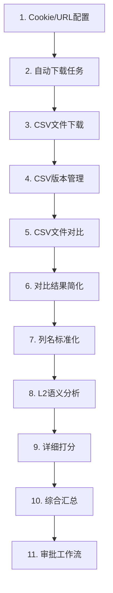

# 0000 - 腾讯文档管理系统完整存储路径索引
## Tencent Doc Manager Complete Storage Path Index

生成时间: 2025-09-08 17:00:00  
更新时间: 2025-09-12 14:30:00  
版本: 1.2.0

---

## ⚠️ 重要提示：路径一致性问题

**发现严重路径错误**（2025-09-10）:
- 🔴 **scoring_results路径错误**: 实际存储在`/root/projects/`而非文档记载的`/root/projects/tencent-doc-manager/`
- 🟡 **幽灵路径存在**: `comparison_cache`、`standard_outputs`等3个路径不存在
- 🟢 **解决方案已实施**: 创建PathManager统一管理系统，详见[路径系统深度分析与重构方案.md](./路径系统深度分析与重构方案.md)

---

## 📍 数据流完整路径图谱
### Complete Data Flow Path Map

```
Cookie/URL → 自动下载配置 → CSV下载 → CSV对比 → 简化 → 标准化 → L2语义分析 → 详细打分 → 综合汇总
```

---

## 1️⃣ Cookie与URL存储
### Cookie and URL Storage

| 步骤 | 描述 | 存储路径 | 文件格式 |
|------|------|----------|----------|
| 1.1 | Cookie主存储（用于腾讯文档认证） | `/root/projects/tencent-doc-manager/config/cookies.json` | JSON |
| 1.2 | Cookie备份（防止丢失的备份文件） | `/root/projects/tencent-doc-manager/config/cookies_backup.json` | JSON |
| 1.3 | Cookie加密存储（加密保护的敏感信息） | `/root/projects/tencent-doc-manager/config/cookies_encrypted.json` | Encrypted JSON |
| 1.4 | Cookie密钥（解密所需的密钥文件） | `/root/projects/tencent-doc-manager/config/cookie_key.key` | KEY |
| 1.5 | Cookie新版本（更新后的新Cookie） | `/root/projects/tencent-doc-manager/config/cookies_new.json` | JSON |
| 1.6 | URL配置（UI界面显示的文档链接） | `/root/projects/tencent-doc-manager/config/ui_config.json` | JSON |
| 1.7 | 真实文档配置（动态文档管理） | `/root/projects/tencent-doc-manager/config/real_documents.json` | JSON |
| 1.8 | 监控配置（持久化监控设置） | `/root/projects/tencent-doc-manager/config/monitor_config.json` | JSON |
| 1.9 | 下载链接配置（含软删除）⚡ | `/root/projects/tencent-doc-manager/config/download_config.json` | JSON（带deleted_links数组） |

---

## 2️⃣ 自动下载时间管理配置
### Auto-Download Time Management Configuration

| 步骤 | 描述 | 存储路径 | 文件格式 |
|------|------|----------|----------|
| 2.1 | 下载配置（控制下载参数和频率） | `/root/projects/tencent-doc-manager/config/download_config.json` | JSON |
| 2.2 | 定时任务配置（自动执行的时间计划） | `/root/projects/tencent-doc-manager/config/schedule_tasks.json` | JSON |
| 2.3 | 任务文件夹（批量任务存储位置） | `[已弃用 - 此路径不再使用]` | Directory |
| 2.4 | 专项任务配置（特定项目的任务配置） | `/root/projects/tencent-doc-manager/专项单个下载项目文件夹/config/tasks/` | Directory |

---

## 3️⃣ CSV下载存储
### CSV Download Storage

| 步骤 | 描述 | 存储路径 | 文件格式 |
|------|------|----------|----------|
| 3.1 | 主下载目录（手动下载的CSV文件） | `/root/projects/tencent-doc-manager/downloads/` | CSV Files |
| 3.2 | 自动下载目录（定时自动下载的文件） | `/root/projects/tencent-doc-manager/auto_downloads/` | CSV Files |
| 3.3 | 浏览器下载（通过浏览器API下载） | `/root/projects/tencent-doc-manager/browser_downloads/` | CSV Files |
| 3.4 | 企业下载系统（企业级批量下载） | `/root/projects/tencent-doc-manager/enterprise_download_system/downloads/` | CSV Files |
| 3.5 | 测试下载（测试用途的临时文件） | `/root/projects/tencent-doc-manager/test_downloads/` | CSV Files |
| 3.6 | 专项下载（特定项目的下载文件） | `/root/projects/tencent-doc-manager/专项单个下载项目文件夹/downloads/` | CSV Files |

---

## 4️⃣ CSV版本管理与同步存储
### CSV Version Management and Synchronization Storage

| 步骤 | 描述 | 存储路径 | 文件格式 |
|------|------|----------|----------|
| 4.1 | 版本根目录（所有版本的总目录） | `/root/projects/tencent-doc-manager/csv_versions/` | Directory |
| 4.2 | 当前版本（最新的活跃版本） | `/root/projects/tencent-doc-manager/csv_versions/current/` | CSV Files |
| 4.3 | 基准版本（对比的参考基准） | `/root/projects/tencent-doc-manager/csv_versions/baseline/` | CSV Files |
| 4.4 | 归档版本（历史版本备份） | `/root/projects/tencent-doc-manager/csv_versions/archive/` | CSV Files |
| 4.5 | 周版本存储（按周组织的版本） | `/root/projects/tencent-doc-manager/csv_versions/2025_W{周数}/` | Directory |
| 4.5.1 | - 基准版（周初基准文件） | `.../2025_W{周数}/baseline/` | CSV Files |
| 4.5.2 | - 周中版（周三更新文件） | `.../2025_W{周数}/midweek/` | CSV Files |
| 4.5.3 | - 周末版（周五最终文件） | `.../2025_W{周数}/weekend/` | CSV Files |
| 4.5.4 | - 基线软删除文件夹⚡ | `.../2025_W{周数}/baseline/.deleted/` | Soft-deleted Files |

**示例周目录：**
- `/root/projects/tencent-doc-manager/csv_versions/2025_W34/`
- `/root/projects/tencent-doc-manager/csv_versions/2025_W36/`
- `/root/projects/tencent-doc-manager/csv_versions/2025_W37/`
- `/root/projects/tencent-doc-manager/csv_versions/2025_W38/`
- `/root/projects/tencent-doc-manager/csv_versions/2025_W39/`
- `/root/projects/tencent-doc-manager/csv_versions/2025_W40/`

---

## 5️⃣ CSV对比存储
### CSV Comparison Storage

| 步骤 | 描述 | 存储路径 | 文件格式 |
|------|------|----------|----------|
| 5.1 | 对比结果主目录（存储所有对比结果） | `/root/projects/tencent-doc-manager/comparison_results/` | JSON Files |
| 5.2 | 对比基准目录（存储基准CSV文件） | `/root/projects/tencent-doc-manager/comparison_baseline/` | CSV Files |
| 5.3 | 对比目标目录（存储目标CSV文件） | `/root/projects/tencent-doc-manager/comparison_target/` | CSV Files |
| 5.4 | 对比缓存（提高对比速度的缓存） | `/root/projects/tencent-doc-manager/csv_versions/comparison_cache/` | ❌ 不存在 |
| 5.5 | 版本对比（版本间的差异分析） | `/root/projects/tencent-doc-manager/csv_versions/comparison/` | ❌ 不存在 |

**对比结果文件命名规范：**
```
{baseline_name}_vs_{target_name}_{timestamp}.json
```

---

## 6️⃣ CSV对比简化
### CSV Comparison Simplification

| 步骤 | 描述 | 存储路径 | 文件格式 |
|------|------|----------|----------|
| 6.1 | 简化结果（只保留修改部分的精简版） | `/root/projects/tencent-doc-manager/comparison_results/simplified_*.json` | JSON |
| 6.2 | 简化脚本（执行简化逻辑的程序） | `/root/projects/tencent-doc-manager/simplified_csv_comparator.py` | Python |

**简化文件命名规范：**
```
simplified_{source_name}_vs_{target_name}_{timestamp}.json
或
simplified_{description}_{timestamp}.json
```

**示例文件：**
- `simplified_副本-测试版本-出国销售计划表-工作表1_vs_副本-副本-测试版本-出国销售计划表-工作表1_20250906_222914.json`

---

## 7️⃣ CSV列标准化
### CSV Column Standardization

| 步骤 | 描述 | 存储路径 | 文件格式 |
|------|------|----------|----------|
| 7.1 | 标准化输出（AI标准化后的列名） | `/root/projects/tencent-doc-manager/comparison_results/simplified_*_standardized.json` | JSON |
| 7.2 | 标准化结果目录（存储标准化结果） | `/root/projects/tencent-doc-manager/csv_versions/standard_outputs/` | ❌ 不存在 |
| 7.3 | 标准化映射日志（AI映射关系记录） | `[已弃用 - 8098服务已停用]` | ⚠️ 服务停用 |

**标准化文件命名规范：**
```
simplified_{name}_standardized.json
```

**示例文件：**
- `simplified_副本-测试版本-出国销售计划表-工作表1_vs_副本-副本-测试版本-出国销售计划表-工作表1_20250906_222914_standardized.json`

---

## 8️⃣ L2语义分析结果
### L2 Semantic Analysis Results

| 步骤 | 描述 | 存储路径 | 文件格式 |
|------|------|----------|----------|
| 8.1 | 语义分析主目录（L2列AI分析结果） | `/root/projects/tencent-doc-manager/semantic_results/` | Directory |
| 8.2 | 周语义分析（按周存储的分析结果） | `/root/projects/tencent-doc-manager/semantic_results/2025_W{周数}/` | JSON |
| 8.3 | 最新分析结果（最近一次的分析） | `/root/projects/tencent-doc-manager/semantic_results/latest/` | JSON |
| 8.4 | 第一层日志（快速筛选层的日志） | `/root/projects/tencent-doc-manager/semantic_logs/layer1_logs/` | LOG |
| 8.5 | 第二层日志（深度分析层的日志） | `/root/projects/tencent-doc-manager/semantic_logs/layer2_logs/` | LOG |
| 8.6 | 性能日志（API调用性能记录） | `/root/projects/tencent-doc-manager/semantic_logs/performance_logs/` | LOG |

**L2分析文件命名规范：**
```
semantic_analysis_L2_{timestamp}.json
```

**示例文件：**
- `/root/projects/tencent-doc-manager/semantic_results/2025_W36/semantic_analysis_L2_20250908_164143.json`

---

## 9️⃣ 详细打分文件存储
### Detailed Scoring File Storage

| 步骤 | 描述 | 存储路径 | 文件格式 |
|------|------|----------|----------|
| 9.1 | **历史错误位置**（已废弃） | `/root/projects/scoring_results/detailed/` | ❌ 已迁移 |
| 9.2 | 存储逻辑说明（已修复） | integrated_scorer.py使用PathManager统一管理路径 | ✅ 已修复 |
| 9.3 | **当前正确位置**（生产使用） | `/root/projects/tencent-doc-manager/scoring_results/detailed/` | ✅ 27个文件 |

**详细打分文件命名规范：**
```
detailed_score_{simplified_name}_standardized_{timestamp}.json
```

**示例文件：**
- `detailed_score_simplified_副本-测试版本-出国销售计划表-工作表1_vs_副本-副本-测试版本-出国销售计划表-工作表1_20250906_222914_standardized_20250908_164201.json`

---

## 🔟 综合打分文件存储
### Comprehensive Scoring File Storage

| 步骤 | 描述 | 存储路径 | 文件格式 |
|------|------|----------|----------|
| 10.1 | 综合打分实际存储（已废弃路径） | `/root/projects/tencent-doc-manager/csv_security_results/` | JSON |
| 10.2 | 安全分析综合结果（项目级汇总） | `/root/projects/tencent-doc-manager/csv_security_archive/{项目名}/{项目名}_comprehensive.json` | JSON |
| 10.3 | **综合打分当前目录**（汇总所有表格） | `/root/projects/tencent-doc-manager/scoring_results/comprehensive/` | JSON（包含综合报告） |

**综合打分文件命名规范：**
```
comprehensive_score_{analysis_type}_{timestamp}.json
```

---

## 1️⃣1️⃣ 审批工作流存储
### Approval Workflow Storage

| 步骤 | 描述 | 存储路径 | 文件格式 |
|------|------|----------|----------|
| 11.1 | 待审批（等待人工审核的工作流） | `/root/projects/tencent-doc-manager/approval_workflows/pending/` | JSON |
| 11.2 | 已批准（审核通过的工作流） | `/root/projects/tencent-doc-manager/approval_workflows/approved/` | JSON |
| 11.3 | 已拒绝（审核驳回的工作流） | `/root/projects/tencent-doc-manager/approval_workflows/rejected/` | JSON |

**工作流文件命名规范：**
```
workflow_WF-L2-{timestamp}.json
```

**示例文件：**
- `workflow_WF-L2-20250908_164143.json`

---

## 1️⃣2️⃣ 安全分析存储
### Security Analysis Storage

| 步骤 | 描述 | 存储路径 | 文件格式 |
|------|------|----------|----------|
| 12.1 | 安全归档（历史安全分析备份） | `/root/projects/tencent-doc-manager/csv_security_archive/` | Various |
| 12.2 | 安全结果（当前安全分析结果） | `/root/projects/tencent-doc-manager/csv_security_results/` | JSON |

---

## 📊 核心程序位置
### Core Program Locations

| 组件 | 描述 | 文件路径 |
|------|------|----------|
| DeepSeek客户端（调用DeepSeek V3 API） | AI API调用核心 | `/root/projects/tencent-doc-manager/production/core_modules/deepseek_client.py` |
| L2语义分析器（两层AI架构实现） | 两层架构分析 | `/root/projects/tencent-doc-manager/production/core_modules/l2_semantic_analysis_two_layer.py` |
| 集成打分器（计算风险分数） | 综合打分引擎 | `/root/projects/tencent-doc-manager/production/scoring_engine/integrated_scorer.py` |
| 列名标准化器（AI列名映射） | 列名智能映射 | `/root/projects/tencent-doc-manager/production/core_modules/column_standardization_prompt.py` |
| ~~8098服务器（标准化+语义分析）~~ | ~~DeepSeek V3平台~~ | `[已弃用 - 使用内置AI服务]` |
| 8100服务器（打分系统UI界面） | 综合分析平台 | `/root/projects/tencent-doc-manager/integrated_scoring_test_server.py` |
| 简化比较器（提取修改内容） | CSV简化处理 | `/root/projects/tencent-doc-manager/simplified_csv_comparator.py` |
| 下载管理器（自动批量下载） | 自动下载控制 | `/root/projects/tencent-doc-manager/enterprise_download_system/` |

---

## 🔄 数据流处理顺序
### Data Flow Processing Sequence



---

## 📝 关键文件示例路径
### Key File Example Paths

### Cookie存储示例
```
/root/projects/tencent-doc-manager/config/cookies.json
```

### 软删除配置示例（⚡新增）
```json
// /root/projects/tencent-doc-manager/config/download_config.json
{
  "document_links": [
    {"url": "https://docs.qq.com/...", "name": "活跃文档", "enabled": true}
  ],
  "deleted_links": [
    {"url": "https://docs.qq.com/...", "name": "已删除文档", "active": false, "deleted_at": "2025-09-12T10:30:00"}
  ],
  "last_updated": "2025-09-12T10:30:00"
}
```

### 基线软删除文件夹示例（⚡新增）
```
/root/projects/tencent-doc-manager/csv_versions/2025_W37/baseline/.deleted/
├── 20250912_103000_tencent_baseline_W37.csv  # 软删除的文件，带时间戳前缀
└── 20250912_103500_tencent_test_W37.xlsx     # 软删除的Excel文件
```

### CSV下载示例
```
/root/projects/tencent-doc-manager/csv_versions/2025_W36/midweek/tencent_副本-测试版本-出国销售计划表-工作表1_csv_20250904_2256_midweek_W36.csv
```

### 对比结果示例
```
/root/projects/tencent-doc-manager/comparison_results/副本-测试版本-出国销售计划表-工作表1_vs_副本-副本-测试版本-出国销售计划表-工作表1_20250906_222914.json
```

### 简化结果示例
```
/root/projects/tencent-doc-manager/comparison_results/simplified_副本-测试版本-出国销售计划表-工作表1_vs_副本-副本-测试版本-出国销售计划表-工作表1_20250906_222914.json
```

### 标准化结果示例
```
/root/projects/tencent-doc-manager/comparison_results/simplified_副本-测试版本-出国销售计划表-工作表1_vs_副本-副本-测试版本-出国销售计划表-工作表1_20250906_222914_standardized.json
```

### L2语义分析示例
```
/root/projects/tencent-doc-manager/semantic_results/2025_W36/semantic_analysis_L2_20250908_164201.json
```

### 详细打分示例
```
/root/projects/scoring_results/detailed/detailed_score_simplified_副本-测试版本-出国销售计划表-工作表1_vs_副本-副本-测试版本-出国销售计划表-工作表1_20250906_222914_standardized_20250908_164201.json
```

### 综合打分示例
```
/root/projects/scoring_results/comprehensive/comprehensive_score_L2_analysis_20250908_164201.json
```

### 审批工作流示例
```
/root/projects/tencent-doc-manager/approval_workflows/pending/workflow_WF-L2-20250908_164201.json
```

---

## 🚀 快速访问端口
### Quick Access Ports

| 服务 | 端口 | 访问地址 | 功能描述 |
|------|------|----------|----------|
| 热力图监控系统⚡ | 8089 | http://202.140.143.88:8089 | 热力图可视化 + 基线文件管理 + URL软删除 |
| 文档处理系统 | 8093 | http://202.140.143.88:8093 | CSV下载 + 对比分析 + Excel标记上传 |
| ~~DeepSeek V3平台（AI分析服务）~~ | ~~8098~~ | `[已弃用]` | ~~列名标准化 + L2语义分析~~ |
| 综合分析平台（可视化UI） | 8100 | http://localhost:8100 | 详细打分 + 综合汇总 |

---

## 📌 重要说明
### Important Notes

1. **路径格式**：所有路径均为绝对路径，从根目录 `/root/projects/` 开始（确保路径准确性）
2. **时间戳格式**：`YYYYMMDD_HHMMSS` 例如 `20250908_164201`（用于文件版本控制）
3. **周数格式**：`W{周数}` 例如 `W36`（ISO 8601标准周数）
4. **文件编码**：所有JSON文件使用UTF-8编码（支持中文内容）
5. **权限要求**：配置文件通常需要600权限（仅所有者可读写，保护敏感信息）

---

## 🔍 快速查找指令
### Quick Search Commands

```bash
# 查找最新的L2语义分析结果（查看最近的AI分析）
ls -lt /root/projects/tencent-doc-manager/semantic_results/latest/

# 查找今天的详细打分文件（获取今日所有打分记录）
find /root/projects/tencent-doc-manager/scoring_results/detailed/ -name "*$(date +%Y%m%d)*" -type f

# 查看当前周的CSV版本（查看本周所有CSV文件）
ls -la /root/projects/tencent-doc-manager/csv_versions/2025_W$(date +%V)/

# 查找所有简化文件（列出所有对比简化结果）
find /root/projects/tencent-doc-manager/comparison_results/ -name "simplified*.json"

# 查找所有标准化文件（列出AI标准化后的文件）
find /root/projects/tencent-doc-manager/comparison_results/ -name "*_standardized.json"
```

---

## 📅 更新记录
### Update History

- **2025-09-08 17:00:00** - 初始版本创建，包含完整路径索引
- **2025-09-10 21:30:00** - 添加路径一致性问题说明，更新PathManager信息
- **2025-09-12 14:30:00** - 添加8089服务软删除和基线文件管理路径（标记为⚡）

---

## 🏷️ 标签
### Tags

`storage-index` `data-flow` `path-mapping` `tencent-doc-manager` `csv-processing` `ai-analysis` `scoring-system`

---

**文档结束 / End of Document**