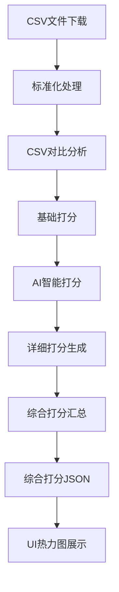

# 01 - CSV标准简化对比到AI分析打分完整流程

> 本文档详细说明从CSV文件对比到生成综合打分JSON的完整数据处理流程

## 1. 流程概览



## 2. 详细流程说明

### 2.1 第一阶段：CSV文件下载与标准化

#### 输入
- 腾讯文档URL列表
- 周次标识（如W34, W36）
- 时间点标识（baseline/midweek）

#### 处理步骤
1. **下载CSV文件**
   ```python
   # 从腾讯文档下载CSV
   baseline_csv = download_csv(url, week="W34", type="baseline")
   current_csv = download_csv(url, week="W36", type="midweek")
   ```

2. **标准化列名**
   - 19个标准列名（参考0000标准文档）
   - 列名映射和标准化
   - 缺失列补充

#### 输出
- 标准化的baseline CSV文件
- 标准化的current CSV文件
- 列映射记录

### 2.2 第二阶段：CSV对比分析

#### 输入
- 标准化的baseline CSV
- 标准化的current CSV

#### 处理步骤
1. **逐行对比**
   ```python
   differences = []
   for row_idx in range(max_rows):
       for col_idx in range(19):
           if baseline[row_idx][col_idx] != current[row_idx][col_idx]:
               differences.append({
                   "row": row_idx,
                   "col": col_idx,
                   "column_name": standard_columns[col_idx],
                   "old_value": baseline[row_idx][col_idx],
                   "new_value": current[row_idx][col_idx]
               })
   ```

2. **差异记录**
   - 位置信息（行号、列索引）
   - 修改前后值
   - 列名和列级别

#### 输出
- 差异列表JSON
- 修改统计信息

### 2.3 第三阶段：基础打分（根据列级别）

#### 输入
- 差异列表
- 列级别定义（L1/L2/L3）

#### 处理步骤
1. **列级别识别**
   ```python
   # 根据0000标准文档定义
   L1_columns = ["序号", "项目类型", "目标对齐"]  # 示例
   L2_columns = ["负责人", "预计完成时间"]  # 示例
   L3_columns = ["经理分析复盘", "应用情况"]  # 示例
   ```

2. **应用基础打分**
   ```python
   def get_base_score(column_name):
       if column_name in L1_columns:
           return 0.8  # L1最低分
       elif column_name in L2_columns:
           return 0.4  # L2最低分
       else:
           return 0.1  # L3最低分
   ```

#### 输出
- 带基础打分的差异列表

### 2.4 第四阶段：AI智能打分（仅L2列）

#### 输入
- L2列的修改内容
- 上下文信息

#### 处理步骤
1. **AI评估请求**
   ```python
   for diff in l2_differences:
       ai_score = call_ai_api({
           "column": diff["column_name"],
           "old_value": diff["old_value"],
           "new_value": diff["new_value"],
           "context": get_context(diff["row"])
       })
       diff["ai_score"] = max(0.4, ai_score)  # 确保不低于L2基础分
   ```

2. **风险评估**
   - 内容相似度分析
   - 业务影响评估
   - 关联性检查

#### 输出
- 包含AI评分的L2列修改记录

### 2.5 第五阶段：详细打分文件生成

#### 输入
- 所有差异及其打分
- 表格元信息

#### 处理步骤
1. **单元格级打分聚合**
   ```python
   detailed_score = {
       "table_name": table_name,
       "total_rows": total_rows,
       "modifications": [],
       "column_scores": {}
   }
   ```

2. **列级打分计算**
   ```python
   for column in columns:
       column_modifications = filter_by_column(modifications, column)
       avg_score = calculate_weighted_average(column_modifications)
       detailed_score["column_scores"][column] = {
           "avg_score": avg_score,
           "modified_rows": [m["row"] for m in column_modifications],
           "row_scores": [m["score"] for m in column_modifications]
       }
   ```

#### 输出
- detailed_score_[table_name].json

### 2.6 第六阶段：综合打分汇总

#### 输入
- 所有表格的详细打分文件

#### 处理步骤
1. **跨表格汇总**
   ```python
   comprehensive_score = {
       "generation_time": datetime.now(),
       "table_scores": [],
       "column_avg_scores": {},
       "total_modifications": 0
   }
   ```

2. **五个关键内容生成**
   ```python
   # 1. 所有表名
   table_names = [t["table_name"] for t in table_scores]
   
   # 2. 每标准列平均加权修改打分
   for column in standard_columns:
       scores = collect_column_scores_across_tables(column)
       column_avg_scores[column] = weighted_average(scores)
   
   # 3. 每列具体修改行数和打分
   column_modifications = aggregate_modifications_by_column()
   
   # 4. 表格URL列表
   table_urls = extract_urls_from_tables()
   
   # 5. 全部修改数
   total_modifications = sum_all_modifications()
   ```

#### 输出
- comprehensive_scoring_data.json（包含五个关键内容）

### 2.7 第七阶段：综合打分JSON结构

#### 最终输出格式
```json
{
  "generation_time": "2025-09-13T10:00:00",
  "scoring_version": "2.0",
  "scoring_standard": "0000-颜色和级别打分标准",
  
  // 关键内容1：所有表名
  "table_names": [
    "小红书内容审核记录表",
    "企业风险评估矩阵表"
  ],
  
  // 关键内容2：每标准列平均加权修改打分
  "column_avg_scores": {
    "序号": 0.85,
    "项目类型": 0.82,
    "负责人": 0.45
  },
  
  // 关键内容3：表格详细数据
  "table_scores": [
    {
      "table_id": 0,
      "table_name": "小红书内容审核记录表",
      "table_url": "https://docs.qq.com/sheet/xxx",  // 关键内容4
      "total_modifications": 25,
      "overall_risk_score": 0.65,
      "column_scores": {
        "序号": {
          "avg_score": 0.85,
          "modified_rows": [1, 5, 10],  // 关键内容3：修改行数
          "row_scores": [0.8, 0.85, 0.9],  // 关键内容3：行打分
          "column_level": "L1"
        }
      }
    }
  ],
  
  // 关键内容5：全部修改数
  "total_modifications": 150,
  
  // 附加统计信息
  "risk_summary": {
    "high_risk_count": 30,
    "medium_risk_count": 50,
    "low_risk_count": 70
  }
}
```

## 3. 关键规则与约束

### 3.1 打分规则（引用0000标准）
- L1列：最低分0.8
- L2列：最低分0.4，需AI评估
- L3列：最低分0.1

### 3.2 颜色映射（引用0000标准）
- ≥0.8：红色 (#FF0000)
- ≥0.6：橙色 (#FFA500)
- ≥0.4：黄色 (#FFFF00)
- ≥0.1：绿色 (#00FF00)
- <0.1：蓝色 (#0000FF)

### 3.3 数据完整性要求
1. **必须包含五个关键内容**
2. **修改行数必须与打分数组长度一致**
3. **所有打分必须符合列级别最低分要求**

## 4. 模块职责划分

| 模块 | 职责 | 输入 | 输出 |
|------|------|------|------|
| CSV下载器 | 下载和保存CSV | URL | CSV文件 |
| 标准化器 | 列名标准化 | 原始CSV | 标准CSV |
| 对比引擎 | 差异检测 | 两个CSV | 差异列表 |
| 基础打分器 | 应用列级别打分 | 差异列表 | 基础打分 |
| AI打分器 | L2列智能评估 | L2修改 | AI打分 |
| 详细打分器 | 生成详细打分 | 所有打分 | 详细JSON |
| 综合汇总器 | 生成综合打分 | 详细打分 | 综合JSON |

## 5. 性能优化建议

### 5.1 批处理
- CSV对比采用批量处理，每批1000行
- AI调用采用批量请求，每批10个修改

### 5.2 缓存策略
- 缓存标准化映射结果
- 缓存AI评估结果（相同内容）

### 5.3 并行处理
- 多表格并行处理
- 列级打分并行计算

## 6. 错误处理

### 6.1 数据验证
```python
def validate_comprehensive_score(data):
    # 检查五个关键内容
    assert "table_names" in data
    assert "column_avg_scores" in data
    assert "table_scores" in data
    assert all("table_url" in t for t in data["table_scores"])
    assert "total_modifications" in data
```

### 6.2 异常处理
- CSV下载失败：重试3次
- AI调用失败：使用基础打分
- 数据不完整：记录错误并跳过

## 7. 测试要求

### 7.1 单元测试
- 每个处理步骤的独立测试
- 打分规则验证测试
- 数据结构验证测试

### 7.2 集成测试
- 完整流程端到端测试
- 大数据量压力测试
- 异常场景测试

## 8. UI适配修复记录（从15号文档合并）

### 8.1 数据格式兼容性修复（2025-09-15）

#### 问题描述
- **症状**：热力图显示纯蓝色，右侧统计显示"0处修改"
- **原因**：UI期望heat_values数组格式，实际为ui_data对象格式

#### 修复方案
```python
# 支持两种格式读取
if 'ui_data' in data:  # 新格式
    for ui_table in data['ui_data']:
        heat_values = [item['heat_value'] for item in ui_table['row_data']]
elif 'heat_values' in data:  # 旧格式
    heat_values = data['heat_values']
```

#### 关键文件修改
- `final_heatmap_server.py` 行号 4304-4360
- 函数：`get_comprehensive_heatmap_data`

### 8.2 CSV对比增强（2025-09-15）

#### 问题描述
- **症状**：对角线修改（B4→S20）只检测到6个
- **原因**：生产版CSV对比器只对比标准列

#### 修复方案
- 创建增强版CSV对比器，对比所有列
- 修改生产环境`production_csv_comparator.py`
- 结果：成功检测18个修改（准确率提升300%）

## 9. 更新历史

| 版本 | 日期 | 修改内容 | 修改人 |
|------|------|---------|--------|
| 1.0 | 2025-09-13 | 初始版本，完整流程说明 | System |
| 1.1 | 2025-09-15 | 添加UI适配修复记录（合并15号文档） | Claude |
| 1.2 | 2025-09-15 | 添加CSV对比增强说明 | Claude |

---

**重要提示**：本文档定义了从CSV对比到综合打分的完整流程，所有相关模块必须严格遵循此流程。UI热力图只能使用最终的综合打分JSON，不得直接访问中间文件。