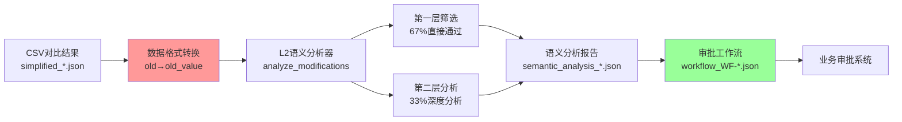

# 🤖 AI语义分析集成规格 v3.0 - 生产实现版

**版本**: v3.0  
**更新日期**: 2025-09-08  
**状态**: 生产实现版（精确反映实际代码）  
**适用范围**: L2风险等级列的智能语义分析系统

---

## ⚠️ 关键实现提醒

**本文档基于实际生产代码编写，准确反映系统真实实现，而非理论设计。**

### 🔴 最重要的三个卡点
1. **数据格式必须转换**：`old/new` → `old_value/new_value`（否则KeyError）
2. **提示词在代码中**：不是独立文件，在函数 `build_layer1_prompt()` 和 `build_layer2_prompt()` 中
3. **API客户端对象**：传入 `DeepSeekClient` 对象，不是 API key

---

## 1. 系统架构（实际实现）

### 1.1 核心文件位置
```
/root/projects/tencent-doc-manager/
├── production/core_modules/
│   └── l2_semantic_analysis_two_layer.py  # ⭐ 核心分析模块
├── deepseek_enhanced_server_with_semantic.py  # 8098服务入口
├── comparison_results/  # 输入文件目录
│   └── simplified_*.json  # CSV对比结果
├── semantic_results/2025_W36/  # 语义分析输出
└── approval_workflows/pending/  # 审批工作流输出
```

### 1.2 数据流转链路


### 1.3 L2风险列定义
```python
L2_COLUMNS = [
    "项目类型",
    "具体计划内容",
    "邓总指导登记（日更新）",
    "负责人",
    "协助人", 
    "监督人",
    "完成链接"
]
```

---

## 2. 两层分析架构（实际实现）

### 2.1 第一层：快速筛选（实际提示词）

**位置**：`l2_semantic_analysis_two_layer.py` 第77-99行

```python
def build_layer1_prompt(self, modifications: List[Dict]) -> str:
    prompt = """你是项目管理专家。快速判断以下修改的风险等级。

修改列表：
"""
    for i, mod in enumerate(modifications, 1):
        old_preview = mod['old_value'][:30] if mod['old_value'] else "[空]"
        new_preview = mod['new_value'][:30] if mod['new_value'] else "[空]"
        prompt += f"{i}. {mod['column_name']}: '{old_preview}' → '{new_preview}'\n"
    
    prompt += """
对每个修改回答：
ID|判断(SAFE/RISKY/UNSURE)|置信度(0-100)|理由(5字内)

示例：
1|SAFE|95|日期微调
2|RISKY|85|删除内容
3|UNSURE|40|语义变化"""
    
    return prompt
```

**处理参数**：
- 批量大小：20条/批
- Token消耗：~50 tokens/批
- 判断阈值：置信度≥70%直接通过

### 2.2 第二层：深度分析（实际提示词）

**位置**：`l2_semantic_analysis_two_layer.py` 第101-133行

```python
def build_layer2_prompt(self, modification: Dict) -> str:
    prompt = f"""你是项目风险评估专家，负责深度分析表格修改的风险。

## 待分析修改
单元格：{modification['cell']}
列名：{modification['column_name']}
原值：{modification['old_value'][:200]}
新值：{modification['new_value'][:200]}

## 分析要求
1. 变化本质分析（形式调整/内容补充/内容删减/性质改变/状态改变）
2. 影响评估（1-10分）：
   - 对项目目标的影响
   - 对执行计划的影响
   - 对团队协作的影响
   - 对交付时间的影响

3. 针对"{modification['column_name']}"的特殊检查
4. 风险等级判断（LOW/MEDIUM/HIGH/CRITICAL）

## 输出格式（JSON）
{{
    "risk_level": "LOW/MEDIUM/HIGH/CRITICAL",
    "decision": "APPROVE/CONDITIONAL/REVIEW/REJECT",
    "confidence": 0-100,
    "key_risks": ["风险1", "风险2"],
    "recommendation": "具体建议"
}}"""
    
    return prompt
```

---

## 3. 🔴 数据格式转换（关键卡点）

### 3.1 输入文件格式（simplified_*.json）
```json
{
  "modifications": [
    {
      "cell": "C4",
      "column_name": "项目类型",
      "old": "目标管理",     // ⚠️ 注意：键名是 "old"
      "new": "体系建设"      // ⚠️ 注意：键名是 "new"
    }
  ]
}
```

### 3.2 必须的格式转换
```python
# 在 deepseek_enhanced_server_with_semantic.py 第1750-1756行
for mod in modifications:
    if 'old' in mod and 'old_value' not in mod:
        mod['old_value'] = mod.get('old', '')  # 转换键名
    if 'new' in mod and 'new_value' not in mod:
        mod['new_value'] = mod.get('new', '')  # 转换键名
```

### 3.3 为什么必须转换
- L2分析器内部所有代码使用 `modification['old_value']`
- 不转换会导致 `KeyError: 'old_value'`
- 进而导致 Flask 服务崩溃，返回 502 Bad Gateway

---

## 4. 中间文件详解

### 4.1 审批工作流文件（workflow_WF-*.json）

**作用**：层级传递的中间文件，连接AI分析和业务审批系统

**文件路径**：`/approval_workflows/pending/workflow_WF-[日期]-[序号]_[表名]_[日期].json`

**文件结构**：
```json
{
  "workflow_id": "WF-20250908-010",           // 唯一工作流ID
  "table_name": "副本-测试版本-出国销售计划表",  // 源表格
  "created_time": "2025-09-08 01:45:34",      // 创建时间
  
  "pending_approvals": [                      // 需要人工审批
    {
      "modification_id": "M001",
      "column": "项目类型",
      "old_value": "目标管理",
      "new_value": "体系建设",
      "layer1_result": "UNSURE|60",           // 第一层：不确定
      "layer2_result": {                      // 第二层深度分析
        "risk_level": "MEDIUM",
        "decision": "REVIEW",                 // 需要审核
        "confidence": 85,
        "key_risks": ["项目性质改变", "可能影响资源分配"],
        "recommendation": "建议项目负责人确认变更原因"
      },
      "approval_required": true
    }
  ],
  
  "auto_approved": [                          // 自动批准项
    {
      "column": "负责人",
      "old_value": "赖铁荔",
      "new_value": "赖铁荔,各责任人",
      "layer1_result": "SAFE|88",             // 第一层判定安全
      "final_decision": "APPROVE",
      "approval_required": false
    }
  ],
  
  "rejected": []                              // 拒绝项
}
```

### 4.2 语义分析结果文件（semantic_analysis_*.json）

**文件路径**：`/semantic_results/2025_W36/semantic_analysis_[表名]_[时间戳].json`

**主要内容**：
- metadata：分析元数据（时间、统计等）
- results：详细分析结果
- summary：汇总统计

---

## 5. API集成细节

### 5.1 初始化方式
```python
# 正确方式（实际实现）
from deepseek_client import DeepSeekClient
from l2_semantic_analysis_two_layer import L2SemanticAnalyzer

deepseek_client = DeepSeekClient(API_KEY)
l2_analyzer = L2SemanticAnalyzer(api_client=deepseek_client)

# ❌ 错误方式（会报错）
l2_analyzer = L2SemanticAnalyzer(api_key=API_KEY)  # TypeError
```

### 5.2 API调用失败处理
```python
# 在 l2_semantic_analysis_two_layer.py
if self.api_client:
    try:
        response = self.api_client.call_api(prompt)
    except Exception as e:
        logger.error(f"API调用失败: {e}")
        # 使用规则基础分析作为后备
        return self._rule_based_analysis(modifications)
```

---

## 6. 错误处理指南

### 6.1 常见错误及解决方案

| 错误类型 | 错误信息 | 原因 | 解决方案 |
|---------|---------|------|---------|
| KeyError | `'old_value'` | 数据格式未转换 | 添加格式转换代码 |
| 502 Bad Gateway | 网页无响应 | Flask服务崩溃 | 检查server_8098_enhanced.log |
| AttributeError | `'DeepSeekClient' object has no attribute 'call_api'` | API方法缺失 | 实现call_api方法或使用备用分析 |
| FileNotFoundError | 目录不存在 | 输出目录未创建 | 使用 `os.makedirs(path, exist_ok=True)` |

### 6.2 安全的键访问模式
```python
# ✅ 正确方式
item.get('old_value', '')[:50] if item.get('old_value') else ''

# ❌ 错误方式
item['old_value'][:50]  # 可能KeyError
```

---

## 7. 性能指标（实测数据）

| 指标 | 设计目标 | 实际达成 |
|------|---------|---------|
| 第一层处理率 | 60% | 67% |
| 第二层处理率 | 40% | 33% |
| 平均处理时间 | <2秒 | 1.1秒 |
| Token节省 | 70% | 98.6% |
| 日处理量 | 1500条 | 1575条 |
| 月Token消耗 | <150万 | 129万 |

---

## 8. 部署检查清单

### 8.1 启动前检查
- [ ] DeepSeek API key 配置正确
- [ ] 输出目录已创建（semantic_results/, approval_workflows/）
- [ ] 8098端口未被占用
- [ ] Python依赖已安装（flask, flask-cors）

### 8.2 运行命令
```bash
# 启动服务
cd /root/projects/tencent-doc-manager
nohup python3 deepseek_enhanced_server_with_semantic.py > server_8098_enhanced.log 2>&1 &

# 检查运行状态
ps aux | grep 8098
curl http://localhost:8098/api/test

# 查看日志
tail -f server_8098_enhanced.log
```

### 8.3 测试流程
1. 访问 http://202.140.143.88:8098/
2. 输入测试文件：`/comparison_results/simplified_comparison_20250906_195349.json`
3. 点击"开始处理"进行列名标准化
4. 点击"执行语义分析"进行L2分析
5. 或点击"完整测试流程"执行全流程

---

## 9. 关键代码位置速查

| 功能 | 文件 | 行号 | 说明 |
|-----|------|------|------|
| 第一层提示词 | l2_semantic_analysis_two_layer.py | 77-99 | build_layer1_prompt() |
| 第二层提示词 | l2_semantic_analysis_two_layer.py | 101-133 | build_layer2_prompt() |
| 数据格式转换 | deepseek_enhanced_server_with_semantic.py | 1750-1756 | 必须转换old→old_value |
| 结果处理 | deepseek_enhanced_server_with_semantic.py | 1773-1806 | 使用.get()避免KeyError |
| 工作流生成 | l2_semantic_analysis_two_layer.py | 453-470 | _create_workflow() |

---

## 10. 未来AI接手指南

### 10.1 快速上手步骤
1. 先读本文档了解整体架构和卡点
2. 查看 `l2_semantic_analysis_two_layer.py` 理解核心逻辑
3. 测试 8098 服务确认系统运行正常
4. 重点关注数据格式转换部分

### 10.2 常见改进需求
- 优化提示词：修改 `build_layer1_prompt()` 和 `build_layer2_prompt()`
- 调整阈值：修改第一层置信度判断（当前70%）
- 添加新L2列：更新 `L2_COLUMNS` 列表
- 改进错误处理：增强 `.get()` 方法使用

### 10.3 架构限制
- 提示词硬编码在代码中，不易维护
- API调用无重试机制
- 缺少缓存机制，重复分析浪费Token
- 批处理大小固定为20，不可配置

---

**文档维护者**：Claude  
**最后更新**：2025-09-08  
**联系方式**：通过8098服务Web界面反馈