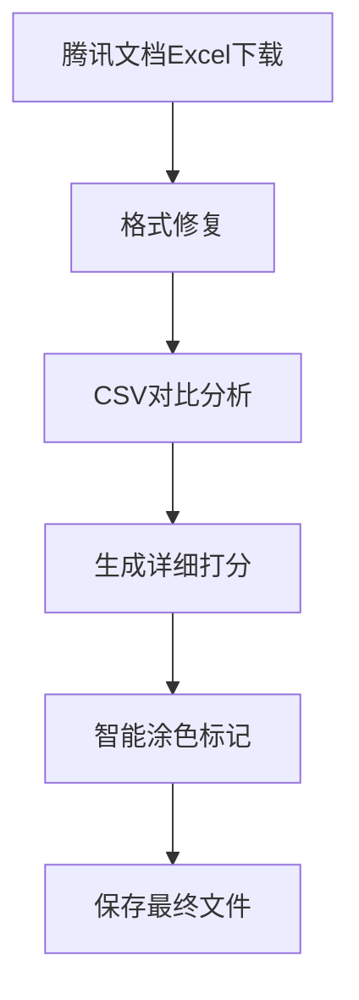

# 06-Excel智能涂色完整处理流程规范

> 📅 创建日期: 2025-01-10  
> 🔖 版本: v2.0  
> 📝 用途: 详细记录从腾讯文档下载到AI智能涂色的完整技术流程

---

## 📊 流程概览



---

## 🔄 详细处理流程

### 1️⃣ **下载阶段**

#### 1.1 下载执行程序
- **主程序**: `/root/projects/tencent-doc-manager/production/core_modules/stable_cookie_downloader.py`
- **备用程序**: `/root/projects/tencent-doc-manager/production/core_modules/tencent_export_automation.py`

#### 1.2 下载文件存储
```yaml
下载目录: /root/projects/tencent-doc-manager/downloads/
文件命名: {doc_id}_{timestamp}.xlsx
示例: 副本-副本-测试版本-出国销售计划表.xlsx
```

#### 1.3 文件识别逻辑
```python
# 文件类型检测（在stable_cookie_downloader.py第239-247行）
content_type = response.headers.get('Content-Type', '')
if 'application/json' in content_type:
    # JSON响应，需要重新请求
else:
    # 二进制Excel文件，正确下载
```

---

### 2️⃣ **格式修复阶段**

#### 2.1 格式问题诊断
- **问题**: 腾讯文档Excel包含空的`<fill/>`标签，导致openpyxl无法打开
- **错误信息**: `expected <class 'openpyxl.styles.fills.Fill'>`

#### 2.2 修复程序
```yaml
程序路径: /root/projects/tencent-doc-manager/fix_tencent_excel.py
核心函数: fix_tencent_excel(input_file, output_file)
修复逻辑: 
  - 解压xlsx文件
  - 定位xl/styles.xml
  - 替换: <fill/> → <fill><patternFill patternType="none"/></fill>
  - 重新打包为xlsx
```

#### 2.3 修复后文件存储
```yaml
存储路径: /root/projects/tencent-doc-manager/downloads/
命名规则: {原文件名}_fixed.xlsx
示例: 副本-副本-测试版本-出国销售计划表_fixed.xlsx
```

---

### 3️⃣ **数据对比分析阶段**

#### 3.1 CSV转换程序
```yaml
程序路径: /root/projects/tencent-doc-manager/production/core_modules/adaptive_table_comparator.py
功能: 将修复后的Excel转换为CSV格式进行对比
```

#### 3.2 基准文件查找
```yaml
基准目录: /root/projects/tencent-doc-manager/csv_versions/2025_W{周数}/baseline/
查找逻辑:
  - 使用WeekTimeManager获取当前周数
  - 匹配模式: tencent_*_baseline_W{周数}.csv
  - 示例: tencent_csv_20250818_1200_baseline_W34.csv
```

#### 3.3 对比执行
```yaml
对比程序: /root/projects/tencent-doc-manager/production/core_modules/production_csv_comparator.py
核心类: AdaptiveTableComparator
主要方法: compare_tables_with_mapping()
```

---

### 4️⃣ **详细打分生成阶段**

#### 4.1 打分数据结构
```json
{
  "comparison_id": "comp_20250110_123456",
  "total_cells": 2204,
  "changed_cells": 45,
  "cell_scores": {
    "B5": {
      "old_value": "100",
      "new_value": "150",
      "change_type": "numeric_increase",
      "risk_level": "medium",
      "score": 75,
      "color_code": "FFFF00"
    }
  }
}
```

#### 4.2 打分文件存储
```yaml
存储目录: /root/projects/tencent-doc-manager/scoring_results/detailed/
文件命名: detailed_scores_{doc_id}_{timestamp}.json
查找方法: 
  - 按时间戳排序，获取最新文件
  - 或通过comparison_id精确匹配
```

#### 4.3 打分程序
```yaml
主程序: /root/projects/tencent-doc-manager/production/scoring_engine/detailed_scorer.py
评分规则配置: /root/projects/tencent-doc-manager/config/scoring_rules.json
```

---

### 5️⃣ **智能涂色标记阶段**

#### 5.1 涂色执行程序
```yaml
主程序路径: /root/projects/tencent-doc-manager/intelligent_excel_marker.py
核心类: IntelligentExcelMarker
主要方法: 
  - find_matching_score_file() # 精确匹配打分文件
  - apply_striped_coloring()   # 应用条纹涂色
  - process_excel_with_auto_match() # 自动处理流程
```

#### 5.2 精确匹配系统 - 打分JSON查找逻辑
```python
def find_matching_score_file(self, excel_file: str) -> Optional[str]:
    """
    查找与Excel文件精确匹配的详细打分JSON
    
    三级匹配策略：
    1. 文档名称匹配 - 提取Excel基础名称，查找对应的打分文件
    2. 文档ID匹配 - 通过8位哈希ID进行匹配
    3. 元数据匹配 - 检查JSON中的metadata.target_file字段
    """
    # 提取文档标识信息
    base_name = os.path.basename(excel_file)
    doc_name = base_name.replace('.xlsx', '').replace('_fixed', '')
    
    # 方法1：通过文档名称匹配
    pattern1 = f"detailed_scores_{doc_name}_*.json"
    matches = glob.glob(os.path.join(self.score_dir, pattern1))
    
    # 方法2：通过文档ID匹配
    if not matches:
        import re
        id_match = re.search(r'([a-f0-9]{8})', doc_name)
        if id_match:
            doc_id = id_match.group(1)
            pattern2 = f"*{doc_id}*.json"
            matches = glob.glob(os.path.join(self.score_dir, pattern2))
    
    # 方法3：通过元数据匹配
    if not matches:
        all_scores = glob.glob(os.path.join(self.score_dir, "detailed_scores_*.json"))
        for score_file in all_scores:
            with open(score_file, 'r') as f:
                data = json.load(f)
                if doc_name in data['metadata'].get('target_file', ''):
                    matches.append(score_file)
    
    # 选择最新的匹配文件
    if matches:
        return max(matches, key=os.path.getmtime)
    return None
```

#### 5.3 涂色逻辑实现（条纹纹理版）
```python
def apply_striped_coloring(self, excel_file: str, score_file: str) -> str:
    """应用条纹涂色到Excel文件"""
    
    # 条纹图案映射（区别于原表格涂色）
    pattern_mapping = {
        "high": "darkVertical",      # 红色深垂直条纹
        "medium": "lightHorizontal",  # 黄色浅水平条纹
        "low": "lightUp"              # 绿色浅斜向上条纹
    }
    
    # 颜色映射（前景色和背景色）
    color_mapping = {
        "high": {"fg": "FF0000", "bg": "FFE0E0"},     # 红色系
        "medium": {"fg": "FFD700", "bg": "FFFACD"},   # 黄色系
        "low": {"fg": "00FF00", "bg": "E0FFE0"}       # 绿色系
    }
    
    # 加载打分数据
    with open(score_file, 'r', encoding='utf-8') as f:
        score_data = json.load(f)
    
    wb = openpyxl.load_workbook(excel_file)
    ws = wb.active
    
    # 遍历所有变更的单元格
    for cell_ref, cell_data in score_data['cell_scores'].items():
        # 获取风险等级和对应的图案
        risk_level = cell_data['risk_level']
        pattern = pattern_mapping[risk_level]
        colors = color_mapping[risk_level]
        
        # 创建条纹填充（区别于原有的solid填充）
        fill = PatternFill(
            patternType=pattern,     # 使用条纹图案而非solid
            fgColor=colors['fg'],    # 前景色（条纹颜色）
            bgColor=colors['bg']     # 背景色（底色）
        )
        
        # 应用填充
        ws[cell_ref].fill = fill
        
        # 添加评分批注
        try:
            comment_text = (
                f"AI评分: {cell_data['score']}\n"
                f"风险等级: {risk_level}\n"
                f"原值: {cell_data['old_value']}\n"
                f"新值: {cell_data['new_value']}\n"
                f"变更类型: {cell_data['change_type']}"
            )
            ws[cell_ref].comment = Comment(comment_text, "AI智能标记系统")
        except:
            pass  # 合并单元格无法添加批注
```

#### 5.4 涂色配置
```yaml
配置文件: /root/projects/tencent-doc-manager/config/coloring_rules.json
内容示例:
{
  "score_ranges": [
    {"min": 0, "max": 30, "color": "FF0000", "label": "高风险"},
    {"min": 30, "max": 70, "color": "FFFF00", "label": "中风险"},
    {"min": 70, "max": 90, "color": "00FF00", "label": "低风险"},
    {"min": 90, "max": 100, "color": "0000FF", "label": "安全"}
  ]
}
```

---

### 6️⃣ **最终文件存储阶段**

#### 6.1 存储路径和命名
```yaml
存储目录: /root/projects/tencent-doc-manager/excel_outputs/
命名规则: {原文档名}_marked_{timestamp}_W{周数}.xlsx
完整示例: 副本-测试版本-出国销售计划表_marked_20250110_143022_W37.xlsx
```

#### 6.2 文件组织结构
```
excel_outputs/
├── marked/              # AI标记后的文件
│   └── *.xlsx
├── original_fixed/      # 修复后的原始文件
│   └── *.xlsx
└── reports/            # 处理报告
    └── *.json
```

---

## 🔍 关键查找逻辑汇总

### 查找最新下载文件
```python
def find_latest_download():
    download_dir = "/root/projects/tencent-doc-manager/downloads/"
    xlsx_files = glob.glob(os.path.join(download_dir, "*.xlsx"))
    # 排除已修复的文件
    xlsx_files = [f for f in xlsx_files if "_fixed" not in f]
    if xlsx_files:
        return max(xlsx_files, key=os.path.getmtime)
```

### 查找对应的打分文件
```python
def find_score_file_by_doc(doc_name):
    # 提取文档基础名称
    base_name = doc_name.replace(".xlsx", "").replace("_fixed", "")
    
    # 在打分目录中查找
    score_dir = "/root/projects/tencent-doc-manager/scoring_results/detailed/"
    pattern = f"*{base_name}*.json"
    
    matches = glob.glob(os.path.join(score_dir, pattern))
    if matches:
        # 返回最新的匹配文件
        return max(matches, key=os.path.getmtime)
```

### 查找基准文件
```python
def find_baseline_file(week_num):
    baseline_dir = f"/root/projects/tencent-doc-manager/csv_versions/2025_W{week_num}/baseline/"
    baseline_files = glob.glob(os.path.join(baseline_dir, "*baseline*.csv"))
    if baseline_files:
        return baseline_files[0]  # 通常只有一个基准文件
```

---

## 🎨 条纹纹理涂色特性

### 为什么使用条纹纹理？
- **区分性**: 条纹图案与表格原有的纯色填充明显不同，一眼可辨
- **层次感**: 不同方向的条纹代表不同风险等级，视觉层次分明
- **专业性**: 条纹纹理是专业数据分析软件的标准标记方式

### 条纹图案详解
| 风险等级 | 图案类型 | 条纹方向 | 颜色搭配 | 含义 |
|---------|---------|---------|---------|------|
| 高风险 | darkVertical | 垂直深条纹 | 深红/浅红 | 严重变更，需立即关注 |
| 中风险 | lightHorizontal | 水平浅条纹 | 金黄/浅黄 | 中度变更，需要审核 |
| 低风险 | lightUp | 斜向上浅条纹 | 深绿/浅绿 | 轻微变更，可以接受 |

### 支持的条纹图案类型
```python
# openpyxl支持的条纹图案
pattern_types = [
    'lightVertical',    # 垂直浅条纹
    'lightHorizontal',  # 水平浅条纹  
    'lightUp',          # 斜向上浅条纹
    'lightDown',        # 斜向下浅条纹
    'darkVertical',     # 垂直深条纹
    'darkHorizontal',   # 水平深条纹
    'darkUp',           # 斜向上深条纹
    'darkDown',         # 斜向下深条纹
    'lightGrid',        # 浅网格
    'darkGrid'          # 深网格
]
```

---

## 🚀 完整处理命令示例

```bash
# 1. 下载Excel文件
python3 /root/projects/tencent-doc-manager/production/core_modules/stable_cookie_downloader.py

# 2. 修复格式问题
python3 /root/projects/tencent-doc-manager/fix_tencent_excel.py \
  downloads/副本-副本-测试版本-出国销售计划表.xlsx

# 3. 方式A：使用新的智能标记系统（推荐 - 自动完成全流程）
python3 /root/projects/tencent-doc-manager/intelligent_excel_marker.py

# 3. 方式B：分步执行（用于调试）
# 3.1 生成详细打分
python3 -c "
from intelligent_excel_marker import DetailedScoreGenerator
generator = DetailedScoreGenerator()
score_file = generator.generate_score_json(
    'csv_versions/2025_W34/baseline/baseline.csv',
    'downloads/副本-副本-测试版本-出国销售计划表_fixed.xlsx',
    'scoring_results/detailed/'
)
print(f'打分文件: {score_file}')
"

# 3.2 应用条纹涂色
python3 -c "
from intelligent_excel_marker import IntelligentExcelMarker
marker = IntelligentExcelMarker()
output = marker.apply_striped_coloring(
    'downloads/副本-副本-测试版本-出国销售计划表_fixed.xlsx',
    'scoring_results/detailed/latest.json'
)
print(f'涂色完成: {output}')
"

# 5. 验证结果
python3 -c "import openpyxl; wb=openpyxl.load_workbook('excel_outputs/marked/latest.xlsx'); print('✓ 文件可正常打开')"
```

---

## 📋 检查清单

- [ ] 下载的Excel文件是真正的二进制文件（非JSON）
- [ ] 文件已通过fix_tencent_excel.py修复格式问题
- [ ] 存在对应周数的基准文件进行对比
- [ ] 详细打分JSON已生成并包含cell_scores数据
- [ ] 涂色程序能找到并读取打分JSON
- [ ] 最终输出文件保存在excel_outputs目录
- [ ] 文件名包含正确的时间戳和周数标识

---

## ⚠️ 常见问题处理

### 问题1: openpyxl报错"expected Fill"
**解决**: 运行`fix_tencent_excel.py`修复空fill标签

### 问题2: 找不到打分文件
**解决**: 检查scoring_results/detailed/目录，确认对比分析已执行

### 问题3: 涂色后文件无法打开
**解决**: 确认使用了修复后的_fixed.xlsx文件作为输入

### 问题4: 合并单元格无法添加批注
**解决**: 这是openpyxl的限制，程序会自动跳过，不影响涂色

---

## 📚 相关文档

- [02-时间管理和文件版本规格.md](02-时间管理和文件版本规格.md) - 文件命名规范
- [03-CSV对比算法规范.md](03-CSV对比算法规范.md) - 对比逻辑详解
- [10-智能评分体系规范.md](10-智能评分体系规范.md) - 评分规则说明

---

*本文档为腾讯文档智能监控系统的核心技术规范，请确保所有开发人员熟悉此流程。*