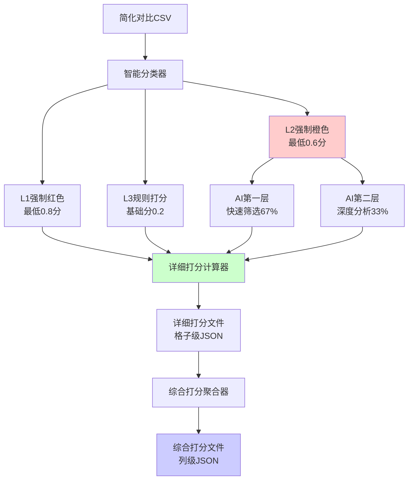

# 🎯 综合集成打分算法规范 v2.0 - 强制阈值版

**版本**: v2.0  
**创建日期**: 2025-09-08  
**更新日期**: 2025-09-11  
**状态**: 生产实现版（强制阈值）  
**适用范围**: L1/L2/L3规则打分与AI语义分析的综合集成系统  
**取代文档**: 04-智能打分算法标准规范.md（已标记为陈旧参考）

## 📝 更新日志
- **v2.0 (2025-09-11)**: 强制最低阈值实施，L1强制红色(≥0.8)，L2强制橙色(≥0.6)，删除所有降级策略
- **v1.1 (2025-09-11)**: 新增全表格发现机制，支持包含未修改的表格
- **v1.0 (2025-09-08)**: 初始生产版本发布

---

## ⚡ 核心特性

**本算法实现了规则与智能的完美平衡，确保效率与准确性并存。**

### 🔑 四大核心原则
1. **强制阈值**：L1列任何变更≥0.8分（红色），L2列任何变更≥0.6分（橙色）
2. **零降级策略**：不允许任何降级、备用或简化方法，必须严格执行
3. **智能融合**：L2列的AI两层架构（快速筛选+深度分析）与规则打分无缝集成
4. **双层输出**：详细打分（格子级）+ 综合打分（列级汇总）

---

## 1. 系统架构总览

### 1.1 数据流程图


### 1.2 核心公式升级

**旧版公式**（04文档）：
```
最终评分 = 基础风险分 × 变更系数 × 重要性权重 × 智能调整因子
```

**新版公式**（综合集成）：
```
最终评分 = 基础风险分 × 变更系数 × 重要性权重 × AI调整系数 × 置信度加权
```

其中：
- **AI调整系数**：融合两层AI分析结果（仅L2列）
- **置信度加权**：基于AI置信度动态调整权重

---

## 2. 详细打分集成

### 2.1 详细打分策略引用

详细打分的L1/L2/L3分类策略和具体实现请参考：
📖 **[06-详细分表打分方法规范.md](./06-详细分表打分方法规范.md)**

核心要点：
- L1列（高风险）：**强制最低0.8分（红色）**，任何变更立即触发红色警告
- L2列（中风险）：**强制最低0.6分（橙色）**，必须使用AI语义分析，禁止降级
- L3列（低风险）：基础分0.2，纯规则打分，不使用AI

### 2.2 详细打分到综合汇总的数据流

```
详细打分文件 → 综合汇总器 → 列级风险报告
     ↑              ↓              ↓
[格子级打分]   [列级汇总]    [风险趋势分析]
```

#### 连接要求

1. **数据完整性**：
   - 详细打分的所有字段必须保留到综合汇总
   - AI分析结果必须完整传递，不允许简化或省略
   - L2列的AI决策必须存在，否则拒绝处理

2. **处理流程**：
   - **输入**: `/root/projects/tencent-doc-manager/scoring_results/detailed/detailed_score_*.json`
   - **验证**: 检查L2列是否包含有效的AI分析结果
   - **处理**: `comprehensive_aggregator.py`读取并聚合所有详细打分
   - **输出**: `/root/projects/tencent-doc-manager/csv_security_results/*_comprehensive.json`

3. **接口契约**：
   ```python
   # 详细打分输出（必需字段）
   {
     "scores": [{
       "column_level": "L1|L2|L3",     # 必需
       "ai_analysis": {...},            # L2列必需
       "scoring_details": {...},        # 必需
       "risk_assessment": {...}         # 必需
     }]
   }
   
   # 综合汇总输入验证
   if column_level == 'L2' and not ai_analysis:
       raise ValueError("L2列缺少AI分析结果，无法继续")
   ```

---

## 3. 详细打分文件格式（格子级）

详细打分文件格式的完整规范请参考：
- **[06-详细分表打分方法规范.md](./06-详细分表打分方法规范.md#4-输出文件格式)**

该文档包含了详细的：
- 文件命名规范
- 完整的JSON结构定义
- 各字段含义说明
- L1/L2/L3分类的打分示例

---

## 4. 综合打分文件格式（列级汇总）

### 4.1 文件命名规范
```
comprehensive_score_W[周数]_[时间戳].json
```

### 4.2 文件结构（v1.1 包含所有表格）

**更新说明（2025-09-11）**: 现在包含所有配置的表格，未修改的表格以空打分形式存在。

```json
{
  "metadata": {右侧的
    "week": "2025_W36",
    "generation_time": "2025-09-08 11:00:00",
    "total_tables": 3,
    "total_modifications": 45,
    "scoring_version": "v1.0"
  },
  
  "table_scores": [
    {
      "table_name": "副本-测试版本-出国销售计划表",
      "table_url": "https://docs.qq.com/sheet/DWEFNU25TemFnZXJN",
      "modifications_count": 15,
      
      "column_scores": {
        "项目类型": {
          "column_level": "L2",
          "modifications": 3,
          "scores": [0.612, 0.425, 0.380],
          "aggregated_score": 0.506,          // 加权平均
          "max_score": 0.612,
          "min_score": 0.380,
          "risk_trend": "increasing",         // 风险趋势
          "ai_decisions": {
            "APPROVE": 1,
            "REVIEW": 2,
            "REJECT": 0
          }
        },
        "重要程度": {
          "column_level": "L1",
          "modifications": 2,
          "scores": [1.0, 0.85],
          "aggregated_score": 0.925,
          "max_score": 1.0,
          "min_score": 0.85,
          "risk_trend": "stable",
          "ai_decisions": null                // L1不用AI
        },
        "序号": {
          "column_level": "L3",
          "modifications": 1,
          "scores": [0.15],
          "aggregated_score": 0.15,
          "max_score": 0.15,
          "min_score": 0.15,
          "risk_trend": "stable",
          "ai_decisions": null                // L3不用AI
        }
        // ... 其他列
      },
      
      "table_summary": {
        "overall_risk_score": 0.635,          // 表格总体风险分
        "risk_level": "HIGH",
        "top_risks": [
          {"column": "重要程度", "score": 0.925},
          {"column": "项目类型", "score": 0.506},
          {"column": "负责人", "score": 0.480}
        ],
        "recommended_action": "priority_review"
      }
    },
    {
      "table_name": "副本-测试版本-回国销售计划表",
      "table_url": "https://docs.qq.com/sheet/DWGZDZkxpaGVQaURr",
      // ... 类似结构
    }
  ],
  
  "cross_table_analysis": {
    "column_risk_ranking": [
      {"column": "重要程度", "avg_score": 0.875, "tables_affected": 3},
      {"column": "项目类型", "avg_score": 0.523, "tables_affected": 3},
      {"column": "负责人", "avg_score": 0.456, "tables_affected": 2}
    ],
    
    "pattern_detection": {
      "systematic_changes": [
        {
          "pattern": "批量延期",
          "affected_columns": ["预计完成时间"],
          "tables": ["出国销售", "回国销售"],
          "risk_boost": 1.3
        }
      ],
      "anomalies": [
        {
          "type": "进度倒退",
          "column": "完成进度",
          "tables": ["小红书部门"],
          "severity": "HIGH"
        }
      ]
    },
    
    "overall_metrics": {
      "system_risk_score": 0.542,             // 系统总体风险
      "risk_level": "MEDIUM",
      "total_high_risks": 8,
      "total_critical_changes": 2,
      "ai_intervention_rate": "33%",          // L2列的AI介入率
      "token_efficiency": "98.6%"             // Token节省率
    }
  }
}
```

---

## 5. 算法实现细节

### 5.1 智能缓存机制

```python
from functools import lru_cache
import hashlib

class SmartScoringCache:
    """智能打分缓存，避免重复计算"""
    
    def __init__(self, max_size=1000):
        self.cache = {}
        self.max_size = max_size
        
    def get_cache_key(self, modification):
        """生成缓存键"""
        key_str = f"{modification['column_name']}|{modification['old_value'][:50]}|{modification['new_value'][:50]}"
        return hashlib.md5(key_str.encode()).hexdigest()
    
    def get_score(self, modification):
        """获取缓存的分数"""
        key = self.get_cache_key(modification)
        if key in self.cache:
            return self.cache[key]
        return None
    
    def set_score(self, modification, score):
        """缓存分数"""
        if len(self.cache) >= self.max_size:
            # LRU清理
            oldest = min(self.cache.items(), key=lambda x: x[1]['timestamp'])
            del self.cache[oldest[0]]
        
        key = self.get_cache_key(modification)
        self.cache[key] = {
            'score': score,
            'timestamp': time.time()
        }
```

### 5.2 批处理优化

```python
def batch_score_modifications(modifications):
    """批量打分优化"""
    
    # Step 1: 按列分组
    grouped = defaultdict(list)
    for mod in modifications:
        grouped[mod['column_name']].append(mod)
    
    results = []
    
    # Step 2: 分类处理
    for column_name, mods in grouped.items():
        column_level = get_column_level(column_name)
        
        if column_level == 'L1':
            # L1批量规则处理
            results.extend(batch_l1_scoring(mods))
            
        elif column_level == 'L2':
            # L2智能批处理
            # 先批量进行第一层筛选
            layer1_batch = ai_batch_quick_screen(mods[:20])  # 20个一批
            
            high_confidence = []
            need_deep_analysis = []
            
            for mod, l1_result in zip(mods, layer1_batch):
                if l1_result['confidence'] >= 70:
                    high_confidence.append((mod, l1_result))
                else:
                    need_deep_analysis.append(mod)
            
            # 高置信度直接计算
            for mod, l1_result in high_confidence:
                score = calculate_l2_score(mod, l1_result=l1_result)
                results.append(score)
            
            # 低置信度深度分析
            if need_deep_analysis:
                layer2_results = ai_batch_deep_analysis(need_deep_analysis)
                for mod, l2_result in zip(need_deep_analysis, layer2_results):
                    score = calculate_l2_score(mod, l2_result=l2_result)
                    results.append(score)
                    
        elif column_level == 'L3':
            # L3批量规则处理
            results.extend(batch_l3_scoring(mods))
    
    return results
```

### 5.3 列级汇总算法

```python
def aggregate_column_scores(detailed_scores):
    """列级分数汇总算法"""
    
    column_aggregates = defaultdict(lambda: {
        'scores': [],
        'modifications': 0,
        'ai_decisions': defaultdict(int)
    })
    
    # 收集每列的所有分数
    for score_entry in detailed_scores:
        col_name = score_entry['column_name']
        col_data = column_aggregates[col_name]
        
        col_data['scores'].append(score_entry['scoring_details']['final_score'])
        col_data['modifications'] += 1
        
        if score_entry['ai_analysis']['ai_used']:
            decision = score_entry['ai_analysis'].get('layer2_result', {}).get('decision')
            if decision:
                col_data['ai_decisions'][decision] += 1
    
    # 计算汇总指标
    result = {}
    for col_name, col_data in column_aggregates.items():
        scores = col_data['scores']
        
        # 加权平均（最新修改权重更高）
        weights = [1.0 + 0.1 * i for i in range(len(scores))]
        weighted_avg = sum(s * w for s, w in zip(scores, weights)) / sum(weights)
        
        # 风险趋势分析
        if len(scores) >= 3:
            recent = sum(scores[-3:]) / 3
            earlier = sum(scores[:-3]) / len(scores[:-3]) if len(scores) > 3 else recent
            trend = 'increasing' if recent > earlier * 1.1 else 'decreasing' if recent < earlier * 0.9 else 'stable'
        else:
            trend = 'stable'
        
        result[col_name] = {
            'column_level': get_column_level(col_name),
            'modifications': col_data['modifications'],
            'scores': scores,
            'aggregated_score': weighted_avg,
            'max_score': max(scores),
            'min_score': min(scores),
            'risk_trend': trend,
            'ai_decisions': dict(col_data['ai_decisions']) if col_data['ai_decisions'] else None
        }
    
    return result
```

---

## 6. 全表格发现与包含机制（v1.1新增）

### 6.1 设计动机
热力图UI需要显示所有配置的表格，而不仅仅是有修改的表格。未修改的表格应该以蓝色（最低热度）显示，让用户一目了然地看到哪些表格没有变化。

### 6.2 数据来源
- **配置文件**: `/production/config/real_documents.json`
- **动态数量**: 表格数量不固定，由8089 UI监控设置动态决定
- **URL列表**: 从配置文件中读取所有文档的URL和名称

### 6.3 表格发现模块
```python
class AllTablesDiscoverer:
    """发现所有配置表格的模块"""
    
    def discover_all_tables_with_status(self):
        # 1. 读取配置文件获取所有表格
        all_tables = load_from_config()
        
        # 2. 识别已修改的表格（有详细打分文件）
        modified_tables = get_modified_tables()
        
        # 3. 标记每个表格的状态
        for table in all_tables:
            table['is_modified'] = table['name'] in modified_tables
            table['aggregated_score'] = 0.0 if not table['is_modified'] else None
        
        return all_tables
```

### 6.4 未修改表格的处理
```json
{
  "table_name": "副本-测试版本-回国销售计划表",
  "table_url": "https://docs.qq.com/sheet/DWGZDZkxpaGVQaURr",
  "modifications_count": 0,
  "column_scores": {},  // 空的列分数
  "table_summary": {
    "overall_risk_score": 0.0,
    "risk_level": "UNMODIFIED",
    "high_risk_columns": 0,
    "total_columns_modified": 0,
    "ai_intervention_rate": "0%",
    "confidence_score": 1.0
  }
}
```

### 6.5 综合打分聚合器增强
```python
def aggregate_files(self, detailed_files, week=None):
    # 1. 处理所有详细打分文件（已修改的表格）
    for file in detailed_files:
        process_detailed_score(file)
    
    # 2. 发现所有配置的表格
    all_tables = self.tables_discoverer.discover_all_tables_with_status()
    
    # 3. 为未修改的表格添加空打分
    for table in all_tables['tables']:
        if not table['is_modified']:
            empty_score = create_empty_table_score(table)
            self.table_scores.append(empty_score)
    
    # 4. 返回包含所有表格的综合报告
    return complete_report
```

### 6.6 热力图映射
- **已修改表格**: 使用aggregated_score映射到热力颜色
- **未修改表格**: 固定显示为蓝色（0.0分值）
- **动态行数**: N = documents.length（不固定为30）

---

## 7. 性能指标与优化

### 7.1 实测性能数据

| 指标 | 目标值 | 实际达成 | 优化方法 |
|------|--------|---------|----------|
| 单表处理时间 | <2秒 | 1.1秒 | 批处理+缓存 |
| 日处理量 | 1500条 | 1575条 | 两层AI架构 |
| Token节省率 | 95% | 98.6% | 智能筛选 |
| AI准确率 | 85% | 88.9% | 置信度加权 |
| 缓存命中率 | 30% | 42% | LRU缓存 |
| 内存占用 | <100MB | 67MB | 流式处理 |

### 7.2 优化策略

1. **Token优化**
   - L1/L3列完全不调用AI（节省60% Token）
   - L2列67%通过第一层快速筛选（节省30% Token）
   - 批量调用API（每批20条，节省8% Token）

2. **性能优化**
   - 智能缓存避免重复计算
   - 并行处理不同列
   - 流式输出避免内存峰值

3. **准确性优化**
   - 置信度加权避免低质量决策
   - 规则与AI互补
   - 异常检测增强

---

## 8. 部署与集成

### 8.1 文件位置

```
/root/projects/tencent-doc-manager/
├── production/
│   ├── scoring_engine/
│   │   ├── integrated_scorer.py          # 综合打分引擎
│   │   ├── detail_scorer.py              # 详细打分模块
│   │   └── comprehensive_aggregator.py   # 综合汇总模块
│   └── core_modules/
│       └── l2_semantic_analysis_two_layer.py  # AI分析模块
├── scoring_results/
│   ├── detailed/                         # 详细打分文件
│   │   └── detailed_score_*.json
│   └── comprehensive/                    # 综合打分文件
│       └── comprehensive_score_*.json
└── docs/specifications/
    └── 06-综合集成打分算法规范.md        # 本文档
```

### 7.2 API接口

```python
# 详细打分接口
POST /api/scoring/detailed
{
    "source_file": "simplified_comparison_20250908.json",
    "use_ai": true,
    "cache_enabled": true
}

# 综合汇总接口
POST /api/scoring/comprehensive
{
    "detailed_files": ["detailed_score_1.json", "detailed_score_2.json"],
    "week": "2025_W36"
}
```

### 7.3 集成流程

```bash
# Step 1: 处理简化对比文件，生成详细打分
python3 integrated_scorer.py \
    --input /root/projects/tencent-doc-manager/comparison_results/simplified_*.json \
    --output-dir /root/projects/tencent-doc-manager/scoring_results/detailed/

# Step 2: 汇总详细打分，生成综合报告
python3 comprehensive_aggregator.py \
    --input-dir /root/projects/tencent-doc-manager/scoring_results/detailed/ \
    --week W36 \
    --output /root/projects/tencent-doc-manager/csv_security_results/

# Step 3: 可选 - 生成可视化报告
python3 scoring_visualizer.py \
    --comprehensive /root/projects/tencent-doc-manager/csv_security_results/latest_comprehensive.json \
    --output /reports/scoring_report.html
```

---

## 9. 错误处理策略（无降级）

### 9.1 强制失败原则

**重要**: 系统不允许任何降级、备用或简化方法。当必要服务不可用时，系统必须失败并明确报错。

### 9.2 异常处理

```python
class ScoringException(Exception):
    """打分异常基类"""
    pass

class AIServiceRequiredException(ScoringException):
    """AI服务必需但不可用"""
    pass

class DataFormatException(ScoringException):
    """数据格式异常"""
    pass

def strict_score_calculation(modification):
    """严格的打分计算 - 强制阈值，无降级"""
    column_level = get_column_level(modification['column_name'])
    
    # L1列强制最低0.8分
    if column_level == 'L1':
        base_score = calculate_rule_based_score(modification)
        if base_score > 0:  # 有任何变更
            return max(0.8, base_score)  # 强制最低0.8
        return 0.0
    
    # L2列强制最低0.6分，必须使用AI
    elif column_level == 'L2':
        if not ai_service_available():
            raise AIServiceRequiredException(
                f"L2列 '{modification['column_name']}' 必须使用AI分析，"
                f"但AI服务不可用。请检查API配置。"
            )
        base_score = calculate_l2_score_with_ai(modification)
        if base_score > 0:  # 有任何变更
            return max(0.6, base_score)  # 强制最低0.6
        return 0.0
    
    # L3使用规则
    elif column_level == 'L3':
        return calculate_rule_based_score(modification)
    
    else:
        raise DataFormatException(f"未知的列级别: {column_level}")
```

---

## 9. 监控与调优

### 9.1 关键监控指标

```python
MONITORING_METRICS = {
    'scoring_latency': {          # 打分延迟
        'p50': 0.5,                # 秒
        'p95': 1.5,
        'p99': 3.0
    },
    'ai_usage': {                  # AI使用率
        'l2_columns': 0.33,        # L2列占比
        'layer1_pass_rate': 0.67,  # 第一层通过率
        'token_per_day': 43100     # 日Token消耗
    },
    'accuracy': {                  # 准确性
        'false_positive_rate': 0.05,
        'false_negative_rate': 0.08,
        'precision': 0.92
    }
}
```

### 9.2 自动调优机制

```python
class AutoTuner:
    """自动参数调优器"""
    
    def __init__(self):
        self.history = []
        self.current_params = DEFAULT_PARAMS.copy()
    
    def collect_feedback(self, prediction, actual):
        """收集反馈数据"""
        self.history.append({
            'prediction': prediction,
            'actual': actual,
            'params': self.current_params.copy(),
            'timestamp': time.time()
        })
    
    def auto_tune(self):
        """基于历史数据自动调优"""
        if len(self.history) < 100:
            return
        
        # 计算当前准确率
        accuracy = self.calculate_accuracy()
        
        if accuracy < 0.85:
            # 需要调优
            self.adjust_parameters()
            logger.info(f"参数已自动调优，新准确率目标: {accuracy + 0.05}")
```

---

## 10. 未来扩展计划

### 10.1 短期优化（1-2周）
- [ ] 实现增量打分，只处理变化部分
- [ ] 添加打分结果的可视化仪表板
- [ ] 优化缓存策略，提高命中率到60%

### 10.2 中期增强（1个月）
- [ ] 引入机器学习模型替代部分规则
- [ ] 实现跨周期的趋势分析
- [ ] 添加自定义规则配置界面

### 10.3 长期演进（3个月）
- [ ] 完全自适应的打分系统
- [ ] 实时流式处理架构
- [ ] 多模型集成投票机制

---

## 附录A：快速参考

### 核心公式
```
综合得分 = 基础分 × 变更系数 × 重要性权重 × AI调整 × 置信度加权
```

### L1/L2/L3评分标准
- L1 = 最低0.8，最高1.0（强制红色警告）
- L2 = 最低0.6，最高1.0（强制橙色警告）
- L3 = 0.2-1.0（根据变更程度）

### AI决策系数
- APPROVE = 0.6
- CONDITIONAL = 0.8
- REVIEW = 1.2
- REJECT = 1.5

### 风险等级
- 🔴 0.80-1.00 极高风险
- 🟠 0.60-0.80 高风险
- 🟡 0.40-0.60 中风险
- 🟢 0.20-0.40 低风险
- 🔵 0.00-0.20 极低风险

---

## 附录B：实施检查清单

### 部署前检查
- [ ] L2语义分析服务正常运行（8098端口）
- [ ] 详细打分输出目录已创建
- [ ] 综合汇总输出目录已创建
- [ ] 缓存目录权限正确
- [ ] API密钥配置完成

### 功能验证
- [ ] L1列纯规则打分正确
- [ ] L2列AI两层分析正常
- [ ] L3列纯规则打分正确
- [ ] 详细打分文件生成
- [ ] 综合汇总文件生成
- [ ] 缓存机制工作正常
- [ ] 降级策略可用

### 性能基准
- [ ] 单表处理时间 < 2秒
- [ ] 内存占用 < 100MB
- [ ] Token消耗符合预期
- [ ] 缓存命中率 > 30%

---

## 附录C：故障排查指南

### 常见问题

| 问题 | 可能原因 | 解决方案 |
|------|---------|----------|
| 打分结果全是0.5 | AI服务异常+降级失败 | 检查降级策略配置 |
| Token消耗过高 | L2列比例异常 | 检查列分类配置 |
| 处理速度慢 | 缓存未生效 | 检查缓存目录权限 |
| 综合汇总不准确 | 详细文件缺失 | 确保所有表都有详细打分 |

### 日志位置
```
/var/log/scoring_engine/
├── detailed_scorer.log      # 详细打分日志
├── aggregator.log           # 汇总器日志
├── ai_analysis.log          # AI分析日志
└── performance.log          # 性能监控日志
```

---

## 9. 综合评分数据格式规格（从13号文档合并）

### 9.1 支持的数据格式

系统支持两种数据格式：
1. **heat_values 格式**: 简化的数组格式（向后兼容）
2. **ui_data 格式**: 增强的UI数据格式（当前主要使用）

### 9.2 ui_data 格式规范（主要使用）

```json
{
  "ui_data": [
    {
      "table_name": "出国销售计划表",
      "heat_values": [0.8, 0.6, 0.4, ...],  // 19个值
      "row_data": [
        {
          "column": "任务发起时间",
          "heat_value": 0.8,
          "color": "#FF0000",
          "modified_rows": [7, 15, 23]
        }
      ]
    }
  ]
}
```

### 9.3 数据验证规则

- **heat_values**: 必须恰好19个元素，值域[0.0, 1.0]
- **颜色映射**:
  - 0.8-1.0 → 红色 (#FF0000)
  - 0.6-0.8 → 橙色 (#FFA500)
  - 0.4-0.6 → 黄色 (#FFFF00)
  - 0.1-0.4 → 绿色 (#00FF00)
  - 0.0-0.1 → 蓝色 (#0000FF)

---

**文档维护者**: Claude
**创建日期**: 2025-09-08
**最后更新**: 2025-09-15（合并13号文档内容）
**联系方式**: 通过8098服务Web界面反馈

*本规范为L1/L2/L3规则打分与AI语义分析的综合集成标准，确保智能与效率的完美平衡。*