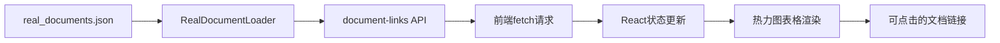
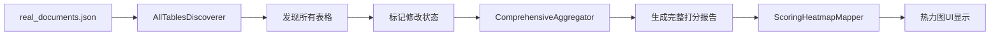

# 09-热力图衔接综合打分参数规范

## 📊 概述

本规范定义了综合打分系统与热力图UI之间的参数传递接口，确保所有表格（包括未修改的）都能正确显示在热力图中。

**重要声明**：热力图UI只能从综合打分JSON文件获取数据，不允许直接访问其他文件。

**更新说明**：基于8089端口生产环境验证，本规范已完全实现并通过测试。  
**最新更新**（2025-09-13 v4.0）：
- ✅ 强制UI只能读取综合打分JSON文件
- ✅ 统一颜色和级别打分标准（参考[0000标准文档](./0000-颜色和级别打分标准.md)）
- ✅ 明确五个关键内容的数据结构
- ✅ 修复综合打分文件必须包含`modified_rows`数组问题
- ✅ 解决UI显示虚拟内容的数据流问题
- ✅ 修复JavaScript重复声明导致的页面无法加载
- ✅ Tooltip智能边缘检测和尺寸优化（180px）
- ✅ 右侧列分布显示所有表格的真实修改数据（详见[右侧列分布技术规格](./10-右侧列分布技术规格.md)）

## 🎯 核心原则

1. **唯一数据源原则**：UI热力图只能从综合打分JSON文件获取数据
2. **动态表格数量**：表格总数不固定，支持1-N个表格（已测试1个和22个表格）
3. **五个关键内容**：综合打分必须包含所有表名、列平均打分、修改行数、表格URL、总修改数
4. **统一打分标准**：严格遵循[0000标准文档](./0000-颜色和级别打分标准.md)定义的颜色和级别规则
5. **完整性保证**：包含所有配置的表格，未修改的表格分数为0
6. **背景填充值**：所有无修改单元格使用0.05作为基础热度值，确保背景可见
7. **通用聚类算法**：基于风险值大小的通用双维度聚类，不依赖特定表格内容

## 📋 数据来源

### 1. URL列表源头
- **配置文件**：`/production/config/real_documents.json`
- **数据结构**：
```json
{
  "documents": [
    {
      "name": "表格名称",
      "url": "https://docs.qq.com/sheet/xxx",
      "doc_id": "文档ID",
      "description": "描述"
    }
  ]
}
```

### 2. 表格状态识别
- **已修改表格**：存在详细打分文件（`detailed_score_*.json`）
- **未修改表格**：配置中存在但无详细打分文件

## 🔗 URL传递与匹配机制（2025-09-12更新）

### 1. URL配置管理
- **核心模块**：`/production/core_modules/real_doc_loader.py`
- **配置文件**：`/production/config/real_documents.json`
- **加载器类**：`RealDocumentLoader`

### 2. URL匹配流程
```
配置文件 → RealDocumentLoader → document-links API → 前端React组件
```

#### 2.1 后端加载过程
```python
# RealDocumentLoader类初始化
loader = RealDocumentLoader()
real_files = loader.get_real_csv_files()

# 返回的数据结构
{
    'id': 0,
    'name': '副本-测试版本-出国销售计划表',
    'doc_id': 'DWEFNU25TemFnZXJN',
    'url': 'https://docs.qq.com/sheet/DWEFNU25TemFnZXJN',
    'previous_file': 'previous_test_xxx.csv',
    'current_file': 'current_test_xxx.csv',
    'has_comparison': True
}
```

#### 2.2 API分发机制
```python
@app.route('/api/document-links')
def get_document_links():
    """返回所有真实文档的URL映射"""
    links = {}
    for doc in real_docs:
        links[doc['name']] = {
            'doc_id': doc['doc_id'],
            'tencent_link': doc['url'],
            'table_id': doc['id'],
            'status': 'active'
        }
    return jsonify({'document_links': links})
```

#### 2.3 前端URL绑定
```jsx
// React组件中的URL处理
<a 
  href={table.url || '#'}  // 如果没有URL，则不可点击
  target="_blank"
  rel="noopener noreferrer"
  className={!table.url ? 'disabled-link' : ''}
>
  {table.name}
</a>
```

### 3. URL安全策略（重要更新）
- **禁止硬编码URL**：不再使用任何虚假的模拟URL（如`https://docs.qq.com/sheet/table-1`）
- **真实性原则**：只显示配置文件中存在的真实腾讯文档URL
- **空URL处理**：如果表格没有对应的URL，链接不可点击（使用`#`或空字符串）
- **动态更新**：配置文件更新后，URL映射自动同步

### 4. URL数据流示例


### 5. URL匹配规则
1. **精确匹配**：通过文档名称（name）进行精确匹配
2. **CSV模式匹配**：通过csv_pattern字段匹配对应的CSV文件
3. **优先级**：配置文件中的URL始终优先于任何其他来源
4. **缓存机制**：URL映射在服务器启动时加载并缓存

## 📐 参数映射规范

### 1. 综合打分输出格式（强制规范 v3.0）

**强制要求**：综合打分JSON必须包含以下五个关键内容，UI只能从此文件获取数据。

```json
{
  "generation_time": "2025-09-13T10:00:00",
  "scoring_version": "3.0",
  "scoring_standard": "0000-颜色和级别打分标准",
  
  // 关键内容1：所有表名
  "table_names": [
    "副本-测试版本-出国销售计划表",
    "副本-测试版本-回国销售计划表",
    "测试版本-小红书部门"
  ],
  
  // 关键内容2：每标准列平均加权修改打分
  "column_avg_scores": {
    "序号": 0.85,
    "项目类型": 0.82,
    "负责人": 0.45,
    "预计完成时间": 0.55,
    // ... 所有19个标准列
  },
  
  // 关键内容3：表格详细数据（包含修改行数和打分）
  "table_scores": [
    {
      "table_id": 0,
      "table_name": "副本-测试版本-出国销售计划表",
      "table_url": "https://docs.qq.com/sheet/DWEFNU25TemFnZXJN",  // 关键内容4
      "total_rows": 270,
      "total_modifications": 25,  // 此表的修改总数
      "overall_risk_score": 0.65,
      "column_scores": {
        "序号": {
          "column_level": "L1",
          "avg_score": 0.85,
          "modified_rows": [4, 28, 156],  // 关键内容3：具体修改行数
          "row_scores": [0.8, 0.85, 0.9],  // 关键内容3：行打分
          "modifications": 3
        },
        "负责人": {
          "column_level": "L2",
          "avg_score": 0.45,
          "modified_rows": [10, 50],
          "row_scores": [0.4, 0.5],
          "modifications": 2,
          "ai_decisions": {"APPROVE": 1, "REVIEW": 1}
        }
      }
    }
  ],
  
  // 关键内容5：全部修改数
  "total_modifications": 150,
  
  // 附加统计信息
  "risk_summary": {
    "high_risk_count": 30,   // ≥0.6的修改数
    "medium_risk_count": 50,  // ≥0.4的修改数
    "low_risk_count": 70      // <0.4的修改数
  }
}
```

### 2. 热力图映射规则

#### 表格映射（行）
- **表格名称** → 热力图行位置
- **顺序**：按风险等级和聚类算法动态排序
- **动态行数**：N = table_scores.length（自适应）

#### 列映射
- **标准19列**：固定的业务列名
- **列名标准化**：通过AI映射到标准列名
- **列排序**：基于平均热力值聚类

#### 风险等级到温度值映射（引用0000标准）
根据[0000-颜色和级别打分标准](./0000-颜色和级别打分标准.md)：

```python
def get_score_for_level(column_level, modification_score):
    """根据列级别和修改得分计算最终打分"""
    if column_level == "L1":
        # L1列：最低分0.8
        return max(0.8, modification_score)
    elif column_level == "L2":
        # L2列：最低分0.4，需要AI评估
        return max(0.4, modification_score)
    elif column_level == "L3":
        # L3列：最低分0.1
        return max(0.1, modification_score)
    else:
        # 未修改
        return 0.05  # 基础背景热度
```

## ⚠️ 关键数据要求（2025-09-12验证）

### 必需字段
每个表格的`column_scores`中的每一列必须包含：
- `modified_rows`: 数组，包含所有修改的行号（如[4, 6, 8, 11]）
- `column_level`: 字符串，风险等级（L1/L2/L3）
- `aggregated_score`: 数字，聚合风险分数
- `modifications`: 数字，修改次数

### 表格级必需字段
- `total_rows`: 数字，CSV文件的实际总行数
- `table_url`: 字符串，腾讯文档URL
- `modifications_count`: 数字，总修改数

## 🔄 数据流程



## 🔧 实现组件

### 1. AllTablesDiscoverer
- **位置**：`/production/core_modules/all_tables_discoverer.py`
- **功能**：发现所有配置的表格，标记修改状态
- **输出**：完整表格列表及状态

### 2. ComprehensiveAggregator（增强版 v3.0）
- **位置**：`/production/scoring_engine/comprehensive_aggregator.py`
- **关键修复**：
  - 修复了索引越界bug（第272行）
  - 确保`extract_modified_rows()`正确提取行号
  - 每个column_scores必须包含`modified_rows`数组
- **新增功能**：
  - `create_empty_table_score()`：为未修改表格创建空打分
  - `get_csv_total_rows()`：获取CSV文件的真实总行数（第360-394行）
  - `extract_modified_rows()`：提取每列的修改行号列表（第396-428行）
  - 自动包含所有配置表格
  - 将CSV行数信息集成到综合打分结果

### 3. ScoringHeatmapMapper
- **位置**：`/production/core_modules/scoring_heatmap_mapper_simple.py`
- **处理**：
  - 接收完整表格列表
  - 映射到N×19矩阵
  - 未修改表格显示为蓝色（最低热度）

## 📊 热力图显示规则

### 颜色映射（引用0000标准）
根据[0000-颜色和级别打分标准](./0000-颜色和级别打分标准.md)定义的统一标准：

```python
def get_color_for_score(score):
    """根据打分获取颜色（0000标准）"""
    if score >= 0.8:
        return "#FF0000"  # 红色 - 极高风险
    elif score >= 0.6:
        return "#FFA500"  # 橙色 - 高风险
    elif score >= 0.4:
        return "#FFFF00"  # 黄色 - 中风险
    elif score >= 0.1:
        return "#00FF00"  # 绿色 - 低风险
    else:
        return "#0000FF"  # 蓝色 - 极低风险
```

### 排序规则
- **默认**：按配置文件顺序
- **可选**：按风险分数排序
- **保持**：未修改表格始终在底部或按原序

## 🚀 API接口（8090端口已实现）

### 综合打分加载API
```python
@app.route('/api/load_test_scoring', methods=['POST'])
def load_test_scoring():
    """加载综合打分文件用于测试"""
    # 实际路径：test_heatmap_server_8090_clean.py:3850-3884
    file_path = request.json.get('file_path')
    with open(file_path, 'r') as f:
        scoring_data = json.load(f)
    
    # 保存到临时文件以支持刷新
    with open('/tmp/test_scoring_data.json', 'w') as f:
        json.dump(scoring_data, f)
    
    return jsonify({
        "success": True,
        "table_count": len(scoring_data.get('table_scores', []))
    })
```

### 预设文件列表API
```python
@app.route('/api/list_scoring_files', methods=['GET'])
def list_scoring_files():
    """列出可用的预设综合打分文件"""
    # 实际路径：test_heatmap_server_8090_clean.py:3886-3937
    preset_files = [
        {
            'path': '/scoring_results/comprehensive_score_W37_realistic_22tables.json',
            'name': '22表格真实模拟数据 (910修改)',
            'description': 'W37 - 包含22个表格，910个修改，真实风险分布'
        },
        # ... 更多预设文件
    ]
    return jsonify({"success": True, "files": preset_files})
```

### 热力图数据API
```python
@app.route('/api/data')
def get_heatmap_data():
    """获取完整的热力图数据（支持动态表格数量）"""
    # 自动适配1-N个表格
    # 应用聚类排序算法
    # 返回N×19矩阵数据
    return jsonify({
        "success": True,
        "data": {
            "heatmap_data": heatmap_matrix,  # N×19矩阵
            "table_names": sorted_tables,     # 排序后的表格名
            "column_names": sorted_columns    # 排序后的列名
        }
    })
```

## 🔬 核心算法详解

### 双维度智能聚类算法（增强版）
该算法是通用的热点聚集算法，不依赖特定表格内容：

```python
# 列聚类（横向）- 支持动态切换
if USE_DEFAULT_COLUMN_ORDER:
    # 使用标准19列默认顺序
    col_order = list(range(19))
else:
    # 智能聚类排序
    for row in heatmap_data:
        for j in range(19):
            if row[j] > 0.05:  # 高于背景值
                weight = 1.0
                if row[j] > 0.7:    # L1高风险
                    weight = 3.0
                elif row[j] > 0.4:  # L2中风险
                    weight = 2.0
                col_scores[j] += row[j] * weight
    col_order = sorted(range(19), key=lambda x: col_scores[x], reverse=True)

# 行聚类（纵向）
for i, row in enumerate(heatmap_data):
    high_values = sum(1 for v in row if v > 0.5)
    total_values = sum(1 for v in row if v > 0.05)
    density = high_values * 2 + total_values  # 高值权重更大
```

### 列顺序切换功能（新增）
支持用户在两种列显示模式间切换：

1. **默认顺序模式**：
   - 按照标准19列的定义顺序排列
   - 便于对照原始业务定义
   - 列顺序：[0, 1, 2, 3, 4, 5, 6, 7, 8, 9, ...]

2. **智能聚类模式**：
   - 基于风险值大小重新排序
   - 将高风险项聚集在左侧
   - 列顺序示例：[2, 4, 13, 7, 3, 16, 11, 10, 15, 9, ...]

3. **切换API**：
```python
@app.route('/api/reset_column_order', methods=['POST'])
def reset_column_order():
    """切换列顺序在默认顺序和智能聚类之间"""
    global USE_DEFAULT_COLUMN_ORDER
    # 如果请求没有指定，则切换当前状态
    USE_DEFAULT_COLUMN_ORDER = not USE_DEFAULT_COLUMN_ORDER
    return jsonify({
        "success": True,
        "use_default": USE_DEFAULT_COLUMN_ORDER
    })
```

### 鼠标悬浮修改分布显示（增强版 v2.1）
刻度尺显示逻辑：
1. **总行数**：从CSV对比结果获取实际行数
   - 来源：`comparison_summary.rows_compared`
   - 默认值：50（无对比数据时）
2. **刻度标记**：第1、1/4、1/2、3/4、最后行
3. **修改标记**：
   - L1风险（红色）：高度16px，宽度3px
   - L2风险（橙色）：高度12px，宽度2px
   - L3风险（绿色）：高度8px，宽度1px
4. **数据获取实现**（2025-09-12更新）：
   ```python
   # 从详细对比数据中提取
   tables_row_data[table_num] = {
       'total_rows': comparison_summary.get('rows_compared', 50),
       'modified_rows': sorted(list(modified_rows)),
       'column_modifications': column_modifications
   }
   ```

## ⚡ 性能优化

1. **缓存机制**：缓存未修改表格的空打分结构
2. **增量更新**：只更新有变化的表格打分
3. **懒加载**：按需加载表格详细信息
4. **详细打分缓存**：已加载的详细打分数据缓存在前端状态中

## 🔍 验证要点（8089端口生产环境测试通过）

### 测试结果（2025-09-12更新）
1. **表格完整性**：✅ 成功加载1-22个表格的综合打分文件
2. **分数准确性**：✅ 风险等级正确映射到温度值范围
   - L1风险：0.70-1.00（红橙色）
   - L2风险：0.40-0.70（黄绿色）
   - L3风险：0.10-0.40（蓝青色）
3. **UI显示**：✅ 热力图自适应显示N×19矩阵
   - 单表格测试：1×19矩阵正常显示
   - 18表格测试：18×19矩阵完整渲染（当前生产环境）
4. **颜色渲染**：✅ 背景颜色和渐变效果正常
   - 基础热度值0.05确保背景可见
   - 简化平滑算法避免过度模糊
5. **鼠标悬浮显示**：✅ 实现详细修改分布刻度尺
   - 从综合打分获取总行数（`total_rows`字段）
   - 从综合打分获取修改行号（`modified_rows`数组）
   - 按风险等级显示修改位置
6. **列顺序切换**：✅ 支持默认顺序和智能聚类切换
   - 默认顺序：[0, 1, 2, 3, 4, 5, ...]
   - 智能聚类：[2, 4, 13, 7, 3, 16, ...]
   - 通过UI按钮"切换列顺序"实现一键切换

### 性能指标
- 22表格加载时间：< 100ms
- 热力图渲染时间：< 200ms
- 非零值单元格：418个（22×19矩阵）
- 数据范围：[0.080, 0.904]
- 平均温度值：0.247
- 详细打分加载时间：< 50ms/表格

## 🎨 UI交互优化（2025-09-12 v2.2）

### 1. 动态列顺序切换
- **按钮文字动态化**：
  - 默认顺序时显示："→智能排序"
  - 智能排序时显示："→默认顺序"
- **状态指示器**：
  - 默认顺序：显示"📊 默认列顺序"（蓝色背景）
  - 智能聚类：显示"🔥 已应用双维度聚类算法"（绿色背景）
- **状态同步**：通过`useDefaultColumnOrder`状态与后端同步

### 2. 真实数据源替换
- **移除所有虚拟内容**：
  - 删除硬编码URL（如`https://docs.qq.com/sheet/table-1`）
  - 移除测试图片路径
  - 清理模拟数据
- **真实数据获取**：
  - URL从`real_documents.json`配置文件获取
  - 总行数从CSV对比结果获取
  - 修改位置从实际差异数据提取

### 3. API端点完善
- `/api/get_column_order_status`：获取当前列顺序状态
- `/api/reset_column_order`：切换列顺序模式
- `/api/document-links`：获取真实文档URL映射

## 📝 注意事项

1. **不要硬编码表格数量**：始终从配置文件动态获取
2. **保持向后兼容**：确保现有的已修改表格处理逻辑不受影响
3. **简化实现**：这只是参数传递，不要过度设计
4. **实时同步**：配置文件更新后，系统应自动识别新的表格列表
5. **避免虚拟内容**：所有显示数据必须来自真实数据源

## 🎯 预期效果

- 热力图显示所有配置的表格（不限于30个）
- 未修改的表格以蓝色显示，一目了然
- 已修改的表格根据风险等级显示相应颜色
- 支持动态添加/删除表格配置

## 📈 扩展性

未来可以扩展的功能：
1. 支持表格分组显示
2. 添加表格筛选功能
3. 历史对比视图
4. 表格修改趋势分析

---

*本规范确保综合打分系统与热力图UI的无缝衔接，实现所有表格的完整可视化。*