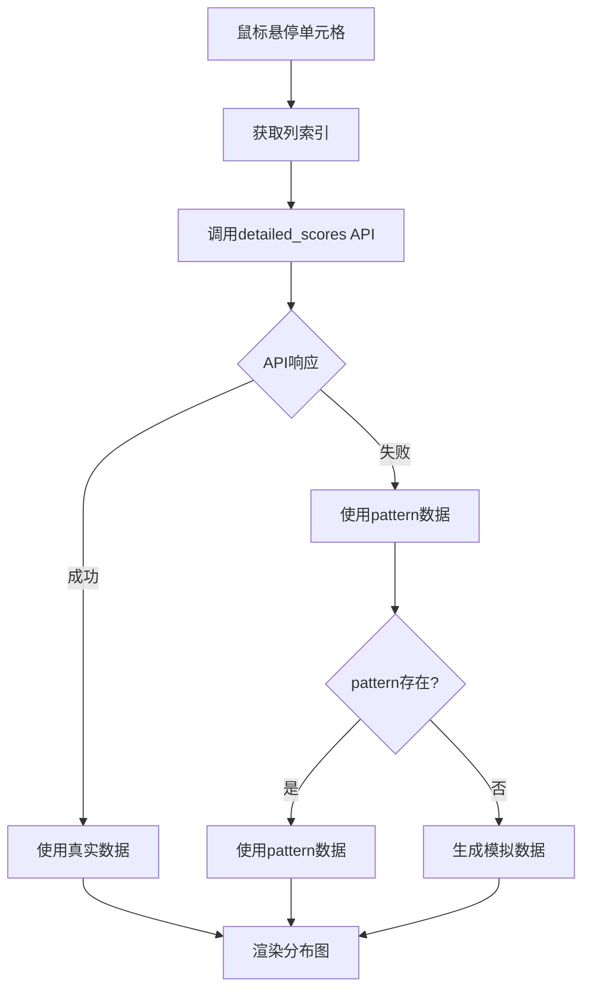

# 热力图右侧列分布技术规格 v1.0

**文档版本**: 1.0  
**更新日期**: 2025-09-13  
**状态**: 生产就绪  
**组件名称**: TableModificationChart

## 1. 概述

右侧列分布组件是热力图系统的关键可视化模块，用于展示当前悬停列在所有表格中的修改分布情况。该组件通过横向条形图的形式，直观展示每个表格在该列的修改密度和风险等级。

### 1.1 核心功能
- 实时响应鼠标悬停事件
- 显示列修改分布的横向条形图
- 风险等级颜色编码
- 修改数量统计
- 动态高度自适应

## 2. 输入数据规格

### 2.1 主要Props接口
```typescript
interface TableModificationChartProps {
  pattern?: ModificationPattern;           // 表格修改模式数据
  columnName?: string;                     // 当前列名
  isHovered: boolean;                      // 是否处于悬停状态
  allPatterns?: ModificationPattern[];     // 所有表格的模式数据
  globalMaxRows: number;                   // 全局最大行数
  maxWidth?: number;                       // 最大宽度（默认300px）
  maxHeight?: number;                      // 单行高度（默认24px）
  tableData?: TableData;                   // 表格元数据
  detailedScores?: DetailedScoreData;      // 详细评分数据
}
```

### 2.2 ModificationPattern数据结构
```typescript
interface ModificationPattern {
  tableId: number;
  tableName: string;
  columnPatterns: Record<string, ColumnPattern>;
  rowOverallIntensity: number;             // 行整体强度（0-1）
  riskLevel: 'L1' | 'L2' | 'L3';          // 风险等级
  realData?: {
    totalRows: number;                     // 总行数
    totalDifferences: number;              // 总修改数
    modifiedRowsCount: number;             // 修改行数
    allModifiedRows: number[];             // 所有修改的行号
    originalTableId: number;
    currentPosition: number;
  };
  totalModifications?: number;             // 备用修改数字段
}
```

### 2.3 DetailedScoreData结构
```typescript
interface DetailedScoreData {
  table_name: string;
  total_rows: number;
  modifications: Modification[];
  column_modifications: Record<string, ColumnModification>;
  data_source: 'comprehensive' | 'detailed' | 'mock';
}

interface ColumnModification {
  rows: number[];                          // 修改的行号数组
  risk_levels: string[];                   // 每行的风险等级
  modifications: number;                    // 修改次数
  aggregated_score: number;                // 聚合分数
}
```

## 3. 组件逻辑规范

### 3.1 渲染状态判断
```javascript
// 状态1: 未悬停状态
if (!isHovered) {
  // 显示简化的横条，仅显示风险等级和修改数量（如果>0）
  return <SimplifiedBar />;
}

// 状态2: 悬停但无数据
if (!pattern && !detailedScores) {
  // 显示空白占位符
  return <EmptyPlaceholder />;
}

// 状态3: 悬停且有数据
// 显示完整的修改分布图表
return <FullModificationChart />;
```

### 3.2 数据优先级
1. **综合评分数据优先**: `detailedScores?.column_modifications`
2. **模式数据次之**: `pattern?.columnPatterns`
3. **模拟数据兜底**: 生成随机分布数据

### 3.3 修改数量计算逻辑
```javascript
// 主数据源
const modifications = 
  pattern.realData?.totalDifferences ||      // 真实差异数据
  pattern.totalModifications ||               // 备用修改数
  0;                                          // 默认值

// 仅在修改数>0时显示
{modifications > 0 && (
  <span>{modifications}改</span>
)}
```

## 4. 可视化规范

### 4.1 颜色编码系统
```javascript
const riskColors = {
  'L1': '#dc2626',  // 红色 - 高风险
  'L2': '#f59e0b',  // 橙色 - 中风险  
  'L3': '#10b981'   // 绿色 - 低风险
};

// 热力值颜色梯度
const heatColors = [
  '#00ff00',  // 0% - 绿色
  '#ffff00',  // 50% - 黄色
  '#ff0000'   // 100% - 红色
];
```

### 4.2 尺寸规范
- **默认宽度**: 300px
- **单行高度**: 24px（与热力图行高一致）
- **条形图最大宽度**: 容器宽度的80%
- **最小条形宽度**: 4px（确保可见性）

### 4.3 布局结构
```
┌─────────────────────────────────┐
│ [条形图] L2 [修改数]             │  <- 未悬停状态
└─────────────────────────────────┘

┌─────────────────────────────────┐
│ 表格名称                        │  <- 悬停状态
│ ████████████░░░░ 45/270行       │
│ [修改行分布热力条]              │
└─────────────────────────────────┘
```

## 5. 数据流程

### 5.1 数据获取流程


### 5.2 API调用规范
```javascript
// API端点
GET /api/detailed_scores/<table_name>

// 响应格式
{
  "success": true,
  "data": {
    "table_name": "表格名称",
    "total_rows": 270,
    "modifications": [...],
    "column_modifications": {
      "列名": {
        "rows": [4, 6, 8, 11, 12],
        "risk_levels": ["L1", "L2", "L1", "L3", "L2"],
        "aggregated_score": 0.75
      }
    },
    "data_source": "comprehensive"
  }
}
```

## 6. 交互行为规范

### 6.1 鼠标悬停响应
- **响应时间**: < 100ms
- **动画过渡**: 200ms ease-in-out
- **防抖延迟**: 50ms（避免频繁切换）

### 6.2 状态转换
```javascript
// 悬停进入
onMouseEnter = (rowIndex, colIndex) => {
  setHoveredCell({ rowIndex, colIndex });
  fetchDetailedScores(tables[rowIndex].name);
};

// 悬停离开
onMouseLeave = () => {
  setHoveredCell(null);
  clearDetailedScores();
};
```

## 7. 性能优化

### 7.1 渲染优化
- **React.memo**: 避免不必要的重渲染
- **useMemo**: 缓存计算结果
- **虚拟滚动**: 大量表格时启用

### 7.2 数据缓存
```javascript
const scoreCache = new Map();

async function fetchDetailedScores(tableName) {
  // 检查缓存
  if (scoreCache.has(tableName)) {
    return scoreCache.get(tableName);
  }
  
  // 获取新数据
  const data = await fetch(`/api/detailed_scores/${tableName}`);
  scoreCache.set(tableName, data);
  
  // 缓存过期（5分钟）
  setTimeout(() => scoreCache.delete(tableName), 300000);
  
  return data;
}
```

## 8. 错误处理

### 8.1 数据异常处理
```javascript
try {
  const response = await fetch(apiUrl);
  if (!response.ok) {
    throw new Error(`HTTP error! status: ${response.status}`);
  }
  const data = await response.json();
  return data;
} catch (error) {
  console.error('加载详细打分数据失败:', error);
  // 降级到模拟数据
  return generateMockData(tableName);
}
```

### 8.2 边界条件
- **空数据**: 显示"暂无修改"
- **超长表名**: 使用省略号截断
- **异常值**: 限制在合理范围内

## 9. 测试要点

### 9.1 单元测试
- 组件渲染测试
- Props传递验证
- 状态转换测试
- 数据计算准确性

### 9.2 集成测试
- API调用响应
- 缓存机制验证
- 错误降级处理
- 性能基准测试

## 10. 配置参数

### 10.1 可配置项
```javascript
const CONFIG = {
  // 显示配置
  MAX_WIDTH: 300,               // 最大宽度
  ROW_HEIGHT: 24,               // 行高
  ANIMATION_DURATION: 200,      // 动画时长(ms)
  
  // 性能配置
  CACHE_DURATION: 300000,       // 缓存时长(5分钟)
  DEBOUNCE_DELAY: 50,          // 防抖延迟(ms)
  
  // 数据配置
  DEFAULT_TOTAL_ROWS: 50,       // 默认总行数
  MIN_BAR_WIDTH: 4,            // 最小条宽
  
  // 颜色配置
  RISK_COLORS: {
    L1: '#dc2626',
    L2: '#f59e0b', 
    L3: '#10b981'
  }
};
```

## 11. 部署注意事项

### 11.1 环境要求
- React 16.8+ (支持Hooks)
- 现代浏览器（Chrome 80+, Firefox 75+, Safari 13+）
- 最小屏幕分辨率: 1366x768

### 11.2 依赖项
```json
{
  "dependencies": {
    "react": "^16.8.0",
    "react-dom": "^16.8.0"
  }
}
```

## 12. 版本历史

| 版本 | 日期 | 更改内容 |
|------|------|----------|
| 1.0 | 2025-09-13 | 初始版本，包含完整技术规格 |

## 13. 相关文档

- [热力图系统技术规格](./09-热力图衔接综合打分参数规范.md)
- [综合评分数据格式](./08-综合打分数据格式规范.md)
- [API接口文档](../api/detailed_scores.md)

---

**维护团队**: 热力图开发组  
**联系方式**: heatmap-dev@company.com  
**最后更新**: 2025-09-13