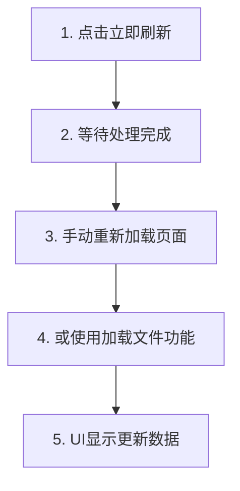

# 8089监控设置使用说明

## 📊 数据源模式

### CSV对比模式（按钮未点亮）
- **数据来源**: 直接读取CSV文件对比结果
- **特点**: 实时计算，适合开发测试
- **路径**: `csv_security_results/`目录
- **缺点**: 可能缺少某些UI参数

### 综合打分模式（按钮点亮）✅
- **数据来源**: 预生成的综合打分JSON文件
- **特点**: 包含完整9类UI参数，加载快速
- **路径**: `scoring_results/comprehensive/`目录
- **优点**: 数据完整，包含column_modifications

## 🔄 立即刷新功能

### 实际作用
1. 触发8093工作流下载最新腾讯文档
2. 执行CSV对比分析
3. 生成新的综合打分文件
4. **注意**: 不会自动刷新UI显示

### 正确使用流程


## ⚠️ 常见问题

### 问题1：刷新后仍显示旧数据
**原因**: 服务器内存缓存未更新
**解决**:
1. 刷新浏览器页面（F5）
2. 或在综合打分管理中重新加载文件

### 问题2：显示"测试表格"
**原因**: 加载了测试数据文件
**解决**:
1. 确保生成真实数据的综合打分文件
2. 在综合打分管理中选择正确的文件加载

### 问题3：column_modifications显示为0
**原因**: CSV对比的列名未正确映射到标准列名
**解决**: 检查CSV文件的列名是否符合标准19列定义

## 📋 数据验证方法

### 检查当前显示数据
1. 查看表格名称是否为真实文档名
2. 检查总行数是否合理（通常100-2000行）
3. 验证修改数是否为实际对比结果

### 确认数据真实性
- ✅ 表名应为腾讯文档实际名称
- ✅ 不应包含"测试表格"等虚拟名称
- ✅ 修改数应基于实际CSV对比

## 🚀 最佳实践

1. **生产环境**: 始终使用综合打分模式
2. **定期刷新**: 每周一执行全链路刷新
3. **验证数据**: 刷新后检查表名和修改数
4. **保存配置**: 使用URL配置管理保存常用文档链接

## 📝 技术说明

### 数据选择优先级
```python
1. 内存缓存 (comprehensive_scoring_data)
2. 最新文件 (comprehensive_score_W*.json)
3. CSV数据 (备用方案)
```

### 文件命名规范
```
综合打分: comprehensive_score_W{周数}_{时间戳}.json
CSV文件: tencent_{文档名}_{时间戳}_{类型}_W{周数}.csv
```

---
更新日期: 2025-09-23
版本: 1.0