# 简化版热力图映射流程说明

## 一、核心理念

**直接映射，无需计算**：取消热力图UI的所有打分逻辑，直接使用综合打分的`aggregated_score`作为热力值。

## 二、映射规则（极简三步）

### 第1步：表格名 → 行位置
```python
table_row_mapping = {
    "副本-测试版本-出国销售计划表": (0, 10),   # 第1个表格占用行0-9
    "副本-测试版本-回国销售计划表": (10, 20),  # 第2个表格占用行10-19
    "测试版本-小红书部门": (20, 30)            # 第3个表格占用行20-29
}
```

### 第2步：列名 → 列位置
```python
standard_columns = [
    "序号",           # 列0
    "项目类型",       # 列1
    "来源",           # 列2
    "任务发起时间",   # 列3
    "目标对齐",       # 列4
    "关键KR对齐",     # 列5
    "具体计划内容",   # 列6
    "邓总指导登记",   # 列7
    "负责人",         # 列8
    "协助人",         # 列9
    "监督人",         # 列10
    "重要程度",       # 列11
    "预计完成时间",   # 列12
    "完成进度",       # 列13
    "形成计划清单",   # 列14
    "复盘时间",       # 列15
    "对上汇报",       # 列16
    "应用情况",       # 列17
    "进度分析总结"    # 列18
]
```

### 第3步：分数 → 热力值
```python
# 直接赋值，无需任何计算！
matrix[row][col] = aggregated_score
```

## 三、数据流示例

### 输入数据（综合打分）
```json
{
  "table_scores": [{
    "table_name": "副本-测试版本-出国销售计划表",
    "column_scores": {
      "项目类型": {
        "aggregated_score": 0.58  // 这个值直接成为热力值
      },
      "任务发起时间": {
        "aggregated_score": 0.975  // 这个值直接成为热力值
      }
    }
  }]
}
```

### 映射过程
```
1. "副本-测试版本-出国销售计划表" → 行0-9
2. "项目类型" → 列1
3. matrix[0-9][1] = 0.58  // 10个单元格都填充0.58

4. "任务发起时间" → 列3
5. matrix[0-9][3] = 0.975  // 10个单元格都填充0.975
```

### 输出矩阵（30×19）
```
       列0   列1   列2   列3   列4  ...  列18
行0   [0.05][0.58][0.05][0.975][0.05]...[0.05]
行1   [0.05][0.58][0.05][0.975][0.05]...[0.05]
...
行9   [0.05][0.58][0.05][0.975][0.05]...[0.05]
行10  [0.12][0.05][0.05][0.05][0.05]...[0.05]  ← 第二个表格
...
行29  [0.05][0.05][0.05][0.05][0.05]...[0.05]  ← 第三个表格
```

## 四、完整数据流

```mermaid
graph LR
    A[综合打分JSON] --> B[提取aggregated_score]
    B --> C[查找表格行位置]
    C --> D[查找列索引]
    D --> E[直接填充矩阵]
    E --> F[高斯平滑优化]
    F --> G[热力图渲染]
```



## 五、实际映射示例（W37数据）

### 表格1：出国销售计划表（行0-9）
| 列名 | 列索引 | aggregated_score | 填充位置 |
|------|--------|-----------------|----------|
| 项目类型 | 1 | 0.58 | matrix[0-9][1] = 0.58 |
| 任务发起时间 | 3 | 0.975 | matrix[0-9][3] = 0.975 |
| 关键KR对齐 | 5 | 0.8 | matrix[0-9][5] = 0.8 |
| 负责人 | 8 | 0.70 | matrix[0-9][8] = 0.70 |
| 预计完成时间 | 12 | 0.96 | matrix[0-9][12] = 0.96 |

### 表格2：回国销售计划表（行10-19）
| 列名 | 列索引 | aggregated_score | 填充位置 |
|------|--------|-----------------|----------|
| 序号 | 0 | 0.12 | matrix[10-19][0] = 0.12 |
| 重要程度 | 11 | 0.877 | matrix[10-19][11] = 0.877 |
| 完成进度 | 13 | 0.45 | matrix[10-19][13] = 0.45 |
| 对上汇报 | 16 | 0.65 | matrix[10-19][16] = 0.65 |

### 表格3：小红书部门（行20-29）
| 列名 | 列索引 | aggregated_score | 填充位置 |
|------|--------|-----------------|----------|
| 邓总指导登记 | 7 | 0.55 | matrix[20-29][7] = 0.55 |
| 协助人 | 9 | 0.18 | matrix[20-29][9] = 0.18 |
| 形成计划清单 | 14 | 0.48 | matrix[20-29][14] = 0.48 |
| 应用情况 | 17 | 0.22 | matrix[20-29][17] = 0.22 |

## 六、视觉效果（保持不变）

### 颜色映射（自动根据分数值）
- **0.0-0.2**: 🟦 深蓝色（低风险）
- **0.2-0.4**: 🟩 绿色（较低风险）
- **0.4-0.6**: 🟨 黄色（中等风险）
- **0.6-0.8**: 🟧 橙色（较高风险）
- **0.8-1.0**: 🟥 红色（高风险）

### 保留的渲染功能
1. **IDW插值**：处理稀疏数据，生成连续场
2. **三层聚类**：热块聚集，优化排列
3. **高斯平滑**：轻微模糊，改善视觉
4. **FLIR色彩**：标准热成像配色

## 七、API调用

### 请求
```bash
GET /api/scoring_enhanced_heatmap?week=37
```

### 响应
```json
{
  "heatmap_data": [[...]],      // 30×19矩阵
  "table_names": [...],          // 30个表格名
  "column_names": [...],         // 19个列名
  "row_order": [0,1,2,...,29],  // 行顺序
  "col_order": [0,1,2,...,18],  // 列顺序
  "statistics": {
    "average_risk_score": 0.560,  // 直接反映综合打分
    "high_risk_count": 120,       // >0.7的单元格数
    "medium_risk_count": 150      // 0.4-0.7的单元格数
  },
  "metadata": {
    "mapper_version": "v2.0-simple"  // 简化版标识
  }
}
```

## 八、优势总结

### 简化前（复杂版）
```python
# 5步计算
base_heat = risk_level_mapping[column_level]  # L1:0.8, L2:0.5, L3:0.2
modification_weight = min(1.0, modifications / 5)
ai_factor = calculate_ai_impact(ai_decisions)
trend_factor = trend_mapping[risk_trend]
heat_value = base_heat * aggregated_score * modification_weight * ai_factor * trend_factor
```

### 简化后（当前版）
```python
# 1步完成
heat_value = aggregated_score  # 就这么简单！
```

### 效果对比
| 指标 | 简化前 | 简化后 |
|------|--------|--------|
| 代码行数 | 475行 | 290行 |
| 计算复杂度 | O(n×m×5) | O(n×m) |
| 维护难度 | 高 | 低 |
| 数据一致性 | 可能不一致 | 100%一致 |
| 性能 | 较慢 | 快速 |

## 九、测试命令

```python
# 测试映射器
cd /root/projects/tencent-doc-manager/production/core_modules
python3 scoring_heatmap_mapper_simple.py

# 测试API
curl http://localhost:8089/api/scoring_enhanced_heatmap?week=37

# 查看结果
cat /root/projects/tencent-doc-manager/scoring_heatmap_simple_test.json
```

## 十、总结

简化版映射实现了：
1. ✅ **数据源单一化**：aggregated_score是唯一数据源
2. ✅ **映射规则清晰**：表格名→行，列名→列，分数→热力值
3. ✅ **视觉效果保持**：所有渲染功能不变
4. ✅ **维护极简化**：代码量减少40%，逻辑一目了然
5. ✅ **性能优化**：去除复杂计算，响应更快

这就是您建议的"非常简单的匹配"方案的完美实现！